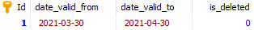
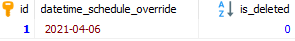
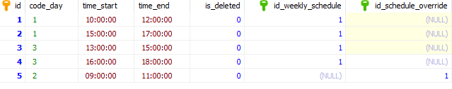
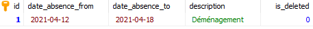
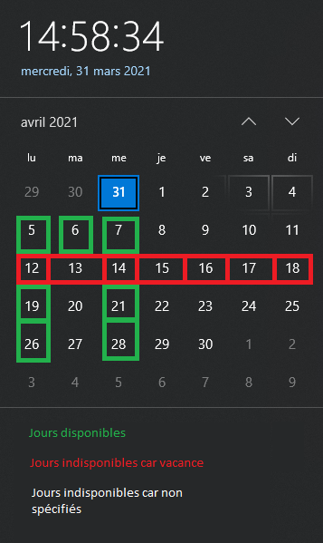
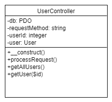
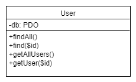

# POC Douceur de Chien

## Log book Jonathan Borel-Jaquet

### Mardi 30  mars 2021

#### Objectif du POC

Pour la réalisation de ce POC, monsieur Mathieu et moi-même avons convenu de réaliser uniquement la partie planning de mon API REST.

C'est à dires, les tables suivantes :


L'objectif est de permettre à l'éducateur canin de créer ses différents créneaux horaires. Ces créneaux horaires (time_slot) pourront être régulier pour une certaine distance(weekly_schedule) ou unique pour un jour(schedule_override), de plus, l'éducateur canin pourra spécifier des distances de vacances(absence) qui devront rendre indisponible tous les créneaux horaires les incluant. Le tout en gérant les différents problèmes de chevauchement que la création de planning pourra entraîner.

Exemple de données de planning allant du 30 mars 2021 jusqu'au 30 avril 2021 :

**weekly_schedule**



**schedule_override**



**time_slot**



**absence**



Croquis d'une représentation graphique du planning



L'objectif du POC sera de réaliser les différents endpoints de l'api afin de permettre à l'éducateur canin de réaliser son planning afin de rendre possible la prise de prendre rendez-vous avec celui-ci 

#### Création de l'arborescence de l'api REST

```
api-rest_douceur-de-chien
└───app
│	└───Controllers
│	└───Models
│	└───System
└───public
└───vendor
│   .env
│   bootstrap.php
│   composer.json
│   dbseed.php
```

##### app/Controllers

Dossier contenant les Controllers de l'API qui permettent l'exécution des fonctions CRUD adéquate pour les endpoints.
Exemple de Class Controller permettant les endpoints *users* ou *user/{id}* :




##### app/Models

Dossier contenant les Models de l'API qui permettent le traitement SQL des données.
Exemple de Class Model permettant de récupérer un utilisateur ou tous les utilisateurs :



#####  app/System

Dossier contenant les fichiers de système de l'API.
Exemple de Class System permettant la connexion à la base de données :


##### public

Dossier contenant mes fichiers publics.
Exemple : index.php

##### vendor

Dossier contenant les librairies PHP utilisées.
Exemple:  Librairie PHP dotenv qui permet la génération de variables d'environnements. 

##### bootstrap.php

Fichier permettant le chargement des librairies et des variables d'environnements.

##### composer.json

Fichier permettant la mémorisation et la génération des différentes libraires a utilisées.

##### dbseed.php

Fichier permettant d'insérer des données de tests dans la base de données.

### Mercredi 31  mars 2021

##### PHP dotenv

Ajout de la libraire [PHP dotenv](https://github.com/vlucas/phpdotenv) permettant la génération et l'utilisation de variables d'environnements.
Création du fichier .env contenant les variables d'environnement de connexion à la base de données :

* DB_HOST
* DB_PORT
* DB_DATABASE
* DB_USERNAME
* DB_PASSWORD

##### System DatabaseConnector

Création de la class DatabaseConnector permettant la connexion à la base de données.
Pour cette première version, la class récupère les variables d'environnements de connexion et créé un objet PDO avec celles-ci dans son constructeur. Une méthode getConnection() permet de récupérer cette connexion PDO.

##### Model User

Création du premier Model User afin de tester la structure objet de l'API.
Le modèle récupère en paramètre la connexion à la PDO.

Méthodes développées :

* findAll()
  * Récupère toutes les informations de tout les clients hormis le mot de passe et son sel dans un tableau associatif.
* find($id)
  * Similaire à findAll() mais uniquement pour un utilisateur.
* getRole
  * Récupère le rôle d'un utilisateur par rapport à son api_token.

##### UserController

Création du premier Controller UserController.

Méthodes développées :

* processRequest()
  * Permet de traiter la requête correspondant à la méthode spécifié dans le constructeur de l'objet.
    * GET
      * Sans l'attribut "userId" set, la méthode va appeler getAllUsers.
      * Avec l'attribut "userId" set, la méthode va appeler getUser($id).
* getAllUsers()
  * Récupère tout les utilisateurs en format JSON si la demande vient d'un utilisateur avec le rôle 2 (Éducateur canin).
* getUser($id)
  * Récupère l'utilisateur en format JSON correspondant à l'identifiant passé en paramètre. 

##### bootstrap.php

Création du fichier de bootage de l'api, celui-ci permet pour l'instant de :

* Charger les différentes librairie ajoutées avec Composer grâce au fichier autoload.php généré par celui-ci
* Charger les variables d'environnements PHP dotenv
* Créer la connexion avec la base de données.

##### index.php

Point d'entrée des HTTP request de l'api.

* Charge le fichier bootstrap.php
* Ajoute les headers :
  * Access-Control-Allow-Origin: *
    * Permet à n'importe quelle ressource d'accéder aux ressource de l'api.
  * Content-Type: application/json; charset=UTF-8
    * Le type et l'encodage des réponses de l'API
  * Access-Control-Allow-Methods: GET,POST,PATCH,DELETE
    * Permet les méthodes de request de type : GET, POST, PATCH et DELETE
  * Access-Control-Max-Age: 3600
    * La durée maximum de la mise en cache des résultats de request. 
  * Access-Control-Allow-Headers: Content-Type, Access-Control-Allow-Headers, Authorization, X-Requested-With
    * Indique quels en-têtes HTTP peuvent être utilisés lors de la request.
* Traite la request pour envoyer la bonne réponse.
  * GET
    * index.php/users => getAllUsers()
    * index.php/user/{id} => getUser{$id}

### Jeudi 01 avril 2021

Ajout de commentaire sur les fichiers : 

* Controllers/UserController.php
* Models/User.php
* System/DatabaseConnector
* Bootstrap.php
* dbseed.php
* index.php

Ajout de type dans tous les paramètres de méthode et de constructeur de l'application.

Création du Model WeeklySchedule avec sa première fonction :

* findAll(bool $isDeleted)
  * Récupère tous les calendriers hebdomadaires encore utilisés ou non.

### Mardi 06 avril 2021

Ajout de fonction dans le Model WeeklySchedule :

* find($id)
  * Récupère un calendrier hebdomadaire grâce à son identifiant.
* insert(array $input)
  * Créé un nouveau calendrier hebdomadaire, le paramètre input correspond pour l'instant à un tableau associatif avec comme clef le nom des colonnes concernées.

Création du Controller WeeklyScheduleController du Model WeeklySchedule.

Méthodes développées :

* processRequest()
* getAllWeeklySchedules()
* getWeeklySchedule(int $id)

Création du Controller ResponseController permettant de retourner les différentes réponses HTTP de l'API.

Méthodes static développées :

* notFoundAuthorizationHeader()
  * Retourne le code 401 Unauthorized ainsi que le message : *L'en-tête d'autorisation n'est pas défini.*
* unauthorizedUser()
  * Retourne le code 401 Unauthorized ainsi que le message : *Vous n'avez pas les permissions.*
* notFoundResponse()
  * Retourne le code 404 Not Found ainsi que le message : *Le serveur n'a pas trouvé la ressource demandée*.
* successfulRequest($result)
  * Retourne le code 200 OK ainsi que la résultat de la réponse en format JSON.

### Mercredi 07 avril 2021

Ajout de fonction dans le Model WeeklySchedule :

* findOverlap(array $input)
  * Récupère les dates qui produisent des problèmes de chevauchement.

Ajout de fonction dans le Controller WeeklyScheduleController :

* createWeeklySchedule()
  * Permet de créer un nouveau calendrier hebdomadaire en vérifiant les points suivants :
    * Attributs obligatoires spécifiés dans la requête (date_valid_from)
    * Format de date valide pour l'attribut date_valid_from et date_valid_to si défini
    * Problème de chevauchement aves les autres dates de la base de données **( /!\ Vérifie pour l'instant uniquement les problèmes de chevauchements avec les deux attributs date_valid_from et date_valid_to définis /!\ )**
* validateWeeklySchedule($input)
  * Contrôle si l'attribut date_valid_from est bien défini
* validateDateFormat($date)
  * Contrôle si une date est dans le bon format (DD-MM-YYYY)

Ajout et modification de fonction dans le Controller ResponseController :

* successfulRequest($result) => successfulGETRequest($result)
* successfulPOSTRequest()
  * Retourne le code 201 Created.

* unprocessableEntityResponse()
  * Retourne le code 422 Unprocessable Entity ainsi que le message : *Attributs invalides.*
* invalidDateFormat()
  * Retourne le code 422 Unprocessable Entity ainsi que le message : *Format de date invalide => (DD-MM-YYYY).*
* overlapProblem
  * Retourne le code 422 Unprocessable Entity ainsi que le message : *Les dates chevauchent d\'autres dates déjà existantes.*

### Jeudi 08 avril 2021

Création du Model ScheduleOverride.

Méthodes développées :

* findAll(bool $isDeleted)
  * Fonctionnement similaire aux précédents Models.
* find(int $id)
  * Fonctionnement similaire aux précédents Models.
* insert(array $input)
  * Fonctionnement similaire aux précédents Models.
* update(int $id, array $input)
  * Fonctionnement similaire aux précédents Models.
* delete(int $id)
  * Fonctionnement similaire aux précédents Models.
* findExistence(string $date)
  * Récupère les dates non-supprimées identiques à celle passée en paramètre afin de vérifier si l'utilisateur ne créé pas deux fois la même date.

Création du Model Absence.

Méthodes développées :

* CRUD similaire aux précédents Models.

Création des Controllers ScheduleOverrideController et AbsenceController qui ont un fonctionnement similaire aux précédents Controllers. 

Création d'un Controller HelperController permettant de contenir les fonctions d'aide de l'api.

* Déplacement de la fonction validateDateFormat($date) dans celui-ci.

Ajout des différents endpoints dans le fichier public : index.php

### Vendredi 09 avril 2021

Création du Model TimeSlot :

* CRUD similaire aux précédents Models.
* findOverlapInWeeklySchedule(array $input)
  * Méthode pour vérifier si la création d'un nouveau créneau horaire ne cause pas de chevauchement avec d'autres créneaux horaire du même calendrier hebdomadaire.

Création du Controller TimeSlotController qui a un fonctionnement similaire aux précédents Controllers. 

Ajout d'une méthode dans le HelperController :

* validateTimeFormat($time)
  * Contrôle si une donnée temporelle est dans le bon format (HH:MM:SS).

Ajout d'une méthode dans le Model WeeklySchedule :

* findActifPermanentSchedule()
  * Vérifie si un calendrier hebdomadaire permanant est déjà existant dans la base de données.

Ajout et modification de méthode dans le ResponseController

* permanentScheduleAlreadyExist()
  * Retourne le code 422 Unprocessable Entity ainsi que le message : *Un calendrier permanent a déjà été créé.*
* invalidTimeFormat()
  * Retourne le code 422 Unprocessable Entity ainsi que le message : *Format de temps invalide => (HH:MM:SS).*
* timeOverlapProblem()
  * Retourne le code 422 Unprocessable Entity ainsi que le message : *Les horaires chevauchent d'autres horaires déjà existants.*
* overlapProblem renommé en dateOverlapProblem

### Lundi 12 avril 2021

Rendez-vous GMeet avec M.Mathieu afin de répondre aux différentes questions :

* Lors de la création d'un TimeSlot, faut-il que la clef étrangère en attribut corresponde bien à un WeeklySchedule ou ScheduleOverride existant ?
  * Résumé de la réponse : Oui, il faut vérifier. Si l'id n'existe pas, il faut retourner un code d'erreur 404 Not Found. Il faut également modifier tout les codes 422 en 400 ou 404 car le code 422 utilise l'extension HTTP WebDAV et de ce fait ne respecte pas le principe architecturaux REST.
* Comment vérifier l'overlap avec un WeeklySchedule existant permanant (lorsque date_valid_from est set mais que date_valid_to est null) ?
  * Résumé de la réponse : Pour commencer, il faut vérifier que la date_valid_from est bien plus petit ou égal à la date_valid_to. Ensuite, il faut tester si le nouveau date_valid_from est plus grand ou égal aux date_valid_from existants et que le date_valid_to est égal à null ou que le nouveau date_valid_from est plus petit ou égal aux date_valid_to existants. 
* Comment doit se comporter l'api lorsqu'un time slot n'est pas supprimé mais que le WeeklySchedule ou le ScheduleOverride est supprimé ?
  * Résumé de la réponse : Lorsque un TimeSlot est avec un WeeklySchedule ou un ScheduleOverride supprimé, alors le time slot n'est pas pris en compte.
* Comment tester de la bonne manière l'overlap des TimeSlots ?
  * Résumé de la réponse : Changement du champ code_day : varchar ("lu","ma","mer",ect...) => int (1,2,3,ect...). Utilisation de la méthode SQL [DAYOFWEEK](https://sql.sh/fonctions/date-heure/dayofweek)  

Développement des points suivants dans le documentation :

* Introduction
* Rappel du cahier des charges
  * Objectifs
  * Environnement de travail
  * Organisation
  * Livrable
* Développement
  * Description des activités
    * Création de la structure de l'API REST
    * Création des différentes class de l'API REST (Création du diagramme de class UML)
* Bilan personnel du travail effectué
* Conclusion

### Mardi 13 avril 2021

Modification du Controller ResponseController

* Modification des code 422 Unprocessable Entity en 400 Bad Request
* Création de la méthode chronologicalDateProblem() Retourne le code 400 Bad Request ainsi que le message : *La date ou l'heure de début est plus récente que la date ou l'heure de fin.*

Modification du Controller HelperController

* Création de la méthode validateChornologicalTime($firsttime, $secondtime)
  * Permet de vérifier si la premier date n'est pas plus récente que la deuxième. 

Modification du Controller TimeSlotController

* Ajout du test de date chronologique dans la méthode de create et d'update.
* Modification de la méthode validateTimeSlot(array $input) afin de vérifier que l'attribut id_weekly_schedule ou id_schedule_override référence bien un champ existant dans la base de données.

Modification du Controller WeeklyScheduleController

* Ajout du test de date chronologique dans la méthode de create et d'update.

Ajout du contrôle chronologique des dates passées dans le body des entpoints dans les Controllers :

* AbsenceController
* WeeklyScheduleController

Modification de la méthode findAll(bool $idDeleted) du Model TimSlot. Dorénavant , la méthode ne prend plus en compte les time slots liés avec un weekly_schedule ou un schedule override supprimé.

Modification de la méthode findOverlap(array $input) du Model WeeklySchedule. Dorénavant, la méthode vérifie toutes les conditions de chevauchement lors d'un insert. Toutefois, la requête SQL génère un warning.

Modification de tout les endpoints afin de respecter les principes architecturaux REST. Dorénavant, tout les endpoints finissent par "s".

### Mercredi 14 avril 2021

Recherche et approfondissement de la requête destinée au dernier endpoint de la partie planning de l'API REST. Pour l'instant, la requête arrive à sortir toutes les dates avec les time slots. Il reste encore à retirer les dates de vacance.

Requête à ce jour développé :

Création des vues virtuelles permettant la génération de date entre (aujourd'hui - 9999 jours) et (aujourd'hui + 365 jours) :

```SQL
CREATE VIEW digits AS
  SELECT 0 AS digit UNION ALL
  SELECT 1 UNION ALL
  SELECT 2 UNION ALL
  SELECT 3 UNION ALL
  SELECT 4 UNION ALL
  SELECT 5 UNION ALL
  SELECT 6 UNION ALL
  SELECT 7 UNION ALL
  SELECT 8 UNION ALL
  SELECT 9;

CREATE VIEW numbers AS
  SELECT
    ones.digit + tens.digit * 10 + hundreds.digit * 100 AS number
  FROM
    digits as ones,
    digits as tens,
    digits as hundreds;

CREATE VIEW dates AS
  SELECT
    SUBDATE(ADDDATE(CURRENT_DATE(),365), number) AS date
  FROM
    numbers;
```

Traitement:

```sql
SELECT time_start,code_day, time_end,date_valid_from, date_valid_to,id_weekly_schedule,id_schedule_override,schedule_override.date_schedule_override, 
IF(dates.date IS NOT NULL, dates.date, schedule_override.date_schedule_override)

FROM time_slot
LEFT JOIN weekly_schedule
ON weekly_schedule.Id = time_slot.id_weekly_schedule

LEFT JOIN schedule_override
ON schedule_override.id = time_slot.id_schedule_override

LEFT JOIN dates
ON DAYOFWEEK(date) = time_slot.code_day 
AND date BETWEEN date_valid_from 
AND IF(date_valid_to IS NULL, DATE_ADD(NOW(), INTERVAL 365 DAY), date_valid_to) 

WHERE weekly_schedule.is_deleted = 0
OR schedule_override.is_deleted = 0


ORDER BY DATE
```


Création du rapport de stage en LaTeX initialement rédigé sur Google Docs.

* Utilisation du paquet LaTeX [rest-api](https://www.ctan.org/pkg/rest-api) permettant d'afficher les endpoints d'une API REST

Envoie d'un mail à M. Mathieu afin de répondre aux points suivants :

* Est-ce que mon rapport de stage répond bien aux attentes ?
* Est-ce qu'une requête qui fonctionne, mais qui génère des avertissements du côté SQL est acceptable ou non ?

### Jeudi 15 avril 2021

Modification du champ code_day de la base de données initialement de type varchar en tinyint. 

* "dim" => 1
* "lun" => 2
* "mar" => 3
* "mer" => 4
* "jeu" => 5
* "ven" => 6
* "sam" => 7

Modification du code d'erreur de la méthode unauthorizedUser()

* 401 Unauthorized => 403 Forbidden

Modification du Model TimeSlot :

* Ajout de la méthode generateViews() qui permet de générer les différentes vues virtuelles pour la génération de date.
* Ajout de la méthode findPlanningTimeSlots() qui permet la récupération de tous les créneaux horaires en prenant en compte les vacances, la requête finale ressemble à ça :

```SQL
SELECT time_start,time_end, IF(dates.date IS NOT NULL, dates.date, so.date_schedule_override) AS date

FROM time_slot AS ts
LEFT JOIN weekly_schedule AS ws
ON ws.Id = ts.id_weekly_schedule

LEFT JOIN schedule_override AS so
ON so.id = ts.id_schedule_override

LEFT JOIN dates
ON DAYOFWEEK(dates.date) = ts.code_day 
AND dates.date BETWEEN ws.date_valid_from 
AND IF(ws.date_valid_to IS NULL, DATE_ADD(NOW(), INTERVAL 365 DAY), ws.date_valid_to) 

WHERE ts.is_deleted = 0 AND (so.is_deleted = 0 OR ws.is_deleted = 0)
AND (SELECT COUNT(*) 
FROM absence AS ab
WHERE IF(so.date_schedule_override IS NULL,dates.date,so.date_schedule_override) BETWEEN ab.date_absence_from AND ab.date_absence_to LIMIT 1) = 0

ORDER BY DATE;
```

Création de la méthode getPlanningTimeSlots() dans le Controller TimeSlotController.

Modification de la requête de vérification de chevauchement de calendrier hebdomadaire qui générait une avertissement coté SQL afin que cela ne soit plus le cas.

Finalisation de la documentation technique.


