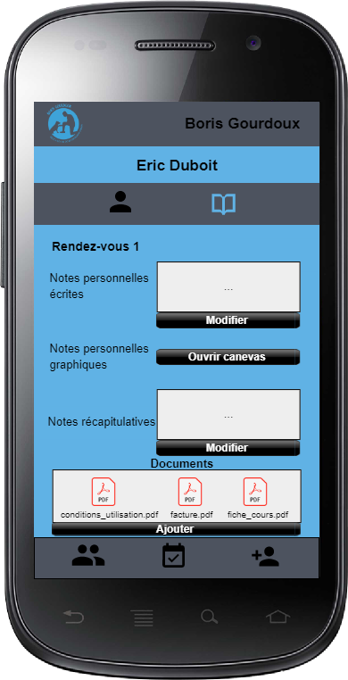

# DDC'App

## Cahier des charges

### Objectif du projet

La PWA (Progressive web app) permettra de faciliter les différentes tâches d'organisation, de prise en charge et de relation d'un client et d'un éducateur canin. L'éducateur canin aura la possibilité de se connecter à l'application afin de pouvoir gérer/visualiser/éditer les différentes informations des ses clients. Il pourra consulter son planning de rendez-vous afin de pouvoir trouver une date adéquate pour un rendez-vous avec un client. L'éducateur canin aura la possibilité de faire signer numériquement les différents contrats lors d'un rendez-vous et d'y stocker avec d'autre documents dans un dossier partagé que le client aura accès depuis son compte. Le client quant-à lui, aura la possibilité de se connecter à l'application afin d'accéder à ses informations personnelles, ses contrats signé/documents et ses rendez-vous planifiés avec un éducateur canin.

### Description détaillée

La PWA permet à un éducateur canin ou à un client de se connecter à l'application pour avoir accès à différentes fonctionnalités.
L'éducateur canin a accès à un calendrier avec tout ces rendez-vous planifié et à une liste contenant tous ses actuels clients ou il peut, si il le souhaite, faire une recherche spécifique par nom afin de visualiser leurs différentes informations, telle que :

* Les informations personnelles du client
  * Nom
  * Prénom
  * Téléphone
  * Adresse mail
  * Adresse du domicile
* Les informations personnelles du chien
  * Date de naissance
  * Race
  * Sexe
  * Nom
  * Photo
  * Numéro de puce sous-cutanée
* Les documents partagés entre le client et l'éducateur canin
  * Conditions d'inscription signé
  * Fiches récapitulatif du cours
  * Autres

L'éducateur canin doit procéder à une création préliminaire d'une fiche client, le client concerné sera avertit par mail qu'une fiche à été créé avec ces informations, il devra alors validé son compte pour pouvoir y accéder. Lors du premier rendez-vous, l'éducateur canin doit compléter la fiche client avec les données qui nécessite une rencontre physique.

L'éducateur canin peut à tout moment lors d'un rendez-vous, accéder à la fiche du client afin de pouvoir y rentrer différentes informations :

- Note personnel de l'éducateur canin du cours sous format texte
- Note personnel de l'éducateur canin du cours sous format graphique
- Note récapitulatif du cours
- Documents à partager

Si le rendez-vous entre l'éducateur canine et le client est le premier, alors l'éducateur doit faire signer depuis l'application, les conditions d'inscription au client.

Le client quant-à lui, peut se connecter à l'application après s'être inscrit pour accéder à ses informations personnelles ainsi que ces documents.

### Liste des fonctionnalités

#### Fonctionnalités de l'éducateur canin

- Connexion à l'application
- Accès au calendrier de ces rendez-vous
- Affichage de tout les clients avec photo du chien et nom de son maitre
- Recherche spécifique d'un client par nom
- Accès aux informations personnelles d'un client depuis la recherche spécifique ou du calendrier de rendez-vous
- Création préliminaire d'une fiche client
- Accès et création de contenue séance d'un client depuis la recherche spécifique ou le calendrier de rendez-vous

#### Fonctionnalités du client

- Inscription à l'application
- Connexion à l'application
- Accès au calendrier de ces rendez-vous
- Accès à ces informations personnelles
- Accès à ses documents personnelles
- Accès à ces différents contenues séances 

### Scénario d'utilisation

#### Prise en charge d'un nouveau client

##### Étape 1 : Création de fiche cliente préliminaire par téléphone

1. Le client appel l'éducateur canin avec son téléphone car il a besoin de ces services.
2. L'éducateur canin va se rendre sur l'application et se connecter avec ses identifiants.
3. Il va se rendre sur l'interface de création d'une nouvelle fiche client.
4. Il va y renter les informations personnelles du client communiqué par téléphone :
   - Nom du client
   - Prénom du client
   - Téléphone du client
   - Adresse mail du client
   - Adresse du domicile du client
   - Date de naissance du chien
   - Race du chien
   - Sexe du chien
   - Nom du chien
5. Il aura accès à son calendrier personnel afin de visualiser à quelle date il peut se rendre au domicile du client.
6. Le client ainsi que l'éducateur se mettront d'accord sur la date du rendez-vous.
7. L'éducateur canin sélectionnera cette date dans le calendrier.
8. Une fois la fiche client préliminaire avec la date du premier rendez-vous remplis, un mail sera envoyé au client afin qu'il puisse créer son compte dans l'application afin d'avoir accès à différentes fonctionnalités.

##### Étape 2 : Rencontre physique avec le client 

1. L'éducateur canin se rend au domicile du client à la date spécifié lors de l'appel téléphonique. 
2. Il va se rendre sur l'application et se connecter avec ses identifiants.
3. Il va rechercher le client grâce à son nom et accéder à sa fiche client précédemment créée lors de l'appel téléphonique.
4. Il va montrer les données personnelles du client et lui demander une vérification de celle-ci.
5. Si elles sont fausses, modification de celle-ci.
6. Si elles sont correctes, l'éducateur canin devra prendre une photo du chien ainsi que de rentrer manuellement les 15 chiffres du code de la puce sous-cutanée du chien.
7. Il pourra ensuite sauvegarder cette version final de la fiche client.

#### Rendez-vous avec un client

1. L'éducateur canin peut à tout moment lors d'un rendez-vous, accéder à la fiche du client afin de pouvoir y rentrer différentes données :
   - Note du cours sous format texte (accessible uniquement par l'éducateur)
   - Note du cours sous format graphique (accessible uniquement par l'éducateur)
   - Note récapitulatif du cours (accessible par l'éducateur ainsi que le client)
2. Si le rendez-vous est le premier, alors le client doit depuis l'application de l'éducateur :
   1. Choisir le forfait qu'il désire.
   2. Ajouter sa signature depuis l'application.
   3. Visualiser la version final des conditions d'inscriptions. 
   4. Validée s'il est d'accord en cochant une case "Lu et approuvé".
   5. Les conditions d'inscription sous format PDF ainsi qu'une génération automatique d'une facture sous format PDF sera ajouté au dossier partagé du client.

### Modèle de données

<table>
    <tr>
    	<th style="text-align:center" COLSPAN="4">user</th>
    </tr>
    <tr>
        <th>Nom</th>
        <th>Type</th>
        <th>Null</th>
        <th>Définition</th>
    </tr>
    <tr>
        <td>email</td>
        <td>varchar</td>
        <td>not null</td>
        <td>Addresse email de l'utilisateur.</td>
    </tr>
    <tr>
        <td>firstname</td>
        <td>varchar</td>
        <td>not null</td>
        <td>Prénom de l'utilisateur.</td>
    </tr>
    <tr>
        <td>secondname</td>
        <td>varchar</td>
        <td>not null</td>
        <td>Nom de l'utilisateur.</td>
    </tr>
    <tr>
        <td>phonenumber</td>
        <td>varchar</td>
        <td>not null</td>
        <td>Numéro de téléphone de l'utilisateur.</td>
    </tr>
    <tr>
        <td>address</td>
        <td>varchar</td>
        <td>not null</td>
        <td>Adresse du domicile de l'utilisateur.</td>
    </tr>
    <tr>
        <td>password</td>
        <td>varchar</td>
        <td>null</td>
        <td>Mot de passe hashé.</td>
    </tr>
    <tr>
        <td>api_token</td>
        <td>varchar</td>
        <td>not null</td>
        <td>Token d'authentification de l'utilisateur.</td>
    </tr>
    <tr>
        <td>is_administrator</td>
        <td>boolean</td>
        <td>not null</td>
        <td>Booléan définisant le rôle de l'utilisateur.</td>
    </tr>
</table>
   <table>
    <tr>
    	<th style="text-align:center" COLSPAN="4">dog</th>
    </tr>
    <tr>
        <th>Nom</th>
        <th>Type</th>
        <th>Null</th>
        <th>Définition</th>
    </tr>
    <tr>
        <td>name</td>
        <td>varchar</td>
        <td>not null</td>
        <td>Nom du chien.</td>
    </tr>
    <tr>
        <td>dog_breed</td>
        <td>varchar</td>
        <td>not null</td>
        <td>Race du chien.</td>
    </tr>
     <tr>
        <td>sex</td>
        <td>varchar</td>
        <td>not null</td>
        <td>Sexe du chien.</td>
    </tr>
     <tr>
        <td>path_dog_picture</td>
        <td>varchar</td>
        <td>null</td>
        <td>Chemin d'accès de la photo du chien.</td>
    </tr>
    <tr>
        <td>chip_id</td>
        <td>varchar</td>
        <td>null</td>
        <td>Code composé de 15 chiffres (3 pour le pays, 2 pour le type d'animal, 2 pour le fabricant, 8 pour le n° de l'animal).</td>
    </tr>
</table>
   <table>
    <tr>
    	<th style="text-align:center" COLSPAN="4">document</th>
    </tr>
    <tr>
        <th>Nom</th>
        <th>Type</th>
        <th>Null</th>
        <th>Définition</th>
    </tr>
    <tr>
        <td>type</td>
        <td>type_document</td>
        <td>not null</td>
        <td>Type de document (conditions d'inscription, poster, résumé du cours canin,ect...) .</td>
    </tr>
    <tr>
        <td>path</td>
        <td>varchar</td>
        <td>not null</td>
        <td>Chemin d'accès du document.</td>
    </tr>
</table>
   <table>
    <tr>
    	<th style="text-align:center" COLSPAN="4">courseContent</th>
    </tr>
    <tr>
        <th>Nom</th>
        <th>Type</th>
        <th>Null</th>
        <th>Définition</th>
    </tr>
    <tr>
        <td>course_note_text</td>
        <td>varchar</td>
        <td>null</td>
        <td>Note du cours sous format texte.</td>
    </tr>
      <tr>
        <td>path_course_note_graphical</td>
        <td>varchar</td>
        <td>null</td>
        <td>Chemin d'accès de note du cours sous format graphique.</td>
    </tr>
       <tr>
        <td>course_summary</td>
        <td>varchar</td>
        <td>null</td>
        <td>Note récapitulatif du cours.</td>
    </tr>
       </tr>
       <tr>
        <td>date</td>
        <td>datetime</td>
        <td>not null</td>
        <td>Date du cours.</td>
    </tr>
</table>

##### Diagramme de séquence

### Maquettes de l'application
#### Client

##### Information personnelles

##### Calendrier

##### Contenue séances

#### Éducateur canin

##### Affichage de tout les clients

##### Calendrier

##### Création de fiche client préliminaire

##### Affichage fiche client

##### Validation de fiche client

##### Contenue séance d'un client

##### Ajout de document

#### Mindmap

.jpg)

### Planning

### Matériel et logiciel

- Ordinateur Windows 10
- IDE (Visual Studio Code)
- Outil de versioning de code (GIT avec repository en ligne sur GitHub)
- Outil bureautique ([Typora](https://typora.io/))
- Éditeur de diagramme ([Visual Paradigm Online](https://online.visual-paradigm.com/fr/))
- Éditeur de base de données ([dbdiagram.io](https://dbdiagram.io/home))
- Éditeur de maquette ([Pencil](https://pencil.evolus.vn/))
- Éditeur de planning (Excel)
- Éditeur de MindMap ([Miro](https://miro.com/))

### Librairies utilisées

* Création de PDF en PHP ([TCPDF](https://tcpdf.org/examples/))
* Dessiner dans un canevas ([responsive-sketchpad](https://github.com/tsand/responsive-sketchpad))
* Création de calendrier en JavaScript ([fullcalendar.io](https://fullcalendar.io/))

