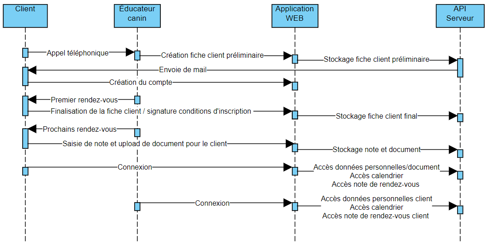
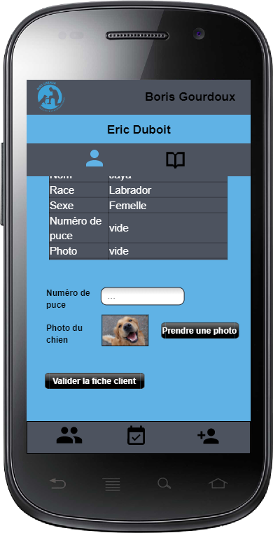
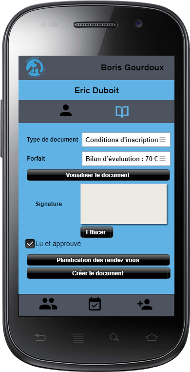

# Douceur de chien

## Cahier des charges

### Objectif du projet

La PWA (Progressive web app) permettra de faciliter les différentes tâches d'organisation, de prise en charge et de relation d'un client et d'un éducateur canin. L'éducateur canin aura la possibilité de se connecter à l'application afin de pouvoir gérer/visualiser/éditer les différentes informations de ses clients. Il pourra consulter son planning de rendez-vous afin de pouvoir trouver une date adéquate pour un rendez-vous avec un client. L'éducateur canin aura la possibilité de faire signer numériquement les différents contrats lors d'un rendez-vous et d'y stocker avec d'autres documents dans un dossier partagé que le client aura accès depuis son compte. Le client quant à lui, aura la possibilité de se connecter à l'application afin d'accéder à ses informations personnelles, ses contrats signé/documents et ses rendez-vous planifiés avec un éducateur canin. Il pourra également, s'il le souhaite, planifier son propre rendez-vous avec l'éducateur canin depuis le calendrier disponible sur la page d'accueil de l'application.

### Description détaillée

La PWA permet à un éducateur canin ou à un client de se connecter à l'application pour avoir accès à différentes fonctionnalités.
L'éducateur canin a accès à un calendrier avec tous ses rendez-vous planifié et à une liste contenant tous ses actuels clients où il peut, s'il le souhaite, faire une recherche spécifique par nom afin de visualiser leurs différentes informations, telles que :

* Les informations personnelles du client
  * Nom
  * Prénom
  * Téléphone
  * Adresse mail
  * Adresse du domicile
* Les informations personnelles du chien
  * Date de naissance
  * Race
  * Sexe
  * Nom
  * Photo
  * Numéro de puce sous-cutanée
* Les documents partagés entre le client et l'éducateur canin
  * Conditions d'inscription signé
  * Fiches récapitulatif du cours
  * Autres

L'éducateur doit éditer son horaire afin de permettre au futur client de planifier leurs propres rendez-vous. 

L'éducateur canin doit procéder à une création préliminaire d'une fiche cliente, le client concerné sera averti par mail qu'une fiche à été créé avec ses informations, il devra alors valider son compte pour pouvoir y accéder. Lors du premier rendez-vous, l'éducateur canin doit compléter la fiche cliente avec les données qui nécessite une rencontre physique.

L'éducateur canin peut à tout moment lors d'un rendez-vous, accéder à la fiche du client afin de pouvoir y rentrer différentes informations :

- Note personnel de l'éducateur canin du cours sous format texte
- Note personnel de l'éducateur canin du cours sous format graphique
- Note récapitulatif du cours
- Documents à partager

Si le rendez-vous entre l'éducateur canin et le client est le premier, alors l'éducateur doit faire signer depuis l'application, les conditions d'inscription au client.

Le client quant à lui peut planifier son propre rendez-vous respectant les horaires spécifié par l'éducateur canin depuis le calendrier disponible sur la page d'accueil de l'application, il rentrera lui-même ses propres informations personnelles que l'éducateur canin validera lors de la première rencontre. Le client peut également se connecter à l'application après s'être inscrit pour accéder à ses informations personnelles ainsi que ses documents.

### Liste des fonctionnalités

#### Fonctionnalités de l'éducateur canin

- Connexion à l'application
- Accès au calendrier de ses rendez-vous
- Édition de l'horaire personnel
- Affichage de tout les clients avec photo du chien et nom de son maitre
- Recherche spécifique d'un client par nom
- Accès aux informations personnelles d'un client depuis la recherche spécifique ou du calendrier de rendez-vous
- Création préliminaire d'une fiche client
- Accès et création de contenu séance d'un client depuis la recherche spécifique ou le calendrier de rendez-vous

#### Fonctionnalités du client

- Prise de rendez-vous autonome
- Inscription à l'application
- Connexion à l'application
- Accès au calendrier de ses rendez-vous
- Accès à ses informations personnelles
- Accès à ses documents personnelles
- Accès à ses différents contenus séances 

### Scénario d'utilisation

#### Prise en charge d'un nouveau client depuis l'application

1. Le client accède à l'application et sélectionne sur le calendrier de la page d'accueil son propre rendez-vous respectant les horaires que l'éducateur canin aura préalablement configuré.

2. Il devra rentrer différentes informations comme :

   * Son nom
   * Son prénom
   * Son numéro de téléphone
   * Son adresse e-mail
   * Son adresse de domicile
   * La date de naissance du chien
   * La race du chien
   * Le sexe du chien
   * Le nom du chien
   * Son mot de passe

   Le client recevra un mail pour valider la création de son compte ainsi que du rendez-vous.

3. L'éducateur canin recevra un mail avec toute les données du rendez-vous qu'il pourra également consulter sur son calendrier personnel.

#### Prise en charge d'un nouveau client par téléphone

1. Le client appel l'éducateur canin avec son téléphone car il a besoin de ses services.
2. L'éducateur canin va se rendre sur l'application et se connecter avec ses identifiants.
3. Il va se rendre sur l'interface de création d'une nouvelle fiche client.
4. Il va y renter les informations personnelles du client communiqué par téléphone :
   - Nom du client
   - Prénom du client
   - Téléphone du client
   - Adresse e-mail du client
   - Adresse du domicile du client
   - Date de naissance du chien
   - Race du chien
   - Sexe du chien
   - Nom du chien
5. Il aura accès à son calendrier personnel afin de visualiser à quelle date il peut se rendre au domicile du client.
6. Le client ainsi que l'éducateur se mettront d'accord sur la date du rendez-vous.
7. L'éducateur canin sélectionnera cette date dans le calendrier.
8. Une fois la fiche client préliminaire avec la date du premier rendez-vous remplis, un mail sera envoyé au client afin qu'il puisse créer son compte dans l'application afin d'avoir accès à différentes fonctionnalités.

#### Première rencontre physique avec le client 

1. L'éducateur canin se rend au domicile du client à la date spécifié lors de l'appel téléphonique ou du rendez-vous pris depuis l'application. 
2. Il va se rendre sur l'application et se connecter avec ses identifiants.
3. Il va rechercher le client grâce à son nom et accéder à sa fiche cliente précédemment créée lors de l'appel téléphonique ou du rendez-vous pris depuis l'application.
4. Il va montrer les données personnelles du client et lui demander une vérification de celle-ci.
5. Si elles sont fausses, modification de celle-ci.
6. Si elles sont correctes, l'éducateur canin devra prendre une photo du chien ainsi que de rentrer manuellement les 15 chiffres du code de la puce sous-cutanée du chien.
7. Il pourra ensuite sauvegarder cette version final de la fiche client.

#### Rendez-vous avec le client

1. L'éducateur canin peut à tout moment lors d'un rendez-vous, accéder à la fiche du client afin de pouvoir y ajouter différentes données :
   - Note du cours sous format texte (accessible uniquement par l'éducateur)
   - Note du cours sous format graphique (accessible uniquement par l'éducateur)
   - Note récapitulatif du cours (accessible par l'éducateur ainsi que le client)
   - Document PDF (accessible par l'éducateur ainsi que le client)
2. Si le rendez-vous est le premier, alors le client doit depuis l'application de l'éducateur :
   1. Choisir le forfait qu'il désire.
   2. Ajouter sa signature depuis l'application.
   3. Visualiser la version final des conditions d'inscriptions. 
   4. Validée s'il est d'accord en cochant une case "Lu et approuvé".
   5. Les conditions d'inscription sous format PDF ainsi qu'une génération automatique d'une facture sous format PDF sera ajouté au dossier partagé du client et envoyé par mail au client.

### Étude des technologies

#### Application mobile ou application WEB

#### Backend

##### API REST

Afin de gérer les différentes données de mon application, j'ai décidé de développer une API respectant l'ensemble de principes architecturaux REST me permettant de rendre mes données plus facilement utilisable lors de futurs projets en lien avec mon travail de diplôme. Pour la réalisation de cette API REST, j'ai été confronté à plusieurs choix de framework, comme :

* Ruby on Rails
* Phoenix
* Laravel
* Django
* Yii

Ruby on Rails utilisant comme langage Ruby, Phoenix utilisant Elixir et Django utilisant Python, je me suis tous naturellement tourné vers l'utilisation d'un framework PHP. En effet, PHP est un langage beaucoup plus familier pour moi, car je l'ai utilisé tout au long de ma formation. Restant les framework PHP Yii et Laravel à départagé, j'ai choisi Laravel pour différentes raisons. La première est que je l'ai déjà utilisé lors de ma formation. La deuxième est que Laravel fournit une documentation complète et lisible ainsi qu'une communauté conséquente. La dernière est que Laravel propose un nombre incalculable de fonctionnalités très utile comme :

* Un système de migration
* La création de données de test
* Une interface de ligne de commande
* Un moteur de routage simple et rapide
* Des tests faciles à exécuter
* Et encore...  

[Laravel](https://laravel.com/)

##### Génération de PDF

Afin de pouvoir créer manuellement les différents contrats PDF de mon application, j'ai recherché différentes façons de procéder. Après mettre rendu compte que la plupart des outils existants étaient payant(PDFTron, radaeePDF), je me suis dirigé vers une solution gratuite et open-source de génération de PDF en PHP.

[TCPDF](https://tcpdf.org/)

##### Envoie de mail

Afin d'envoyer les différents mails aux clients lors de la création du compte ou la création des documents PDF comme les conditions d'inscription ou les factures. Je compte utiliser directement l'API de messagerie proposé par Laravel.

[Laravel Mail](https://laravel.com/docs/8.x/mail)

#### Frontend

##### Bootstrap

Afin de développer le frontend de mon application, plus précisément de ma PWA (Progressive web app), j'ai été confronté à différents choix de framework, comme :

* Angular
* React
* Vue
* Bootstrap

Angular offre beaucoup de fonctionnalité très pratique. Il permet de réduire la quantité de code en fournissant des fonctionnalités importantes par défaut, il est le seul à proposer une synchronisation en temps réel entre le modèle et la vue et de ce fait, le rend très performant. Malgré sa documentation très détaillée, Angular est très complexe et demande l'apprentissage de nouveaux concepts comme l'utilisation de TypeScript. 

React est connu pour être la concurrence directe d'Angular. En effet, ce framework est connu pour offrir une meilleure courbe d'apprentissage, React se démarque par sa simplicité et son développement rapide permettant un gain de temps, il permet également une intégration rapide sur mobile via React Native. Comme inconvénient, on pourrait reprocher à React un manque de documentation officielle.

Ayant partiellement utilisé Vue lors de mon apprentissage, je me suis dit qu'il était bon de l'inclure dans ma recherche. En effet, Vue met à disposition de ses utilisateurs une documentation complète et très détaillée ainsi qu'une syntaxe simple et pur JavaScript. Le plus grand point faible de Vue est sa très petite communauté. 

Le dernier de ma liste, mais non le moindre est Bootstrap. Ce framework plus que complet propose un nombre conséquent de composant facilement intégrable ainsi qu'une énorme communauté contribuant au développement d'autres composants. Sa simplicité déconcertante, sa documentation très complète et son système de grille en fait également l'un des framework les plus utilisés. Le point faible de Bootstrap est le fait qu'il soit plus lourd que ces concurrents et de ce fait, moins performant.

Angular étant plutôt complexe, React ayant une faible documentation et Vue ayant une petite communauté, j'ai choisi de me tourner vers la simplicité et non la performance pour la réalisation de mon travail de diplôme. Malgré ses plus faibles performances, et afin de ne pas perdre trop de temps lors de mon développement, je compte utiliser le framework Bootstrap afin de développer ma PWA. 

[Bootstrap](https://getbootstrap.com/)

##### Dessin dans un canevas

Afin de pouvoir signer numériquement les contrats ainsi que prendre les notes graphiques de mon application, j'ai choisi un module responsive sans dépendances pour répondre aux attentes de mon application qui devra être fonctionnelle sur mobile.

[Responsive-Sketchpad](https://github.com/tsand/responsive-sketchpad)

##### Calendrier

Afin d'afficher les rendez-vous de l'éducateur canin ainsi que des clients, je compte utiliser un calendrier. Pour respecter la disponibilité de mon application sur mobile, j'ai besoin d'implémenter un calendrier responsive. Afin de ne pas perdre trop de temps lors du développement, je compte utiliser FullCalendar, car il est très complet et que je l'ai déjà utilisé lors de mon TPI. 

[FullCalendar](https://fullcalendar.io/)

### Modèle de données

<table>
    <tr>
    	<th style="text-align:center" COLSPAN="4">user</th>
    </tr>
    <tr>
        <th>Nom</th>
        <th>Type</th>
        <th>Null</th>
        <th>Définition</th>
    </tr>
    <tr>
        <td>email</td>
        <td>varchar</td>
        <td>not null</td>
        <td>Addresse email de l'utilisateur.</td>
    </tr>
    <tr>
        <td>firstname</td>
        <td>varchar</td>
        <td>not null</td>
        <td>Prénom de l'utilisateur.</td>
    </tr>
    <tr>
        <td>secondname</td>
        <td>varchar</td>
        <td>not null</td>
        <td>Nom de l'utilisateur.</td>
    </tr>
    <tr>
        <td>phonenumber</td>
        <td>varchar</td>
        <td>not null</td>
        <td>Numéro de téléphone de l'utilisateur.</td>
    </tr>
    <tr>
        <td>address</td>
        <td>varchar</td>
        <td>not null</td>
        <td>Adresse du domicile de l'utilisateur.</td>
    </tr>
    <tr>
        <td>password</td>
        <td>varchar</td>
        <td>null</td>
        <td>Mot de passe hashé.</td>
    </tr>
    <tr>
        <td>api_token</td>
        <td>varchar</td>
        <td>not null</td>
        <td>Token d'authentification de l'utilisateur.</td>
    </tr>
    <tr>
        <td>is_administrator</td>
        <td>boolean</td>
        <td>not null</td>
        <td>Booléan définisant le rôle de l'utilisateur.</td>
    </tr>
</table>
   <table>
    <tr>
    	<th style="text-align:center" COLSPAN="4">dog</th>
    </tr>
    <tr>
        <th>Nom</th>
        <th>Type</th>
        <th>Null</th>
        <th>Définition</th>
    </tr>
    <tr>
        <td>name</td>
        <td>varchar</td>
        <td>not null</td>
        <td>Nom du chien.</td>
    </tr>
    <tr>
        <td>dog_breed</td>
        <td>varchar</td>
        <td>not null</td>
        <td>Race du chien.</td>
    </tr>
     <tr>
        <td>sex</td>
        <td>varchar</td>
        <td>not null</td>
        <td>Sexe du chien.</td>
    </tr>
     <tr>
        <td>path_dog_picture</td>
        <td>varchar</td>
        <td>null</td>
        <td>Chemin d'accès de la photo du chien.</td>
    </tr>
    <tr>
        <td>chip_id</td>
        <td>varchar</td>
        <td>null</td>
        <td>Code composé de 15 chiffres (3 pour le pays, 2 pour le type d'animal, 2 pour le fabricant, 8 pour le n° de l'animal).</td>
    </tr>
</table>
   <table>
    <tr>
    	<th style="text-align:center" COLSPAN="4">document</th>
    </tr>
    <tr>
        <th>Nom</th>
        <th>Type</th>
        <th>Null</th>
        <th>Définition</th>
    </tr>
    <tr>
        <td>type</td>
        <td>type_document</td>
        <td>not null</td>
        <td>Type de document (conditions d'inscription, poster, résumé du cours canin,ect...) .</td>
    </tr>
    <tr>
        <td>path</td>
        <td>varchar</td>
        <td>not null</td>
        <td>Chemin d'accès du document.</td>
    </tr>
</table>
   <table>
    <tr>
    	<th style="text-align:center" COLSPAN="4">courseContent</th>
    </tr>
    <tr>
        <th>Nom</th>
        <th>Type</th>
        <th>Null</th>
        <th>Définition</th>
    </tr>
    <tr>
        <td>course_note_text</td>
        <td>varchar</td>
        <td>null</td>
        <td>Note du cours sous format texte.</td>
    </tr>
      <tr>
        <td>path_course_note_graphical</td>
        <td>varchar</td>
        <td>null</td>
        <td>Chemin d'accès de note du cours sous format graphique.</td>
    </tr>
       <tr>
        <td>course_summary</td>
        <td>varchar</td>
        <td>null</td>
        <td>Note récapitulatif du cours.</td>
    </tr>
       </tr>
       <tr>
        <td>date</td>
        <td>datetime</td>
        <td>not null</td>
        <td>Date du cours.</td>
    </tr>
</table>

##### Diagramme de séquence

### Maquettes de l'application
#### Client

##### Information personnelles

##### Calendrier

##### Contenu séances

#### Éducateur canin

##### Affichage de tout les clients

##### Calendrier

##### Création de fiche client préliminaire

##### Affichage fiche client

##### Validation de fiche client

##### Contenue séance d'un client

##### Ajout de document

#### Mindmap

.jpg)

### Planning

### Fonctionnalités envisagées mais non retenues

#### Scan Bluetooth des puces sous-cutanées canine RFID

Lors de la réalisation de ce cahier des charges, j'ai envisagé le fait d'introduire la possibilité de scanner la puce sous-cutanée canine directement en Bluetooth grâce à un équipement externe. J'ai décidé de ne pas retenir cette fonctionnalité due à sa grande complexité et à son utilité minime. En effet, premièrement, le temps de développement est trop conséquent par rapport à la plus-value direct que peut me rajouter cette fonctionnalité. Deuxièmement, ce code est utilisable uniquement par des vétérinaires et autre autorité compétente. Je compte tout de même garder cette donnée afin de rendre mes données compatibles avec d'autres projets futurs pour la société Douceur de Chien.

### Matériel et logiciel

- Ordinateur Windows 10
- IDE (Visual Studio Code)
- Outil de versioning de code (GIT avec repository en ligne sur GitHub)
- Outil bureautique ([Typora](https://typora.io/))
- Éditeur de diagramme ([Visual Paradigm Online](https://online.visual-paradigm.com/fr/))
- Éditeur de base de données ([dbdiagram.io](https://dbdiagram.io/home))
- Éditeur de maquette ([Pencil](https://pencil.evolus.vn/))
- Éditeur de planning (Excel)
- Éditeur de MindMap ([Miro](https://miro.com/))

### Librairies utilisées

* Création de PDF en PHP ([TCPDF](https://tcpdf.org/examples/))
* Dessiner dans un canevas ([responsive-sketchpad](https://github.com/tsand/responsive-sketchpad))
* Création de calendrier en JavaScript ([fullcalendar.io](https://fullcalendar.io/))

