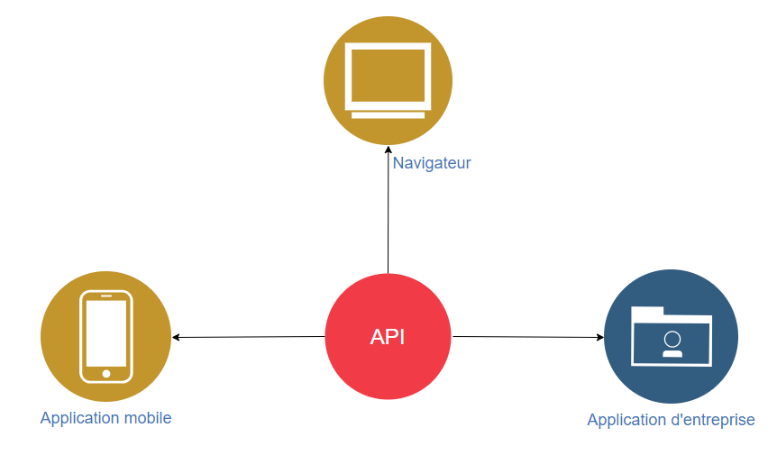
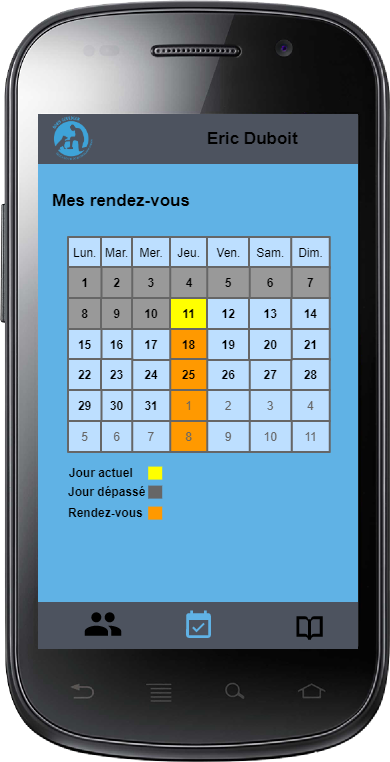

# Cahier des charges Douceur de Chien

## Tables des matières

- [Cahier des charges Douceur de Chien](#cahier-des-charges-douceur-de-chien)
  - [Tables des matières](#tables-des-matières)
  - [Objectif du projet](#objectif-du-projet)
  - [Description détaillée](#description-détaillée)
  - [Liste des fonctionnalités](#liste-des-fonctionnalités)
    - [Fonctionnalités de l'éducateur canin](#fonctionnalités-de-léducateur-canin)
    - [Fonctionnalités du client](#fonctionnalités-du-client)
  - [Scénarios d'utilisation](#scénarios-dutilisation)
    - [Prise en charge d'un nouveau client depuis l'application](#prise-en-charge-dun-nouveau-client-depuis-lapplication)
    - [Prise en charge d'un nouveau client par téléphone](#prise-en-charge-dun-nouveau-client-par-téléphone)
    - [Première rencontre physique avec le client](#première-rencontre-physique-avec-le-client)
    - [Rendez-vous avec le client](#rendez-vous-avec-le-client)
  - [Étude des technologies](#étude-des-technologies)
    - [Application mobile ou application WEB](#application-mobile-ou-application-web)
    - [Backend](#backend)
      - [API REST](#api-rest)
      - [Génération de PDF](#génération-de-pdf)
      - [Envoie de mail](#envoie-de-mail)
    - [Frontend](#frontend)
      - [Bootstrap](#bootstrap)
      - [Dessin dans un canevas](#dessin-dans-un-canevas)
      - [Calendrier](#calendrier)
  - [Modèle de données](#modèle-de-données)
    - [API](#api)
    - [Diagramme de séquence](#diagramme-de-séquence)
  - [Maquettes de l'application](#maquettes-de-lapplication)
    - [Client](#client)
      - [Information personnelles](#information-personnelles)
      - [Calendrier](#calendrier-1)
      - [Contenu séances](#contenu-séances)
    - [Éducateur canin](#éducateur-canin)
      - [Affichage de tout les clients](#affichage-de-tout-les-clients)
      - [Calendrier](#calendrier-2)
      - [Création de fiche client préliminaire](#création-de-fiche-client-préliminaire)
      - [Affichage fiche client](#affichage-fiche-client)
      - [Validation de fiche client](#validation-de-fiche-client)
      - [Contenue séance d'un client](#contenue-séance-dun-client)
      - [Ajout de document](#ajout-de-document)
  - [Planning](#planning)
  - [Fonctionnalités envisagées mais non retenues](#fonctionnalités-envisagées-mais-non-retenues)
    - [Scan Bluetooth des puces sous-cutanées canine RFID](#scan-bluetooth-des-puces-sous-cutanées-canine-rfid)
  - [Matériel et logiciel](#matériel-et-logiciel)
  - [Librairies utilisées](#librairies-utilisées)
  - [Dates importantes](#dates-importantes)
  - [Livrables](#livrables)
## Objectif du projet

La PWA (Progressive web app) permettra de faciliter les différentes tâches d'organisation, de prise en charge et de relation d'un client et d'un éducateur canin. L'éducateur canin aura la possibilité de se connecter à l'application afin de pouvoir gérer/visualiser/éditer les différentes informations de ses clients. Il pourra consulter son planning de rendez-vous afin de pouvoir trouver une date adéquate pour un rendez-vous avec un client. L'éducateur canin aura la possibilité de faire signer numériquement les différents contrats lors d'un rendez-vous et d'y stocker avec d'autres documents dans un dossier partagé que le client aura accès depuis son compte. Le client quant à lui, aura la possibilité de se connecter à l'application afin d'accéder à ses informations personnelles, ses contrats signé/documents et ses rendez-vous planifiés avec un éducateur canin. Il pourra également, s'il le souhaite, planifier son propre rendez-vous avec l'éducateur canin depuis le calendrier disponible sur la page d'accueil de l'application.

## Description détaillée

La PWA permet à un éducateur canin ou à un client de se connecter à l'application pour avoir accès à différentes fonctionnalités.
L'éducateur canin a accès à un calendrier avec tous ses rendez-vous planifié et à une liste contenant tous ses actuels clients où il peut, s'il le souhaite, faire une recherche spécifique par nom afin de visualiser ou éditer leurs différentes informations, telles que :

* Les informations personnelles du client
  * Nom
  * Prénom
  * Téléphone
  * Adresse mail
  * Adresse du domicile
* Les informations personnelles du/des chiens
  * Date de naissance
  * Race
  * Sexe
  * Nom
  * Photo
  * Numéro de puce sous-cutanée
* Les documents partagés entre le client et l'éducateur canin
  * Conditions d'inscription signé
  * Fiches récapitulatif du cours
  * Autres

L'éducateur doit éditer son horaire afin de permettre au futur client de planifier leurs propres rendez-vous. 

L'éducateur canin doit procéder à une création préliminaire d'une fiche cliente, le client concerné sera averti par mail qu'une fiche à été créé avec ses informations, il devra alors valider son compte pour pouvoir y accéder. Lors du premier rendez-vous, l'éducateur canin doit compléter la fiche cliente avec les données qui nécessite une rencontre physique.

L'éducateur canin peut à tout moment lors d'un rendez-vous, accéder à la fiche du client afin de pouvoir y rentrer différentes informations :

- Note personnel de l'éducateur canin du cours sous format texte
- Note personnel de l'éducateur canin du cours sous format graphique
- Note récapitulatif du cours
- Documents à partager

Si le rendez-vous entre l'éducateur canin et le client est le premier, alors l'éducateur doit faire signer depuis l'application, les conditions d'inscription au client.

Le client quant à lui peut planifier son propre rendez-vous respectant les horaires spécifié par l'éducateur canin depuis le calendrier disponible sur la page d'accueil de l'application, il rentrera lui-même ses propres informations personnelles que l'éducateur canin validera lors de la première rencontre. Le client peut également se connecter à l'application après s'être inscrit pour accéder à ses informations personnelles ainsi que ses documents.

## Liste des fonctionnalités

### Fonctionnalités de l'éducateur canin

- Connexion à l'application
- Accès au calendrier de ses rendez-vous
- Édition de l'horaire personnel
- Affichage de tout les clients avec photo du chien et nom de son maitre
- Recherche spécifique d'un client par nom
- Accès aux informations personnelles d'un client depuis la recherche spécifique ou du calendrier de rendez-vous
- Création préliminaire d'une fiche client
- Accès et création de contenu séance d'un client depuis la recherche spécifique ou le calendrier de rendez-vous

### Fonctionnalités du client

- Prise de rendez-vous autonome
- Inscription à l'application
- Connexion à l'application
- Accès au calendrier de ses rendez-vous
- Accès à ses informations personnelles
- Accès à ses documents personnelles
- Accès à ses différents contenus séances 

## Scénarios d'utilisation

### Prise en charge d'un nouveau client depuis l'application

1. Le client accède à l'application et sélectionne sur le calendrier de la page d'accueil son propre rendez-vous respectant les horaires que l'éducateur canin aura préalablement configuré.

2. Il devra rentrer différentes informations comme :

   * Son nom
   * Son prénom
   * Son numéro de téléphone
   * Son adresse e-mail
   * Son adresse de domicile
   * La date de naissance du chien
   * La race du chien
   * Le sexe du chien
   * Le nom du chien
   * Son mot de passe

   Le client recevra un mail pour valider la création de son compte ainsi que du rendez-vous.

3. L'éducateur canin recevra un mail avec toute les données du rendez-vous qu'il pourra également consulter sur son calendrier personnel.

### Prise en charge d'un nouveau client par téléphone

1. Le client appel l'éducateur canin avec son téléphone car il a besoin de ses services.
2. L'éducateur canin va se rendre sur l'application et se connecter avec ses identifiants.
3. Il va se rendre sur l'interface de création d'une nouvelle fiche client.
4. Il va y rentrer les informations personnelles du client communiqué par téléphone :
   - Nom du client
   - Prénom du client
   - Téléphone du client
   - Adresse e-mail du client
   - Adresse du domicile du client
   - Date de naissance du chien
   - Race du chien
   - Sexe du chien
   - Nom du chien
5. Il aura accès à son calendrier personnel afin de visualiser à quelle date il peut se rendre au domicile du client.
6. Le client ainsi que l'éducateur se mettront d'accord sur la date du rendez-vous.
7. L'éducateur canin sélectionnera cette date dans le calendrier.
8. Une fois la fiche client préliminaire avec la date du premier rendez-vous remplis, un mail sera envoyé au client afin qu'il puisse créer son compte dans l'application afin d'avoir accès à différentes fonctionnalités.

### Première rencontre physique avec le client 

1. L'éducateur canin se rend au domicile du client à la date spécifié lors de l'appel téléphonique ou du rendez-vous pris depuis l'application. 
2. Il va se rendre sur l'application et se connecter avec ses identifiants.
3. Il va rechercher le client grâce à son nom et accéder à sa fiche cliente précédemment créée lors de l'appel téléphonique ou du rendez-vous pris depuis l'application.
4. Il va montrer les données personnelles du client et lui demander une vérification de celle-ci.
5. Si elles sont fausses, modification de celle-ci.
6. Si elles sont correctes, l'éducateur canin devra prendre une photo du chien ainsi que de rentrer manuellement les 15 chiffres du code de la puce sous-cutanée du chien (si existante).
7. Il pourra ensuite sauvegarder cette version final de la fiche client.

### Rendez-vous avec le client

1. L'éducateur canin peut à tout moment lors d'un rendez-vous, accéder à la fiche du client afin de pouvoir y ajouter différentes données :
   - Note du cours sous format texte (accessible uniquement par l'éducateur)
   - Note du cours sous format graphique (accessible uniquement par l'éducateur)
   - Note récapitulatif du cours (accessible par l'éducateur ainsi que le client)
   - Document PDF (accessible par l'éducateur ainsi que le client)
2. Si le rendez-vous est le premier, alors le client doit depuis l'application de l'éducateur :
   1. Choisir le forfait qu'il désire.
   2. Ajouter sa signature depuis l'application.
   3. Visualiser la version final des conditions d'inscriptions. 
   4. Validée s'il est d'accord en cochant une case "Lu et approuvé".
   5. Les conditions d'inscription sous format PDF ainsi qu'une génération automatique d'une facture sous format PDF sera ajouté au dossier partagé du client et envoyé par mail au client.

## Étude des technologies

### Application mobile ou application WEB

Après avoir discuté avec le client de mon application, nous avons convenu qu'il lui fallait une application disponible et utilisable sur mobile, je me suis premièrement tourné vers le développement d'une application mobile avec Cordova. Après discussion avec des professeurs du CFPT, ceux-là ont mis en évidence une certaine problématique, le développement et la mise en place d'une application mobile pour les clients d'un éducateur canin est trop restrictive et pas réellement pratique. Afin de répondre aux attentes de mon application, je me suis orienté sur le développement d'une PWA. C'est-à-dire une application WEB disponible autant sur grand écran que petit écran et affiché de la même manière qu'une application mobile. 

### Backend

#### API REST

Afin de gérer les différentes données de mon application, j'ai décidé de développer une API respectant l'ensemble de principes architecturaux REST me permettant de rendre mes données plus facilement utilisable lors de futurs projets en lien avec mon travail de diplôme. Pour la réalisation de cette API REST, j'ai été tenté plusieurs choix de framework, comme :

* Ruby on Rails
* Phoenix
* Laravel
* Django
* Yii

Ruby on Rails utilisant comme langage Ruby, Phoenix utilisant Elixir et Django utilisant Python, je me suis tous naturellement tourné vers l'utilisation d'un framework PHP. En effet, PHP est un langage beaucoup plus familier pour moi, car je l'ai utilisé tout au long de ma formation. Restant les framework PHP Yii et Laravel à départagé, j'ai en premier lieu choisi Laravel pour différentes raisons. La première est que je l'ai déjà utilisé lors de ma formation. La deuxième est que Laravel fournit une documentation complète et lisible ainsi qu'une communauté conséquente. La dernière est que Laravel propose un nombre incalculable de fonctionnalités très utile directement intégré à celui-ci. Toutefois, Malgré toutes les qualités qu'un Framework quelconque peut m'offrir lors du développement de mon API, j'ai décidé de développer mon API en PHP pur afin de rendre mon api maintenable plus facilement. En effet, le développement natif de mon API permettrait à un autre développeur de reprendre le développement de celle-ci sans contrainte de connaissance dans un framework particulier.

#### Génération de PDF

Afin de pouvoir créer manuellement les différents documents PDF de mon application, j'ai recherché différentes façons de procéder. Après mettre rendu compte que la plupart des outils existants étaient payant (PDFTron, radaeePDF), je me suis dirigé vers une solution gratuite et open-source de génération de PDF en PHP proposé par mon maitre de diplôme : TCPDF. Malheureusement, lors de mon POC, je me suis rendu compte que la version actuelle n'était pas maintenue. J'ai donc continué mes recherches jusqu'à trouver une librairie très pratique me permettant de convertir du HTML en PDF.

[DOMPDF](https://github.com/dompdf/dompdf)

#### Envoie de mail

Afin d'envoyer les différents mails aux clients lors de la création du compte ou la création des documents PDF. Je compte utiliser la librairie PHPMailer.

[PHPMailer](https://github.com/PHPMailer/PHPMailer)

### Frontend

#### Bootstrap

Afin de développer le frontend de mon application, plus précisément de ma PWA (Progressive web app), j'ai été confronté à différents choix de framework, comme :

* Angular
* React
* Vue
* Bootstrap

Angular offre beaucoup de fonctionnalité très pratique. Il permet de réduire la quantité de code en fournissant des fonctionnalités importantes par défaut, il propose une synchronisation en temps réel entre le modèle et la vue et de ce fait, le rend très performant. Malgré sa documentation très détaillée, Angular est très complexe et demande l'apprentissage de nouveaux concepts comme l'utilisation de TypeScript. 

React est connu pour être la concurrence directe d'Angular. En effet, ce framework est connu pour offrir une meilleure courbe d'apprentissage, React se démarque par sa simplicité et son développement rapide permettant un gain de temps, il permet également une intégration rapide sur mobile via React Native. Comme inconvénient, on pourrait reprocher à React un manque de documentation officielle.

Ayant partiellement utilisé Vue lors de mon apprentissage, je me suis dit qu'il était bon de l'inclure dans ma recherche. En effet, Vue met à disposition de ses utilisateurs une documentation complète et très détaillée ainsi qu'une syntaxe simple et pur JavaScript. Malgré le fait que Vue ait été implémenté récemment à Laravel, le point faible de Vue pour moi est sa complexité. 

Le dernier de ma liste est Bootstrap. Ce framework plus que complet propose un nombre conséquent de composant facilement intégrable ainsi qu'une énorme communauté contribuant au développement d'autres composants. Sa simplicité, sa documentation très complète et son système de grille en fait également l'un des framework les plus utilisés. Le point faible de Bootstrap est le fait qu'il soit plus lourd que ces concurrents et de ce fait, moins performant.

Angular et Vue étant plutôt complexe, React ayant une faible documentation, j'ai choisi de me tourner vers la simplicité et non la performance pour la réalisation de mon travail de diplôme. Malgré ses plus faibles performances, et afin de ne pas perdre trop de temps lors de mon développement, je compte utiliser le framework Bootstrap afin de développer ma PWA. 

[Bootstrap](https://getbootstrap.com/)

#### Dessin dans un canevas

Afin de pouvoir signer numériquement les contrats ainsi que prendre les notes graphiques de mon application, j'ai choisi un module responsive sans dépendances pour répondre aux attentes de mon application qui devra être fonctionnelle sur mobile.

[Responsive-Sketchpad](https://github.com/tsand/responsive-sketchpad)

#### Calendrier

Afin d'afficher les rendez-vous de l'éducateur canin ainsi que des clients, je compte utiliser un calendrier. Pour respecter la disponibilité de mon application sur mobile, j'ai besoin d'implémenter un calendrier responsive. Afin de ne pas perdre trop de temps lors du développement, je compte utiliser FullCalendar, car il est très complet et que je l'ai déjà utilisé lors de mon TPI. 

[FullCalendar](https://fullcalendar.io/)

## Modèle de données

<table>
    <tr>
    	<th style="text-align:center; font-size: 26px;" COLSPAN="4">user</th>
    </tr>
    <tr>
        <th>Nom</th>
        <th>Type</th>
        <th>Null</th>
        <th>Définition</th>
    </tr>
    <tr>
        <td>email</td>
        <td>varchar</td>
        <td>not null</td>
        <td>Addresse email de l'utilisateur.</td>
    </tr>
    <tr>
        <td>firstname</td>
        <td>varchar</td>
        <td>not null</td>
        <td>Prénom de l'utilisateur.</td>
    </tr>
    <tr>
        <td>lastname</td>
        <td>varchar</td>
        <td>not null</td>
        <td>Nom de l'utilisateur.</td>
    </tr>
    <tr>
        <td>phonenumber</td>
        <td>varchar</td>
        <td>not null</td>
        <td>Numéro de téléphone de l'utilisateur.</td>
    </tr>
    <tr>
        <td>address</td>
        <td>varchar</td>
        <td>not null</td>
        <td>Adresse du domicile de l'utilisateur.</td>
    </tr>
    <tr>
        <td>api_token</td>
        <td>varchar</td>
        <td>not null</td>
        <td>Token d'authentification de l'utilisateur.</td>
    </tr>
    <tr>
        <td>code_role</td>
        <td>varchar</td>
        <td>not null</td>
        <td>Code corréspondant au rôle de l'utilisateur (client, éducateur canin, autre).</td>
    </tr>
    <tr>
        <td>password_hash</td>
        <td>varchar</td>
        <td>null</td>
        <td>Hash du mot de passe de l'utilisateur.</td>
    </tr>
    <tr>
        <td>password_salt</td>
        <td>varchar</td>
        <td>null</td>
        <td>Salt du mot de passe de l'utilisateur.</td>
    </tr>
    <tr>
    	<th style="text-align:center; font-size: 26px;" COLSPAN="4">dog</th>
    </tr>
    <tr>
        <th>Nom</th>
        <th>Type</th>
        <th>Null</th>
        <th>Définition</th>
    </tr>
    <tr>
        <td>name</td>
        <td>varchar</td>
        <td>not null</td>
        <td>Nom du chien.</td>
    </tr>
    <tr>
        <td>breed</td>
        <td>varchar</td>
        <td>not null</td>
        <td>Race du chien.</td>
    </tr>
     <tr>
        <td>sex</td>
        <td>varchar</td>
        <td>not null</td>
        <td>Sexe du chien.</td>
    </tr>
     <tr>
        <td>picture_serial_number</td>
        <td>varchar</td>
        <td>null</td>
        <td>Numéro d'identification de la photo du chien.</td>
    </tr>
    <tr>
        <td>chip_id</td>
        <td>varchar</td>
        <td>null</td>
        <td>Code composé de 15 chiffres (3 pour le pays, 2 pour le type d'animal, 2 pour le fabricant, 8 pour le n° de l'animal).</td>
    </tr>
    <tr>
    	<th style="text-align:center; font-size: 26px;" COLSPAN="4">document</th>
    </tr>
    <tr>
        <th>Nom</th>
        <th>Type</th>
        <th>Null</th>
        <th>Définition</th>
    </tr>
    <tr>
        <td>document_serial_number</td>
        <td>varchar</td>
        <td>not null</td>
        <td>Numéro d'identification du document PDF.</td>
    </tr>
    <tr>
        <td>type</td>
        <td>type</td>
        <td>not null</td>
        <td>Type de document (conditions d'inscription, poster, autre).</td>
    </tr>
    <tr>
    	<th style="text-align:center; font-size: 26px;" COLSPAN="4">appoitment</th>
    </tr>
    <tr>
        <th>Nom</th>
        <th>Type</th>
        <th>Null</th>
        <th>Définition</th>
    </tr>
    <tr>
        <td>datetime_appoitment</td>
        <td>datetime</td>
        <td>not null</td>
        <td>Date du rendez-vous.</td>
    </tr>
      <tr>
        <td>duration_in_hour</td>
        <td>varchar</td>
        <td>not null</td>
        <td>Durée en heure du rendez-vous.</td>
    </tr>
       <tr>
        <td>note_text</td>
        <td>text</td>
        <td>null</td>
        <td>Note textuel du rendez-vous.</td>
    </tr>
       </tr>
       <tr>
        <td>note_graphical_serial_number</td>
        <td>varchar</td>
        <td>null</td>
        <td>Numéro d'identification de l'image des notes graphiques du rendez-vous.</td>
    </tr>
	<tr>
        <td>summary</td>
        <td>text</td>
        <td>null</td>
        <td>Résumé du rendez-vous.</td>
    </tr>
	<tr>
        <td>datetime_deletion</td>
        <td>datetime</td>
        <td>null</td>
        <td>Date de la suppression du rendez-vous.</td>
    </tr>
    <tr>
    	<th style="text-align:center; font-size: 26px;" COLSPAN="4">weekly_schedule</th>
    </tr>
    <tr>
        <th>Nom</th>
        <th>Type</th>
        <th>Null</th>
        <th>Définition</th>
    </tr>
    <tr>
        <td>date_valid_from</td>
        <td>date</td>
        <td>not null</td>
        <td>Date de début d'un planning.</td>
    </tr>
      <tr>
        <td>date_valid_from</td>
        <td>date</td>
        <td>null</td>
        <td>Date de fin d'un planning.</td>
    </tr>
       <tr>
        <td>is_deleted</td>
        <td>text</td>
        <td>not null</td>
        <td>Status du planning.</td>
    </tr>
    <tr>
    	<th style="text-align:center; font-size: 26px;" COLSPAN="4">time_slot</th>
    </tr>
    <tr>
        <th>Nom</th>
        <th>Type</th>
        <th>Null</th>
        <th>Définition</th>
    </tr>
    <tr>
        <td>code_day</td>
        <td>varchar</td>
        <td>not null</td>
        <td>Code correspondant à un jour de la semaine.</td>
    </tr>
      <tr>
        <td>time_start</td>
        <td>TIME</td>
        <td>not null</td>
        <td>horraire de début du slot de rendez-vous.</td>
    </tr>
    <tr>
        <td>time_end</td>
        <td>TIME</td>
        <td>not null</td>
        <td>horraire de fin du slot de rendez-vous.</td>
    </tr>
   	 <tr>
        <td>is_deleted</td>
        <td>text</td>
        <td>not null</td>
        <td>Status du slot.</td>
    </tr>
    <tr>
    	<th style="text-align:center; font-size: 26px;" COLSPAN="4">schedule_override</th>
    </tr>
    <tr>
        <th>Nom</th>
        <th>Type</th>
        <th>Null</th>
        <th>Définition</th>
    </tr>
    <tr>
        <td>datetime_schedule_override</td>
        <td>date</td>
        <td>not null</td>
        <td>Date d'une exception dans un planning.</td>
    </tr>
       <tr>
        <td>is_deleted</td>
        <td>text</td>
        <td>not null</td>
        <td>Status de l'exception.</td>
    </tr>
    <tr>
    	<th style="text-align:center; font-size: 26px;" COLSPAN="4">absence</th>
    </tr>
    <tr>
        <th>Nom</th>
        <th>Type</th>
        <th>Null</th>
        <th>Définition</th>
    </tr>
    <tr>
        <td>date_absence_from</td>
        <td>date</td>
        <td>not null</td>
        <td>Date de début de congé.</td>
    </tr>
        <tr>
        <td>date_absence_to</td>
        <td>date</td>
        <td>null</td>
        <td>Date de fin de congé.</td>
    </tr>
    </tr>
        <tr>
        <td>description</td>
        <td>varchar</td>
        <td>null</td>
        <td>Description du congé.</td>
    </tr>
       <tr>
        <td>is_deleted</td>
        <td>text</td>
        <td>not null</td>
        <td>Status du congé.</td>
    </tr>
</table>

### API

Afin de rendre les données de l'application utilisables sur différents futurs projets pour la société Douceur de Chien, je compte développer ma propre API. Celle-ci me permettra de rendre mes données réutilisables pour une application mobile native ou une application d'entreprise par exemple.

    

 
   <table>
    <tr>
    	<th style="text-align:center; font-size: 24px;" COLSPAN="4">USER</th>
    </tr>
    <tr>
        <th>VERB</th>
        <th>URL</th>
        <th>Description</th>
        <th>Permission</th>
    </tr>
     <tr>
    	<td>POST</td>
        <td>/inscription</td>
        <td>Créé un utilisateur.</td>
        <td>Utilisateur non authentifié</td>
    </tr>
    <tr>
    	<td>POST</td>
        <td>/login</td>
        <td>Permet de fournir à un utilisateur son api_token ainsi que son rôle.</td>
        <td>Utilisateur non authentifié</td>
    </tr>
    <tr>
    	<td>GET</td>
        <td>/user</td>
        <td>Récupère les données de l'utilisateur authentifié.</td>
        <td>Utilisateur authentifié, administrateur</td>
    </tr>
    <tr>
    	<td>GET</td>
        <td>/users</td>
        <td>Récupère les données de tout les utilisateurs.</td>
        <td>Administrateur</td>
    </tr>
    <tr>
    	<td>PATCH</td>
        <td>/user/{id}</td>
        <td>Modifie les données d'un utilisateur.</td>
        <td>Administrateur</td>
    </tr>
    <tr>
    	<td>DELETE</td>
        <td>/user/{id}</td>
        <td>Supprime les données d'un utilisateur.</td>
        <td>Administrateur</td>
    </tr>
    <tr>
    	<th style="text-align:center; font-size: 24px;" COLSPAN="4">DOG</th>
    </tr>
    <tr>
        <th>VERB</th>
        <th>URL</th>
        <th>Description</th>
        <th>Permission</th>
    </tr>
    <tr>
    	<td>POST</td>
        <td>/dog</td>
        <td>Créé un chien pour un utilisateur.</td>
        <td>Administrateur</td>
    </tr>
    <tr>
    	<td>GET</td>
        <td>/dog</td>
        <td>Récupère les données des chiens de l'utilisateur authentifié.</td>
        <td>Utilisateur authentifié, administrateur</td>
    </tr>
    <tr>
    	<td>GET</td>
        <td>/dogs</td>
        <td>Récupère les données de tout les chiens.</td>
        <td>Administrateur</td>
    </tr>
     <tr>
    	<td>PATCH</td>
        <td>/dog/{id}</td>
        <td>Modifie les données d'un chien d'un utilisateur.</td>
        <td>Administrateur</td>
    </tr>
    <tr>
    	<td>DELETE</td>
        <td>/dog/{id}</td>
        <td>Supprime les données d'un chien d'un utilisateur.</td>
        <td>Administrateur</td>
    </tr>
    <tr>
    	<th style="text-align:center; font-size: 24px;" COLSPAN="4">DOCUMENT</th>
    </tr>
    <tr>
        <th>VERB</th>
        <th>URL</th>
        <th>Description</th>
        <th>Permission</th>
    </tr>
    <tr>
    	<td>POST</td>
        <td>/document</td>
        <td>Créé un document pour un utilisateur.</td>
        <td>Administrateur</td>
    </tr>
    <tr>
    	<td>GET</td>
        <td>/document</td>
        <td>Récupère les documents de l'utilisateur authentifié</td>
        <td>Utilisateur authentifié, administrateur</td>
    </tr>
    <tr>
    	<td>GET</td>
        <td>/display-document/{id}</td>
        <td>Affiche le document si il appartient à l'utilisateur authentifié</td>
        <td>Utilisateur authentifié, administrateur</td>
    </tr>
    <tr>
    	<td>DELETE</td>
        <td>/document/{id}</td>
        <td>Supprime un document</td>
        <td>Administrateur</td>
    </tr>
    <th style="text-align:center; font-size: 24px;" COLSPAN="4">APPOITMENT</th>
    </tr>
    <tr>
        <th>VERB</th>
        <th>URL</th>
        <th>Description</th>
        <th>Permission</th>
    </tr>
    <tr>
    	<td>POST</td>
        <td>/appoitment</td>
        <td>Créé un rendez-vous pour un utilisateur.</td>
        <td>Utilisateur non authentifié, Utilisateur authentifié, administrateur</td>
    </tr>
    <tr>
    	<td>GET</td>
        <td>/appoitment</td>
        <td>Récupère les informations de rendez-vous de l'utilisateur authentifié</td>
        <td>Utilisateur authentifié, administrateur</td>
    </tr>
    <tr>
    	<td>GET</td>
        <td>/appoitments</td>
        <td>Récupère toutes les informations de rendez-vous de tout les utilisateurs.</td>
        <td>Utilisateur authentifié, administrateur</td>
    </tr>
	<tr>
    	<td>PATCH</td>
        <td>/appoitment/{id}</td>
        <td>Modifie les informations de rendez-vous d'un utilisateur.</td>
        <td>Administrateur</td>
    </tr>
    <tr>
    	<td>DELETE</td>
        <td>/appoitment/{id}</td>
        <td>Supprime les informations de rendez-vous d'un utilisateur</td>
        <td>Administrateur</td>
    </tr>
	<th style="text-align:center; font-size: 24px;" COLSPAN="4">PLANNING</th>
    </tr>
    <tr>
        <th>VERB</th>
        <th>URL</th>
        <th>Description</th>
        <th>Permission</th>
    </tr>
    <tr>
    	<td>POST</td>
        <td>/weekly_schedule</td>
        <td>Créé un calendrier hebdomadaire.</td>
        <td>Administrateur</td>
    </tr>
	<tr>
    	<td>POST</td>
        <td>/time_slot</td>
        <td>Créé un créneau horaire pour un calendrier hebdomadaire.</td>
        <td>Administrateur</td>
    </tr>
	<tr>
    	<td>POST</td>
        <td>/schedule_override</td>
        <td>Créé une exception pour un créneau horaire de rendez-vous.</td>
        <td>Administrateur</td>
    </tr>
	<tr>
    	<td>GET</td>
        <td>/weekly_schedule/{id}</td>
        <td>Récupère toutes les données d'un calendrier hebdomadaire</td>
        <td>Administrateur</td>
    </tr>
	<tr>
    	<td>GET</td>
        <td>/weekly_schedules</td>
        <td>Récupère toutes les données de tout les calendriers hebdomadaires</td>
        <td>Administrateur</td>
    </tr>
	<tr>
    	<td>PATCH ou DELETE</td>
        <td>/weekly_schedule/{id}</td>
        <td>Modifie/Supprime les données d'un calendrier hebdomadaire.</td>
        <td>Administrateur</td>
    </tr>
	<tr>
    	<td>PATCH ou DELETE</td>
        <td>/time_slot/{id}</td>
        <td>Modifie/Supprime les données d'un créneau horaire.</td>
        <td>Administrateur</td>
    </tr>
	<tr>
    	<td>PATCH ou DELETE</td>
        <td>/schedule_override/{id}</td>
        <td>Modifie/Supprime les données d'une exception.</td>
        <td>Administrateur</td>
    </tr>
</table>

### Diagramme de séquence

## Maquettes de l'application
### Client

#### Information personnelles

#### Calendrier

#### Contenu séances

### Éducateur canin

#### Affichage de tout les clients

#### Calendrier

#### Création de fiche client préliminaire

#### Affichage fiche client

#### Validation de fiche client

#### Contenue séance d'un client

#### Ajout de document

## Planning

## Fonctionnalités envisagées mais non retenues

### Scan Bluetooth des puces sous-cutanées canine RFID

Lors de la réalisation de ce cahier des charges, j'ai envisagé le fait d'introduire la possibilité de scanner la puce sous-cutanée canine directement en Bluetooth grâce à un équipement externe. J'ai décidé de ne pas retenir cette fonctionnalité due à sa grande complexité et à son utilité minime. En effet, premièrement, le temps de développement est trop conséquent par rapport à la plus-value direct que peut me rajouter cette fonctionnalité. Deuxièmement, ce code est utilisable uniquement par des vétérinaires et autre autorité compétente. Je compte tout de même garder cette donnée afin de rendre mes données compatibles avec d'autres futurs projets pour la société Douceur de Chien.

## Matériel et logiciel

- Ordinateur Windows 10
- IDE (Visual Studio Code)
- Outil de versioning de code (GIT avec repository en ligne sur GitHub)
- Outil bureautique ([Typora](https://typora.io/))
- Éditeur de diagramme ([Visual Paradigm Online](https://online.visual-paradigm.com/fr/) - [sequencediagram](https://sequencediagram.org/))
- Éditeur de base de données ([dbdiagram.io](https://dbdiagram.io/home))
- Éditeur de maquette ([Pencil](https://pencil.evolus.vn/))
- Éditeur de planning (Excel)
- Éditeur de MindMap ([Miro](https://miro.com/))

## Librairies utilisées

* Création de PDF grâce à du HTML ([DOMPDF](https://github.com/dompdf/dompdf)) 
* Dessiner dans un canevas ([responsive-sketchpad](https://github.com/tsand/responsive-sketchpad))
* Création de calendrier en JavaScript ([fullcalendar](https://fullcalendar.io/))

## Dates importantes

## Livrables

* Code-source
* Planning
* Documentation technique
* Manuel utilisateur (si applicable)
* Journal de travail ou LogBook
* Résumé / Abstract