# Documentation technique

- [Documentation technique](#documentation-technique)
  - [API REST](#api-rest)
    - [Arborescence](#arborescence)
      - [app/Models](#appmodels)
      - [app/DataAccessObject](#appdataaccessobject)
      - [app/Controllers](#appcontrollers)
      - [app/System](#appsystem)
      - [public](#public)
      - [storage](#storage)
      - [bootstrap.php](#bootstrapphp)
    - [Structure](#structure)
    - [Base de données](#base-de-données)
      - [Requête de génération de planning](#requête-de-génération-de-planning)
        - [Explication](#explication)
        - [Test de performance](#test-de-performance)
    - [Tests unitaires Postman](#tests-unitaires-postman)
      - [Format de code](#format-de-code)
      - [Syntaxe](#syntaxe)
    - [Composer](#composer)
    - [Librairies](#librairies)
      - [PHP dotenv](#php-dotenv)
      - [PHPMailer](#phpmailer)
      - [Dompdf](#dompdf)
    - [Fichier iCalendar](#fichier-icalendar)
    - [Endpoints](#endpoints)
      - [Headers](#headers)
      - [Listes des endpoints](#listes-des-endpoints)
  - [PWA](#pwa)
    - [Vue](#vue)
      - [Arborescence](#arborescence-1)
      - [Composants](#composants)
    - [npm](#npm)
    - [Librairies](#librairies-1)
      - [AlertifyJS](#alertifyjs)
      - [Axios](#axios)
      - [Vuex](#vuex)
      - [Vue Router](#vue-router)
      - [BootstrapVue](#bootstrapvue)
      - [Signature Pad](#signature-pad)
      - [FullCalendar](#fullcalendar)
      - [Moment.js](#momentjs)
      - [reCAPTCHA](#recaptcha)
    - [Tests Katalon Recorder](#tests-katalon-recorder)
  - [Table des figures](#table-des-figures)

## API REST

### Arborescence

```
api
│
└── app
│   └── Models
│   └── DataAccessObject
│   └── Controllers
│   └── System
└── public
└── storage
└── vendor
└── .env
└── bootstrap.php
```

#### app/Models

Le dossier Models contient les modèles de l'API REST. Chaque modèle est une représentation objet de sa table de base de données correspondante. La création de ces modèles me permet d'utiliser les données de ma base de données de manière objet.
Exemple de la classe `Dog` représentant la table `dog` de la base de données :

<figure>
   <center>
  	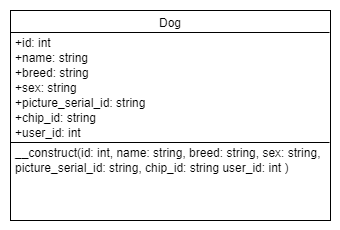      
  	<figcaption>Fig.1 - Dog Model </figcaption>
  </center>
</figure>


<figure>
   <center>
  	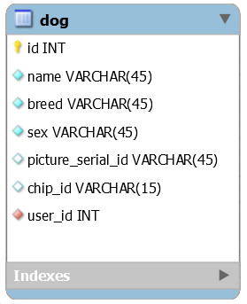      
  	<figcaption>Fig.2 - Table dog </figcaption>
  </center>
</figure>

#### app/DataAccessObject

Le dossier DataAccessObject contient les data access object (DAO) de l'API REST. Ces DAO contiennent toutes les méthodes permettant un CRUD sur sa table de base de données correspondante. Les méthodes des DAO fonctionnent de manière à créer ou récupérer des modèles afin de respecter un maximum la structure objet de l'API REST.
Exemple de la classe `DAODog` :

<figure>
   <center>
  	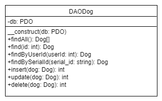      
  	<figcaption>Fig.3 - Data Access Object Dog </figcaption>
  </center>
</figure>

#### app/Controllers

Le dossier Controllers contient les contrôleurs de l'API REST. Comme leurs noms l'indiquent, le but des contrôleurs est de contrôler les différents cas d'utilisation et d'autorisation d'accès en utilisant, s'il le faut, les DAO afin de communiquer avec la base de données et en retournant les différents codes HTTP et messages en format JSON. 
Exemple de la classe `DogController` :

<figure>
   <center>
  	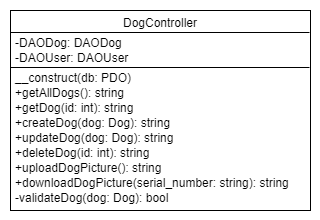      
  	<figcaption>Fig.4 - Dog Controller </figcaption>
  </center>
</figure>
Dans ce dossier résident également les contrôleurs `ResponseController` et `HelperController`. Le `ResponseController` permet de retourner toutes les différentes réponses HTTP. Le `HelperController` permet l'utilisation de méthode dite d'aide et qui n'aurait pas leur place dans un contrôleur basique.
Classes `ResponseController` et `HelperController` :

<figure>
   <center>
  	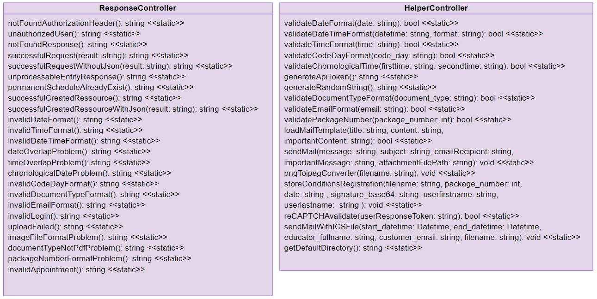      
  	<figcaption>Fig.5 - ResponseController et HelperController </figcaption>
  </center>
</figure>

#### app/System

Le dossier System contient la classe `DatabaseConnector` qui permet la connexion à la base de données en récupérant les variables d'environnements *PHP dotenv* et la classe `Constants` permettant de stocker les différentes constantes de l'API REST.
Classes `DatabaseConnector` et `Constants` :

<figure>
   <center>
  	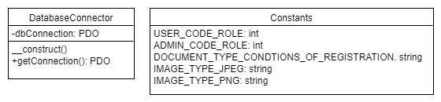      
  	<figcaption>Fig.6 - Classes DatabaseConnector et Constants </figcaption>
  </center>
</figure>

#### public

Le dossier public contient les différents fichiers d'entrée de l'API REST. Les fichiers d'entrée récupèrent le `verb HTTP` d'une requête HTTP afin de pouvoir exécuter les bonnes méthodes des contrôleurs. Ces fichiers s'occupent également d'attribuer les headers et le body si nécessaire. 

#### storage

Dossier contenant les différents fichiers uploadés de l'API REST, comme les documents PDF ou les photos de chiens par exemple. 

#### bootstrap.php

Fichier de bootage de l'API REST inclus dans tous les fichiers d'entrée, celui-ci permet de : 

* Charger les dépendances PHP du dossier vendor
* Charger les variables d'environnements
* Créer la connexion à la base de données

### Structure

<figure>
   <center>
  	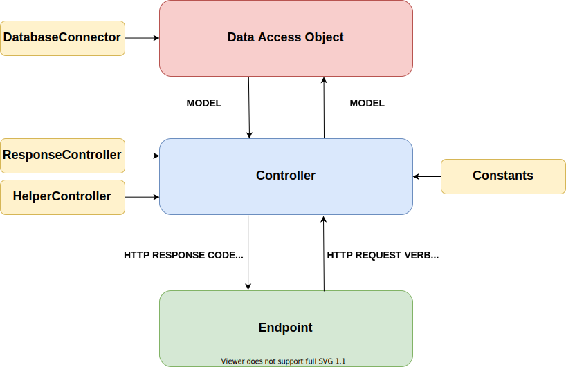      
  	<figcaption>Fig.7 - Structure de l'API REST </figcaption>
  </center>
</figure>

### Base de données

<figure>
   <center>
  	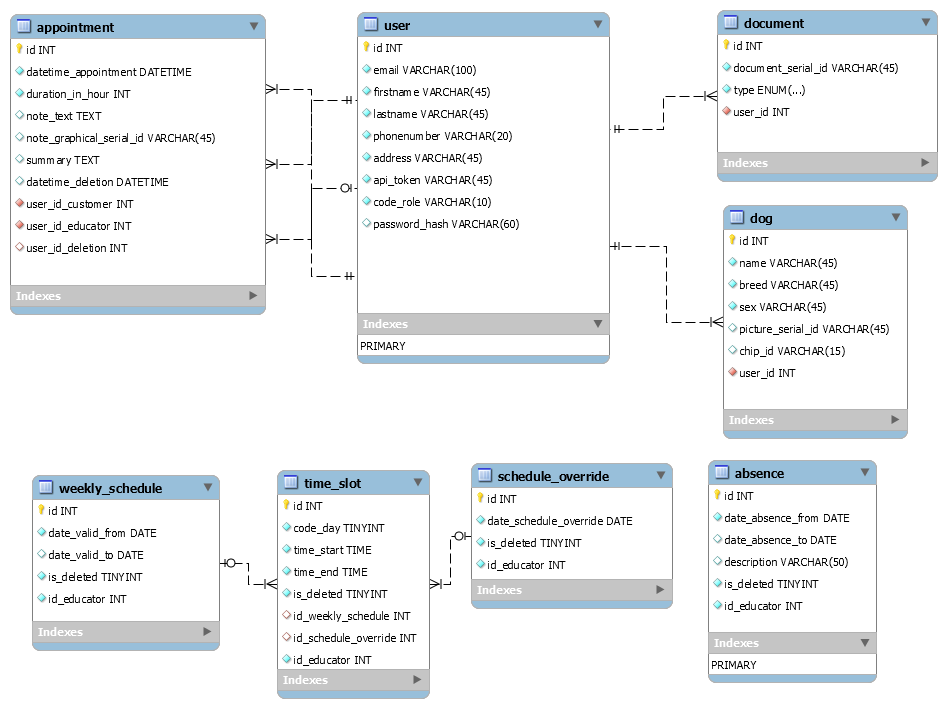      
  	<figcaption>Fig.8 - Base de de données de l'API REST </figcaption>
  </center>
</figure>
La base de données que j'ai développée et utilisée se décompose en deux parties.
La partie supérieure, donc les tables : `appointment`, `user`, `document` et `dog` concernent toutes les données en lien avec les clients de l'application.
Tandis que la partie inférieure, donc les tables : `weekly_schedule`,`time_slot`, `schedule_override` et `absence` concernent les données de planning des éducateurs canins de la société.

La table `appointment` contient les informations des rendez-vous entre un éducateur canin et un client :

<table>
    <tr>
    	<th  style="text-align:center;" COLSPAN="5">appointment</th>
    </tr>
    <tr>
        <th style="text-align:center;">NOM</th>
        <th style="text-align:center;">TYPE</th>
        <th style="text-align:center;">NOT NULL</th>
        <th style="text-align:center;">DESCRIPTION</th>
    </tr>
    <tr>
        <td>datetime_appointment</td>
        <td>DATETIME</td>
        <td style="text-align:center;">X</td>
        <td>la date ainsi que l'heure du rendez-vous entre un client et un éducateur canin.</td>
    </tr>
    <tr>
        <td>duration_in_hour</td>
        <td>INT</td>
        <td style="text-align:center;">X</td>
        <td>La durée en heure du rendez-vous.</td>
    </tr>
    <tr>
        <td>note_text</td>
        <td>TEXT</td>
        <td style="text-align:center;"></td>
        <td>Les notes textuelles du rendez-vous.</td>
    </tr>
    <tr>
        <td>note_graphical_serial_id</td>
        <td>VARCHAR</td>
        <td style="text-align:center;"></td>
        <td>L'identifiant de série de la note graphique uploadé sur le serveur du rendez-vous.</td>
    </tr>
    <tr>
        <td>summary</td>
        <td>TEXT</td>
        <td style="text-align:center;"></td>
        <td>Le résumé d'un rendez-vous.</td>
    </tr>
    <tr>
        <td>datetime_deletion</td>
        <td>DATETIME</td>
        <td style="text-align:center;"></td>
        <td>La date ainsi que l'heure de la suppression du rendez-vous.</td>
    </tr>
    <tr>
        <td>user_id_customer</td>
        <td>INT</td>
        <td style="text-align:center;">X</td>
        <td>L'identifiant de l'utilisateur de type client du rendez-vous.</td>
    </tr>
    <tr>
        <td>user_id_educator</td>
        <td>INT</td>
        <td style="text-align:center;">X</td>
        <td>L'identifiant de l'utilisateur de type éducateur canin du rendez-vous.</td>
    </tr>
    <tr>
        <td>user_id_deletion</td>
        <td>INT</td>
        <td style="text-align:center;"></td>
        <td>L'identifiant de l'utilisateur ayant supprimé le rendez-vous.</td>
    </tr>
</table>


*Remarques*

Les données des champs `datetime_deletion` et `user_id_deletion` sont uniquement ajoutées lors de la suppression non définitive du rendez-vous par un éducateur canin ou un client.

---

La table `user` contient les informations des différents utilisateurs :

<table>
    <tr>
    	<th  style="text-align:center;" COLSPAN="5">user</th>
    </tr>
    <tr>
        <th style="text-align:center;">NOM</th>
        <th style="text-align:center;">TYPE</th>
        <th style="text-align:center;">NOT NULL</th>
        <th style="text-align:center;">DESCRIPTION</th>
    </tr>
    <tr>
        <td>email</td>
        <td>VARCHAR</td>
        <td style="text-align:center;">X</td>
        <td>L'adresse e-mail de l'utilisateur.</td>
    </tr>
    <tr>
        <td>firstname</td>
        <td>VARCHAR</td>
        <td style="text-align:center;">X</td>
        <td>Le prénom de l'utilisateur.</td>
    </tr>
    <tr>
        <td>lastname</td>
        <td>VARCHAR</td>
        <td style="text-align:center;">X</td>
        <td>Le nom de famille de l'utilisateur.</td>
    </tr>
    <tr>
        <td>phonenumber</td>
        <td>VARCHAR</td>
        <td style="text-align:center;">X</td>
        <td>Le numéro de téléphone de l'utilisateur.</td>
    </tr>
    <tr>
        <td>address</td>
        <td>VARCHAR</td>
        <td style="text-align:center;">X</td>
        <td>L'adresse du domicile de l'utilisateur.</td>
    </tr>
    <tr>
        <td>api_token</td>
        <td>VARCHAR</td>
        <td style="text-align:center;">X</td>
        <td>Le token d'authentification de l'utilisateur.</td>
    </tr>
    <tr>
        <td>code_role</td>
        <td>VARCHAR</td>
        <td style="text-align:center;">X</td>
        <td>Le code du rôle de l'utilisateur (client, administrateur, autre).</td>
    </tr>
    <tr>
        <td>password_hash</td>
        <td>VARCHAR</td>
        <td style="text-align:center;"></td>
        <td>Le hash du mot de passe de l'utilisateur.</td>
    </tr>
</table>
*Remarques*

La table ne contient pas de sel pour le mot de passe, car depuis PHP 7.0.0, il est conseillé d'utiliser le sel généré par défaut.

---

La table `document` contient les informations des documents des utilisateurs :

<table>
    <tr>
    	<th  style="text-align:center;" COLSPAN="5">document</th>
    </tr>
    <tr>
        <th style="text-align:center;">NOM</th>
        <th style="text-align:center;">TYPE</th>
        <th style="text-align:center;">NOT NULL</th>
        <th style="text-align:center;">DESCRIPTION</th>
    </tr>
    <tr>
        <td>document_serial_id</td>
        <td>VARCHAR</td>
        <td style="text-align:center;">X</td>
        <td>L'identifiant de série du document uploadé sur le serveur.</td>
    </tr>
    <tr>
        <td>type</td>
        <td>ENUM</td>
        <td style="text-align:center;">X</td>
        <td>Le type du document (conditions d'inscription, poster, autre).</td>
    </tr>
    <tr>
        <td>user_id</td>
        <td>INT</td>
                <td style="text-align:center;">X</td>
        <td>L'identifiant de l'utilisateur propriétaire du document.</td>
    </tr>
</table>


---

La table `dog` contient les informations des chiens des utilisateurs :

<table>
    <tr>
    	<th  style="text-align:center;" COLSPAN="5">dog</th>
    </tr>
    <tr>
        <th style="text-align:center;">NOM</th>
        <th style="text-align:center;">TYPE</th>
        <th style="text-align:center;">NOT NULL</th>
        <th style="text-align:center;">DESCRIPTION</th>
    </tr>
    <tr>
        <td>name</td>
        <td>VARCHAR</td>
        <td style="text-align:center;">X</td>
        <td>Le nom du chien.</td>
    </tr>
    <tr>
        <td>breed</td>
        <td>VARCHAR</td>
        <td style="text-align:center;">X</td>
        <td>La race du chien.</td>
    </tr>
    <tr>
        <td>sex</td>
        <td>VARCHAR</td>
        <td style="text-align:center;">X</td>
        <td>Le sexe du chien.</td>
    </tr>
    <tr>
        <td>picture_serial_id</td>
        <td>VARCHAR</td>
        <td style="text-align:center;">X</td>
        <td>L'identifiant de série de la photo du chien uploadé sur le serveur.</td>
    </tr>
   	<tr>
        <td>chip_id</td>
        <td>VARCHAR</td>
        <td style="text-align:center;"></td>
        <td>L'identifiant de la puce sous-cutanée du chien.</td>
    </tr>
    <tr>
        <td>user_id</td>
        <td>INT</td>
        <td style="text-align:center;">X</td>
        <td>L'identifiant de l'utilisateur propriétaire du chien.</td>
    </tr>
</table>


---

La table `weekly_schedule` contient les informations des calendriers hebdomadaires des éducateurs canins :

<table>
    <tr>
    	<th  style="text-align:center;" COLSPAN="5">weekly_schedule</th>
    </tr>
    <tr>
        <th style="text-align:center;">NOM</th>
        <th style="text-align:center;">TYPE</th>
        <th style="text-align:center;">NOT NULL</th>
        <th style="text-align:center;">DESCRIPTION</th>
    </tr>
    <tr>
        <td>date_valid_from</td>
        <td>DATE</td>
        <td style="text-align:center;">X</td>
        <td>La date de début du calendrier hebdomadaire.</td>
    </tr>
    <tr>
        <td>date_valid_to</td>
        <td>DATE</td>
        <td style="text-align:center;"></td>
        <td>La date de fin du calendrier hebdomadaire.</td>
    </tr>
    <tr>
        <td>is_deleted</td>
        <td>TINYINT</td>
        <td style="text-align:center;">X</td>
        <td>Le statut du calendrier hébdomadaire.</td>
    </tr>
    <tr>
        <td>id_educator</td>
        <td>INT</td>
        <td style="text-align:center;">X</td>
        <td>L'identifiant de l'éducateur canin propriétaire du calendrier hébdomadaire.</td>
    </tr>
</table>

*Remarques*

Le système s'assure qu'il n'y ait pas de chevauchement entre les différentes lignes non supprimées de cette table (`date_valid_from` et `date_valid_to`) appartenant au même éducateur canin.
Une seule ligne non supprimée d'un éducateur canin peut avoir comme valeur `null` le champ `date_valid_to`. Cette ligne correspondra donc à l'unique calendrier permanent d'un éducateur canin.

---

La table `schedule_override` contient les informations des exceptions d'horaires des éducateurs canins :

<table>
    <tr>
    	<th  style="text-align:center;" COLSPAN="5">schedule_override</th>
    </tr>
    <tr>
        <th style="text-align:center;">NOM</th>
        <th style="text-align:center;">TYPE</th>
        <th style="text-align:center;">NOT NULL</th>
        <th style="text-align:center;">DESCRIPTION</th>
    </tr>
    <tr>
        <td>date_schedule_override</td>
        <td>DATE</td>
        <td style="text-align:center;">X</td>
        <td>La date de l'exception d'horaire.</td>
    </tr>
    <tr>
        <td>is_deleted</td>
        <td>TINYINT</td>
        <td style="text-align:center;">X</td>
        <td>Le statut de l'exception d'horaire.</td>
    </tr>
    <tr>
        <td>id_educator</td>
        <td>INT</td>
        <td style="text-align:center;">X</td>
        <td>L'identifiant de l'éducateur canin propriétaire de l'exception d'horaire.</td>
    </tr>
</table>

*Remarques*

Le système s'assure qu'il n'y ait pas deux fois la même date entre les différentes lignes non supprimées de cette table (`date_schedule_override`) appartenant au même éducateur canin.

---

La table `time_slot` contient les informations des créneaux horaires des éducateurs canins :

<table>
    <tr>
    	<th  style="text-align:center;" COLSPAN="5">time_slot</th>
    </tr>
    <tr>
        <th style="text-align:center;">NOM</th>
        <th style="text-align:center;">TYPE</th>
        <th style="text-align:center;">NOT NULL</th>
        <th style="text-align:center;">DESCRIPTION</th>
    </tr>
    <tr>
        <td>code_day</td>
        <td>TINYINT</td>
        <td style="text-align:center;">X</td>
        <td>Le code correspondant à un jour de la semaine du créneau horaire.</td>
    </tr>
    <tr>
        <td>time_start</td>
        <td>TIME</td>
        <td style="text-align:center;">X</td>
        <td>L'heure de début du créneau horaire.</td>
    </tr>
    <tr>
        <td>time_end</td>
        <td>TIME</td>
        <td style="text-align:center;">X</td>
        <td>L'heure de fin du créneau horaire.</td>
    </tr>
        <tr>
        <td>is_deleted</td>
        <td>TINYINT</td>
        <td style="text-align:center;">X</td>
        <td>Le statut du créneau horaire.</td>
    </tr>
    <tr>
        <td>id_weekly_schedule</td>
        <td>INT</td>
        <td style="text-align:center;"></td>
        <td>L'identifiant du calendrier hebdomadaire.</td>
    </tr>
    <tr>
        <td>id_schedule_override</td>
        <td>INT</td>
        <td style="text-align:center;"></td>
        <td>L'identifiant de l'exception d'horaire.</td>
    </tr>
    <tr>
        <td>id_educator</td>
        <td>VARCHAR</td>
        <td style="text-align:center;">X</td>
        <td>L'identifiant de l'éducateur canin propriétaire du créneau horaire.</td>
    </tr>
</table>

*Remarques*

Le système s'assure qu'il n'y ait pas de chevauchement entre les différentes lignes non supprimées de cette table (`time_start` et `time_end`) pour le même parent (`id_weekly_schedule` ou `id_schedule_override`) appartenant au même éducateur canin.
Le système s'assure qu'un créneau horaire appartienne à un calendrier hebdomadaire OU à une exception d'horaire, il ne doit pas appartenir aux deux ni à aucun.

---

La table `absence` contient les informations des vacances des éducateurs canins :

<table>
    <tr>
    	<th  style="text-align:center;" COLSPAN="5">absence</th>
    </tr>
    <tr>
        <th style="text-align:center;">NOM</th>
        <th style="text-align:center;">TYPE</th>
        <th style="text-align:center;">NOT NULL</th>
        <th style="text-align:center;">DESCRIPTION</th>
    </tr>
    <tr>
        <td>date_absence_from</td>
        <td>DATE</td>
        <td style="text-align:center;">X</td>
        <td>La date de début des vacances.</td>
    </tr>
    <tr>
        <td>date_absence_to</td>
        <td>DATE</td>
        <td style="text-align:center;"></td>
        <td>La date de fin des vacances.</td>
    </tr>
    <tr>
        <td>description</td>
        <td>VARCHAR</td>
        <td style="text-align:center;"></td>
        <td>La description des vacances.</td>
    </tr>
        <tr>
        <td>is_deleted</td>
        <td>TINYINT</td>
        <td style="text-align:center;">X</td>
        <td>Le statut des vacances.</td>
    </tr>
    <tr>
        <td>id_educator</td>
        <td>INT</td>
        <td style="text-align:center;">X</td>
        <td>L'identifiant de l'éducateur canin propriétaire des vacances.</td>
    </tr>
</table>

*Remarques*

La valeur du champ `date_absence_to` peut être `null` si le service est suspendu pour un moment.

#### Requête de génération de planning

##### Explication

Une des fonctionnalités les plus importantes de mon travail de diplôme est la génération de planning pour un éducateur canin. En effet, j'ai développé des tables de ma base de données en sorte de permettre aux éducateurs canins de la société d'éditer leurs propres horaires de la manière la plus flexible possible. Les éducateurs canins peuvent créer des calendriers hebdomadaires (weekly schedules) ayant une date de début et une date de fin (à noter qu'un seul et unique calendrier hebdomadaire peut ne pas avoir de date de fin afin de le rendre permanant sur une durée de une année suivant le jour actuel). Chaque calendrier hebdomadaire peut avoir des créneaux horaire (time slots) afin de spécifier les données hebdomadaires de celui-ci.

En plus de cela, les éducateurs canins peuvent créer des exceptions d'horaire (schedule override) afin d'écraser les potentiels créneaux horaires d'un calendrier hebdomadaire d'une journée par les siens. Donc, similaire aux calendriers hebdomadaires, l'exception d'horaire peut également avoir des créneaux horaires.

Pour finir, les éducateur canins ont la possibilité de créer des plages de vacances qui devront permettre d'ignorer tous les créneaux horaire inclus dans celles-ci.

Afin d'être plus clair, imaginons les données suivantes : 

* Calendrier hebdomadaire du 31 mai au 04 juillet
  * Deux créneau horaire tous les lundis
  * Deux créneau horaire tous les mercredis
  * Deux créneau horaire tous les jeudis
  * Deux créneau horaire tous les vendredis
* Exception d'horaire le 03 juin
  * Un créneau horaire dans la journée
* Exception d'horaire le 08 juin
  * Deux créneaux horaires dans la journée
* Exception d'horaire le 19 juin
  * Un créneau horaire dans la journée
* Exception d'horaire le 02 juillet
  * Un créneau horaire dans la journée
* Vacances du 28 juin au 04 juillet

Le résultat sans le traitement ressemblerais à cela :

<figure>
   <center>
  	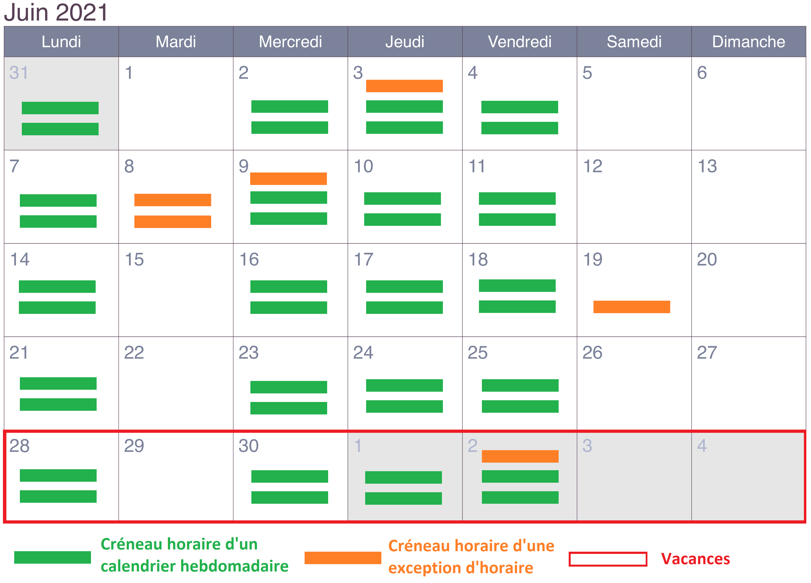      
  	<figcaption>Fig.9 - Planning sans traitement </figcaption>
  </center>
</figure>

Le résultat avec le traitement réalisé dans ma requête ressemblerais à cela :

<figure>
   <center>
  	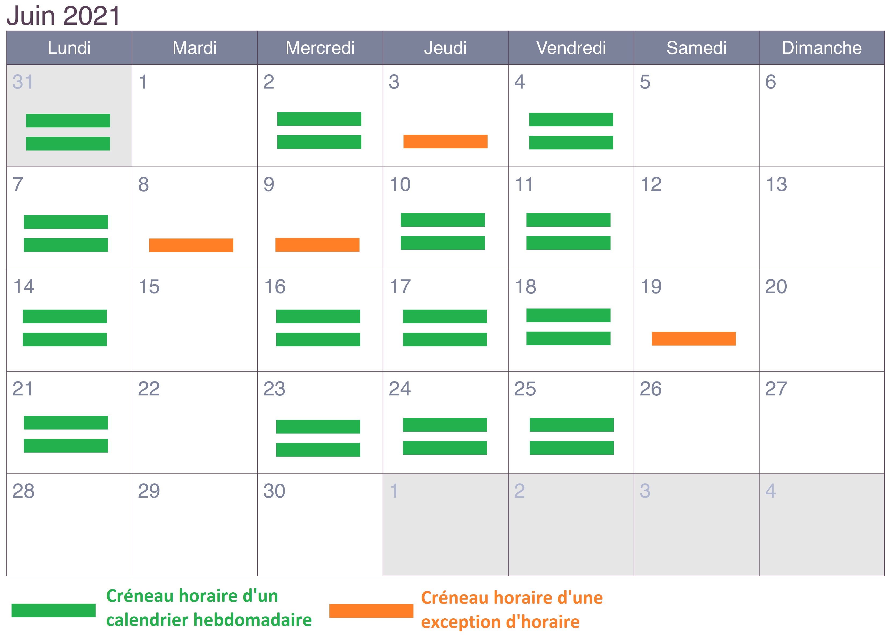      
  	<figcaption>Fig.10 - Planning avec traitement </figcaption>
  </center>
</figure>

##### Test de performance

Afin de réaliser cette fonctionnalité, j'ai développé durant mon travail de diplôme, une requête que je pourrais considérais de touffu. En effet, afin d'arriver à ses fins, ma requête contient trois sous-requêtes et interpelle un total de six tables différentes. J'ai alors voulu vérifier sa capacité à s'adapter à un nombre conséquent de données en réalisant un test de performance de celle-ci. Pour réaliser ce test de performance, j'ai ajouté les données suivantes à l'aide d'un script dans ma base de données :

* 100 000 utilisateurs
* Pour chacun de ces utilisateurs, création d'un calendrier hebdomadaire avec 10 créneaux horaires par jour pour le mois de juillet (2021-07-01 au 2021-07-31)
* Pour chacun de ces utilisateurs, création d'une exception d'horaire avec 5 créneaux horaires le 15 juillet (2021-07-15)
* Pour chacun de ces utilisateurs, création de vacances pour la dernière semaine de juillet (2021-07-26 au 2021-07-31)
* Pour chacun de ces utilisateurs, création d'un rendez-vous (2021-07-15 08:00:00)  

Une fois les données insérées, j'ai alors exécuté ma requête de génération de planning (que vous pouvez retrouver dans le `DAOTimeSlot`) dans l'outil Workbench afin d'y générer un `Visual Explain Plan`. Un `Visual Explain Plan` est une représentation du traitement effectué sur une base de données d'une requête SQL. Voici le `Visual Explain Plan` généré :

<figure>
   <center>
  	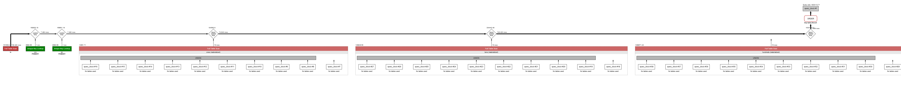      
  	<figcaption>Fig.11 - Visual Explain Plan de la requête de génération de planning</figcaption>
  </center>
</figure>

Avec ces données, ma requête à pris environ 18 minutes afin de générer le planning d'un des éducateurs canins. À l'heure actuelle cette requête n'est pas prête à traiter une grande quantité de données mais je compte, dans le futur, l'optimiser voir la modifier afin que celle-ci soit utilisable avec beaucoup de données. 

### Tests unitaires Postman

Afin de tester l'API REST, j'ai utilisé l'outil Postman qui m'a permis d'exécuter des scripts de test pour chaque endpoint de mon API REST. Ces tests sont réalisables en JavaScript en utilisant la bibliothèque proposée par Postman `pm`. Tous les tests unitaires de mon API REST sont identifiables grâce à un code qui leur est propre dans l'annexe [`postman_unit_tests.md`](./postman_unit_tests.md).

#### Format de code

<figure>
   <center>
  	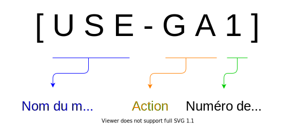      
  	<figcaption>Fig.12 - Format de code des tests unitaires </figcaption>
  </center>
</figure>

**Définition**

<table>
    <tr>
    	<th style="text-align:center; font-size: 24px;" COLSPAN="2">Code des noms de modèles</th>
    </tr>
    <tr>
        <th>Modèle</th>
        <th>CODE</th>
    </tr>
    <tr>
        <td>User</td>
        <td>USE</td>
    </tr>
    <tr>
        <td>Dog</td>
        <td>DOG</td>
    </tr>
    <tr>
        <td>Document</td>
        <td>DOC</td>
    </tr>
    <tr>
        <td>Absence</td>
        <td>ABS</td>
    </tr>
    <tr>
        <td>WeeklySchedule</td>
        <td>WEE</td>
    </tr>
    <tr>
        <td>ScheduleOverride</td>
        <td>SCH</td>
    </tr>
    <tr>
        <td>TimeSlot</td>
        <td>TIM</td>
    </tr>
    <tr>
        <td>Appointment</td>
        <td>APP</td>
    </tr>
</table>


---

<table>
    <tr>
    	<th style="text-align:center; font-size: 24px;" COLSPAN="2">Code des actions</th>
    </tr>
    <tr>
        <th>Action</th>
        <th>CODE</th>
    </tr>
    <tr>
        <td>Get all</td>
        <td>GA</td>
    </tr>
    <tr>
        <td>Get one</td>
        <td>GO</td>
    </tr>
    <tr>
        <td>Create one</td>
        <td>CO</td>
    </tr>
    <tr>
        <td>Update one</td>
        <td>UO</td>
    </tr>
    <tr>
        <td>Delete one</td>
        <td>DO</td>
    </tr>
    <tr>
        <td>Connection</td>
        <td>C</td>
    </tr>
    <tr>
        <td>Get user authenticated</td>
        <td>GUA</td>
    </tr>
    <tr>
        <td>Update password of the authenticated user</td>
        <td>UPAU</td>
    </tr>
    <tr>
        <td>Upload dog picture</td>
        <td>UDP</td>
    </tr>
    <tr>
        <td>Download dog picture</td>
        <td>DDP</td>
    </tr>
    <tr>
        <td>Download document</td>
        <td>DD</td>
    </tr>
    <tr>
        <td>Upload note graphical</td>
        <td>UNG</td>
    </tr>
    <tr>
        <td>Download note graphical</td>
        <td>DNG</td>
    </tr>
</table>
#### Syntaxe

Postman propose à ses utilisateurs la possibilité d'écrire des scripts de test pour tester les différentes requêtes de leurs API. Afin de rédiger ces tests, j'ai dû utiliser une certaine syntaxe JavaScript proposée par Postman. Lors de la réalisation de mes tests unitaires avec Postman, j'ai utilisé la fonction `pm.test` afin de tester tous les cas d'utilisation et d'exception de mon API REST. La fonction `pm.test` prend en premier paramètre une chaîne de caractères qui apparaîtra dans la sortie des résultats du test afin d'identifier le test. Le deuxième paramètre est une fonction qui doit retourner un booléen pour indiquer si le test a réussi ou échoué. 

Dans tous mes tests unitaires, j'ai utilisé la fonction `pm.test` avec la fonction `pm.response.to.have.status(status)` afin de tester si le cas d'utilisation de l'endpoint en question retournait le bon code HTTP. En effet, cette ligne retourne `true` si le code d'état de la réponse est identique à son paramètre de fonction et `false` si ce n'est pas le cas.
Par exemple, afin de tester que l'endpoint de création d'utilisateur `POST api/v1/users` retourne bien le code HTTP `201`, j'ai réalisé le test :

```javascript
pm.test("Right code for successful created ressource", function () {
    pm.response.to.have.status(201);
});
```

Pour les endpoints nécessitant de retourner un message, j'ai également testé que celui-ci soit correct en utilisant la fonction` pm.expect(element1).to.eql(element2)` qui permet de tester que le premier élément corresponde bien au second. 
Par exemple, afin de tester que l'endpoint de création d'utilisateur `POST api/v1/users` avec une adresse e-mail ne respectant pas le bon format retourne bien le code HTTP `400` ainsi que le message d'erreur `Format d'adresse email invalide.`, j'ai réalisé les tests :

```javascript
pm.test("Right code for invalid email format", function () {
    pm.response.to.have.status(400);
});
pm.test("Right message for for invalid email format", function () {
    const responseJson = pm.response.json();
    pm.expect(responseJson.error).to.eql("Format d'adresse email invalide.");
});
```

Pour les tests unitaires nécessitant le test de plusieurs données de corps de requêtes différentes, j'ai utilisé la fonctionnalité d'importation de CSV proposée par Postman. En effet, Postman permet de sélectionner un fichier CSV contenant différentes données afin de procéder à plusieurs itérations de test avec celles-ci. 
Par exemple, afin de tester que l'endpoint de création de vacances `POST api/v1/absences` avec une date ne respectant pas le bon format retourne bien le code HTTP `400` ainsi que le message d'erreur `Format de date invalide => (YYYY-MM-DD).`, j'ai réalisé les tests :

```javascript
pm.test("Right code for invalid date_to format", function () {
    pm.response.to.have.status(400);
});
pm.test("Right message for invalid date_to format", function () {
    const responseJson = pm.response.json();
    pm.expect(responseJson.error).to.eql("Format de date invalide => (YYYY-MM-DD).");
});
```

Ce test est réalisé avec les différentes données du fichier CSV disponibles à la fin de l'annexe [`unit_tests.md`](./unit_tests.md).

Pour les tests unitaires nécessitant un test sur l'en-tête d'autorisation, j'ai utilisé la fonction `pm.request.to.have.header(header)`.
Par exemple, afin de tester que l'endpoint de suppression d'un document `DELETE api/v1/documents` avec un api token appartenant à un client retourne bien le code HTTP `403` ainsi que le message d'erreur `Vous n'avez pas les permissions.`, j'ai réalisé les tests :

```javascript
pm.test("Authorization header is present", () => {
  pm.request.to.have.header("Authorization");
});
pm.test("Authorization header is false", function () {
    pm.response.to.have.status(403);
});
pm.test("Right message for access without permission", function () {
    const responseJson = pm.response.json();
    pm.expect(responseJson.error).to.eql("Vous n'avez pas les permissions.");
});
```

Pour les tests unitaires retournant une réponse JSON spécifique, j'ai effectué un test afin de vérifier que sa structure soit respectée avec la fonction `pm.response.to.have.jsonSchema(jsonSchema)`.
Par exemple, afin de tester que l'endpoint de récupération d'un chien spécifique `GET api/v1/dogs/{dogId}` avec un api token appartenant à un éducateur canin retourne bien le code HTTP `200` ainsi que la réponse JSON au bon format, j'ai réalisé les tests :

```javascript
pm.test("Authorization header is present", () => {
  pm.request.to.have.header("Authorization");
});
pm.test("Authorization header is right", function () {
    pm.response.to.have.status(200);
});
pm.test("The data structure of the response is correct", () => {
  pm.response.to.have.jsonSchema({
          "type": "object",
          "properties": {
              "id" : {"type" : "integer"},
              "name" : {"type" : "string"},
              "breed" : {"type" : "string"},
              "sex" : {"type" : "string"},
              "picture_serial_id" : {"type" : ["string","null"]},
              "chip_id" : {"type" : ["string","null"]},
              "user_id" : {"type" : "integer"}
          },
          "required": ["id","name","breed","sex","picture_serial_id","chip_id","user_id"]
  })
});
```

### Composer

Composer permet de gérer les dépendances PHP de mon API REST. En premier lieu, Composer permet de générer un fichier nommé `composer.json`. Ce fichier est un moyen pour Composer de rechercher les différentes dépendances que mon projet PHP doit télécharger. Le fichier `composer.json` vérifie également la compatibilité des versions des dépendances de mon projet, c'est-à-dire que si j'utilise un paquet obsolète, Composer me le fera savoir afin d'éviter tout problème. Afin d'installer un paquet comme Dompdf, j'ai dû exécuter la commande suivante dans mon invite de commandes : 

```bash
$ composer require dompdf/dompdf
```

Après avoir exécuté ce type de commande, mon projet contient maintenant les fichiers `composer.json` et `composer.lock` ainsi que le dossier `vendor`. Comme expliqué auparavant, `composer.json` est comme un guide correspondant aux versions de dépendance que Composer **doit** installer tandis que `composer.lock` est une représentation exacte des versions de dépendance qui **ont** été installées. Le dossier `vendor` quant à lui, contient tous les paquets et dépendances installés du projet.

Une fois nos paquets et dépendances installés, il faut maintenant pouvoir les inclure dans un de nos scripts PHP. Pour ce faire, Composer nous facilite la tâche en générant un fichier de chargement automatique nommé `autoload.php`. En incluant ce fichier dans mon fichier `bootstrap.php` qui lui-même étant inclus dans chaque points d'entrée de mon API REST, je peux accéder quand je le souhaite aux différents paquets et dépendances de mon projet. Par exemple, si je souhaite utiliser le paquet Dompdf dans un de mes scripts PHP, il me suffit d'écrire la ligne `use Dompdf\Dompdf` afin d'y accéder. 

### Librairies

#### PHP dotenv

Installé avec la commande : 

```bash
$ composer require vlucas/phpdotenv
```

J'ai utilisé Dotenv afin de créer et charger des variables d'environnement accessibles par l'intégralité de mon API REST. Son fonctionnement se déroule de la manière suivante :

Création d'un fichier `.env` à la racine du projet contenant les variables d'environnement de l'application.

```php
DB_HOST= "dbhost"
DB_PORT= "3306"
DB_DATABASE= "database"
DB_USERNAME= "username"
DB_PASSWORD= "password"

SMTP_HOST= "smtphost"
SMTP_USERNAME= "smtpusername"
SMTP_PASSWORD= "smtppassword"

GOOGLE_RECAPTCHA_SECRET_KEY = "secretKey"
```

Chargement de ces variables d'environnement dans le fichier `bootstrap.php`.

```php
...
use Dotenv\Dotenv;
$dotenv = new DotEnv(__DIR__);
$dotenv->load();
...
```

Utilisation de ces variables d'environnement de la manière suivante :

```php
$host = getenv('DB_HOST');
```

[*Documentation de Php dotenv*](https://github.com/vlucas/phpdotenv)

#### PHPMailer

Installé avec la commande : 

```bash
$ composer require phpmailer/phpmailer
```

J'ai utilisé PHPMailer afin d'envoyer des e-mails depuis le contrôleur `HelperController` de la manière suivante :

```php
public static function sendMail(string $message, string $subject,string $emailRecipient, string $attachmentFilePath = null)
{
    // Création d'une instance de la classe PHPMailer en activant les exceptions
    $mail = new PHPMailer(true);
    
    // Chargement du template avec le sujet et le message de l'e-mail
    $body = HelperController::loadMailTemplate($subject,$message);
    try {
        //Paramètres du serveur 
        $mail->SMTPDebug  = SMTP::DEBUG_SERVER;               
        $mail->Host       = getenv('SMTP_HOST');                     
        $mail->SMTPAuth   = true;                                  
        $mail->Username   = getenv('SMTP_USERNAME');                   
        $mail->Password   = getenv('SMTP_PASSWORD');                             
        $mail->SMTPSecure = PHPMailer::ENCRYPTION_STARTTLS;         
        $mail->Port       = 587; 

        //Destinataire
        $mail->setFrom('noreply@douceurdechien.com', 'Douceur de Chien');
        $mail->addAddress($emailRecipient); 

        //Pièce jointe
        if (!is_null($attachmentFilePath)) {
            $mail->addAttachment($attachmentFilePath);
        }
        
        //Contenu
        $mail->isHTML(true);     
        $mail->CharSet = 'UTF-8';      
        $mail->Encoding = 'base64';                      
        $mail->Subject = $subject;
        $mail->AddEmbeddedImage("./../../resources/image/logo_douceur_de_chien.png", "logo-image", "logo_douceur_de_chien.png");
        $mail->Body = $body;
        
        $mail->send();
    } catch (Exception $e) {
        echo "Message could not be sent. Mailer Error: {$mail->ErrorInfo}";
    }
    }
```

[*Documentation de PHPMailer*](https://phpmailer.github.io/PHPMailer/namespaces/default.html)

#### Dompdf

Installé avec la commande : 

```bash
$ composer require dompdf/dompdf
```

J'ai utilisé Dompdf afin de créer les conditions d'inscription depuis le contrôleur `HelperController` de la manière suivante :

```php
public static function storeConditionsRegistration(string $filename,int $package_number,string $date, string $signature_base64,string $userfirstname, string $userlastname)
{
    $dompdf = new DOMPDF();     
    
    ob_start();
    include HelperController::getDefaultDirectory()."resources/template/conditions_registration.php";
    $contents = ob_get_clean();
    
    $dompdf->loadHtml($contents);
    dompdf->render();
    $output = $dompdf->output();
    file_put_contents(HelperController::getDefaultDirectory()."storage/app/conditions_registration/".$filename.".pdf", $output);
}
```

1. Création d'une instance de la classe `DOMPDF`
2. Début de la temporisation de sortie permettant d'inclure les différentes données dans le template HTML et CSS `conditions_registration.php` 
3. Récupération du contenu HTML du tampon de sortie et fermeture de sa session
4. Chargement du contenu HTML avec l'instance `DOMPDF`
5. Transformation du HTML en PDF
6. Récupération du PDF sous forme de données
7. Écriture de ces données dans un fichier PDF stocké sur le serveur

[*Documentation de Dompdf*](https://github.com/dompdf/dompdf/wiki/Usage)

### Fichier iCalendar

Lors de la création d'un rendez-vous entre un client et un éducateur canin, mon API REST envoie un e-mail au client afin de lui fournir les informations du rendez-vous. En plus des informations du rendez-vous, j'ai créé une fonctionnalité permettant de générer un fichier ICS afin de l'inclure dans l'e-mail. Un fichier ICS est un format de fichier pour iCalendar. Ces fichiers ayant comme extension `.ics` permettent d'importer dans un calendrier des données de calendrier. Ce format étant une norme internationale, de nombreux calendriers numériques tels que les calendriers de Microsoft, Google et Apple sont capables de supporter ce format de fichier.

Pour générer ce fichier, je procède de la même manière que la création des conditions d'inscription avec Dompdf. C'est-à-dire qu'une fois la création du rendez-vous effectué, je vais effectuer les étapes suivantes : 

```php
public static function sendMailWithICSFile($start_datetime, $end_datetime, $educator_fullname, $customer_email , $filename)
    {
      ob_start();
      include HelperController::getDefaultDirectory()."resources/template/iCalendar_appointment.php";
      $contents = ob_get_clean();

      $temp = tmpfile();
      fwrite($temp, $contents);

      $tmpfile_path = stream_get_meta_data($temp)['uri'];
      $new_tmpfile_path = sys_get_temp_dir(). '\\' . $filename;
      rename($tmpfile_path, $new_tmpfile_path);

      HelperController::sendMail("Message de l'e-mail","Sujet de l'e-mail",$customer_email,null,$new_tmpfile_path);

      unlink($new_tmpfile_path);
    }
```

1. Début de la temporisation de sortie permettant d'inclure les différentes données dans le template PHP `iCalendar_appointment.php` :

```php
header('Content-type: text/calendar; charset=utf-8');
header('Content-Disposition: attachment; filename=' . $filename);

$now = new DateTime('NOW');

echo "BEGIN:VCALENDAR
VERSION:2.0
PRODID:-//douceurdechien/handcal//NONSGML v1.0//FR
CALSCALE:GREGORIAN
METHOD:PUBLISH
BEGIN:VEVENT
UID:" . md5(time()) . "
DTSTAMP;TZID=/Europe/Berlin:" . gmdate("Ymd\THis",$now->getTimestamp() + 60*60*2) . "
DTSTART;TZID=/Europe/Berlin:".gmdate("Ymd\THis",$start_datetime->getTimestamp() + 60*60*2)."
DTEND;TZID=/Europe/Berlin:".gmdate("Ymd\THis",$end_datetime->getTimestamp() + 60*60*2)."
SUMMARY:Rendez-vous Douceur de Chien
LOCATION:701 Avenue de la Bigorre, 31210 Montréjeau, France
ORGANIZER:MAILTO:douceurdechien@douceurdechien.com
END:VEVENT
END:VCALENDAR";
```

1. Récupération du contenu du tampon de sortie et fermeture de sa session
2. Écriture du contenu dans un fichier temporaire
3. Renommage du fichier temporaire
4. Envoi d'un e-mail avec le fichier temporaire au format iCalendar
5. Suppression du fichier temporaire

[*Informations sur le format iCalendar (RFC2445)*](https://www.ietf.org/rfc/rfc2445.txt)

### Endpoints

#### Headers

Les en-têtes que j'ai utilisés dans les différents points d'entrée de mon API REST sont :

* [`Access-Control-Allow-Origin`](https://developer.mozilla.org/fr/docs/Web/HTTP/Headers/Access-Control-Allow-Origin)
* [`Content-Type`](https://developer.mozilla.org/fr/docs/Web/HTTP/Headers/Content-Type)
* [`Access-Control-Allow-Methods`](https://developer.mozilla.org/fr/docs/Web/HTTP/Headers/Access-Control-Allow-Methods)
* [`Access-Control-Max-Age`](https://developer.mozilla.org/en-US/docs/Web/HTTP/Headers/Access-Control-Max-Age)
* [`Access-Control-Allow-Headers`](https://developer.mozilla.org/en-US/docs/Web/HTTP/Headers/Access-Control-Max-Age)
* [`Content-Length`](https://developer.mozilla.org/fr/docs/Web/HTTP/Headers/Content-Length)

#### Listes des endpoints

* `POST api/v1/users`
* `POST api/v1/connection`
* `GET api/v1/users`
* `GET api/v1/users/educators`
* `GET api/v1/users/{idUser}`
* `GET api/v1/users/me`
* `PATCH api/v1/users/{idUser}`
* `PATCH api/v1/users/me/changePassword`
* `DELETE api/v1/users/{idUser}`

------

* `POST api/v1/dogs`
* `GET api/v1/dogs`
* `GET api/v1/dogs/{idDog}`
* `PATCH api/v1/dogs/{idDog}`
* `DELETE api/v1/dogs/{idDog}`
* `POST api/v1/dogs/uploadPicture`
* `GET api/v1/dogs/downloadPicture/{serial_number}`

------

* `POST api/v1/documents`
* `GET api/v1/documents`
* `GET api/v1/documents/{idDocument}`
* `PATCH api/v1/documents/{idDocument}`
* `DELETE api/v1/documents/{idDocument}`
* `GET api/v1/documents/downloadDocument/{serial_number}`

------

* `POST api/v1/absences`
* `GET api/v1/absences`
* `GET api/v1/absences/{idAbsence}`
* `PATCH api/v1/absences/{idAbsence}`
* `DELETE api/v1/absences/{idAbsence}`

------

* `POST api/v1/weeklySchedules`
* `GET api/v1/weeklySchedules`
* `GET api/v1/weeklySchedules/{idWeeklySchedule}`
* `DELETE api/v1/weeklySchedules/{idWeeklySchedule}`

------

* `POST api/v1/scheduleOverrides`
* `GET api/v1/scheduleOverrides`
* `GET api/v1/scheduleOverrides/{idScheduleOverride}`
* `DELETE api/v1/scheduleOverrides/{idScheduleOverride}`

------

* `POST api/v1/timeSlots`
* `GET api/v1/timeSlots`
* `GET api/v1/timeSlots/{idTimeSlot}`
* `DELETE api/v1/timeSlots/{idTimeSlot}`

------

* `POST api/v1/appointments`
* `GET api/v1/appointments`
* `GET api/v1/appointments/{idTimeSlot}`
* `PATCH api/v1/appointments/{idTimeSlot}`
* `DELETE api/v1/appointments/{idTimeSlot}`
* `POST api/v1/appointments/uploadNoteGraphical`
* `POST api/v1/appointments/downloadNoteGraphical/{serial_number}`
* `GET api/v1/plannings/{idEducator}`

Pour plus d'informations, rendez-vous dans l'annexe [`endpoints.md`](./endpoints.md).

## PWA

### Vue

#### Arborescence

```
pwa
│
└── node_modules
└── public
└── src
   	└── assets
 	│	└── css
 	│	└── img
   	└── components
 	│	└── About.vue
 	│	└── Administration.vue
 	│	└── ...
   	└── plugins
 	│	└── bootstrap-vue.js			
   	└── Router
 	│	└── index.js	
   	└── App.vue
  	└── main.js
  	└── store.js
    └── constants.js
```

#### Composants

Pour réaliser ma SPA (Single page application) Vue de mon travail de diplôme, j'ai réalisé différents composants. La majorité des composants que j'ai développés représentent chacun une des pages de mon application. Par exemple, la page d'accueil de mon application est le composant `home.vue`, la page de connexion de l'application est le composant `connection.vue`, etc.

En plus des composants représentant chacun une des pages de mon application, j'ai essayé de réaliser quelques composants permettant l'intégration d'une fonctionnalité ou d'un affichage redondant. 

Un composant Vue est organisé de la manière suivante :

* Une partie HTML entre les balises `<template> </template>`
* Une partie JavaScript entre les balises `<script> </script>`
* Une partie CSS entre les balises `<style> </style`

Pour la partie HTML, Vue permet l'utilisation de différents outils très pratiques permettant de faciliter l'élaboration de code HTML avec du JavaScript. Le premier outil est la syntaxe dite "Mustache" (les doubles accolades). 
Exemple : 

```html
<h1>Rendez-vous du client {{ lastname }}</h1>
```

Cette syntaxe permet une liaison de données entre le JavaScript et le HTML. Par rapport à cet exemple, la balise "Mustache" sera remplacée par la valeur de la propriété Vue `lastname` et elle sera également mise à jour à chaque fois que la propriété `lastname` subira une modification.

Le deuxième outil que j'ai utilisé sont les directives proposées par Vue : `v-if`, `v-for`,`v-bind`,`v-model` et `v-on`.

`v-if` et `v-for` permettent de réaliser des tests et des boucles dans le code HTML avec des propriétés Vue.
Exemple :

```HTML
<button v-if="auth">Déconnexion</button>
<ul>
    <li v-for="element in elements">
    	{{ element.text }}
    </li>
</ul>
```

`v-bind` pouvant être abrégé en `:` permet d'effectuer une liaison unidirectionnelle d'une propriété Vue avec un attribut HTML. Contrairement à la directive `v-model` qui elle permet une liaison bidirectionnelle. En effet, `v-model` permet de modifier la valeur d'entrée en modifiant les données liées et inversement, tandis que `v-bind` lui permet uniquement de modifier la valeur d'entrée en modifiant les données liées.
Exemple :

```html
<input v-model="inputModel"></input>
<input v-bind:value="inputBind"></input> ou <input :value="inputBind"></input> 
```

`v-on` pouvant être abrégé en `@` permet d'exécuter une fonction JavaScript lors du déclenchement [d'événements DOM](https://developer.mozilla.org/fr/docs/Web/Events).
Exemple :

```html
<button v-on:click="function"></button> ou <button @click="function"></button>
```

Pour ce qui est de la syntaxe JavaScript proposée par Vue, je l'ai utilisée de la manière suivante :

```javascript
import { otherComponent } from "component"; //Importation de composant si nécessaire
export default { 
  components: {
    otherComponent,
  },
  name: "MyComponent", //Le nom du composant actuel
  data() { //Fonction contenant les variables du composant actuel
    return {
        message : "Lorem Ipsum",
        ...
    };
  },
  methods: {}, //Méthodes du composant actuel
  computed: {}, //Propriétés calculées du composant actuel
  created() {}, //Code JavaScript exécuté après que l’instance ait été créée
  mounted() {}, //Code JavaScript exécuté juste après que l’instance ait été montée
  destroyed() {}, //Code JavaScript exécuté après que l'instance de Vue ait été détruite
};
```

Quant à la balise `<style></style>` je l'ai utilisée de manière très classique. A noter que celle-ci contient l'attribut `scoped` afin que le contenu CSS de la balise soit appliqué uniquement aux éléments du composant actuel.

Pour plus d'informations sur Vue, vous pouvez vous référer à sa très bonne documentation.

[*Documentation de Vue.js*](https://fr.vuejs.org/v2/guide/)

### npm

npm de son nom *Node Package Manager* est le gestionnaire de paquets officiel de Node.js. npm permet de gérer les dépendances JavaScript de ma PWA. Similaire à Composer qui lui génère le fichier `composer.json`, npm lui, permet de générer un fichier nommé `package.json`. Son fonctionnement en est également similaire. En effet, il permet à npm de rechercher les différentes dépendances JavaScript que ma PWA doit télécharger. Afin d'installer un paquet comme axios, j'ai dû exécuter la commande suivante dans mon invite de commandes :

```bash
$ npm install axios
```

Après avoir exécuté ce type de commande, mon projet contient maintenant les fichiers `package.json` et `package-lock.json` ainsi que le dossier `node_modules`. Les fichiers `package.json` et `package-lock.json` ont le même fonctionnement que les fichiers `composer.json` et `composer.lock`. Le dossier `node_modules` quant à lui, contient tous les paquets et dépendances installés du projet.

### Librairies

#### AlertifyJS

Plugin vue-alertify installé avec la commande :

```bash
$ npm install vue-alertify
```

Et importé dans le fichier `vue-alertify.js` de la manière suivante :

```javascript
import Vue from "vue";

import VueAlertify from "vue-alertify";
Vue.use(VueAlertify);
```

Lui-même importé dans le fichier `main.js` de la manière suivante :

```javascript
import "./plugins/vue-alertify";
```

J'ai utilisé les notifications d'[AlertifyJS](https://alertifyjs.com/) afin d'avertir l'utilisateur lors des différentes actions de celui-ci comme l'ajout d'un chien pour un utilisateur par exemple :

```javascript
this.$alertify.success("Chien ajouté avec succès");
```

[*Documentation de vue-alertify*](https://github.com/sj82516/vue-alertify)

#### Axios

Installé avec la commande : 

```bash
$ npm install axios
```

Et importé de manière globale dans le fichier `main.js` de la manière suivante :

```javascript
import Axios from "axios";
Vue.prototype.$http = Axios;
```

J'ai utilisé le client HTTP basé sur les promesses Axios afin de réaliser des requêtes HTTP asynchrone à mon API REST depuis ma PWA. Par exemple, j'ai utilisé Axios afin d'ajouter un chien à un utilisateur avec l'endpoint `POST api/v1/dogs` dans le composant `CustomerInformation.vue` de la manière suivante :

```javascript
createDogForCustomerByUserId(dogName, dogBreed, dogSex, dogChipId, userId) {
    const params = new URLSearchParams();
    params.append("name", dogName);
    params.append("breed", dogBreed);
    params.append("sex", dogSex);
    params.append("chip_id", dogChipId);
    params.append("user_id", userId);
    const config = {
        headers: {
            "Authorization" : this.$store.state.api_token,
        },
      };
    this.$http
        .post(this.$API_URL + "dogs/", params, config)
        .then((response) => {
        	//Traitement de la réponse
    	})
        .catch((error) => {
        	//Traitement de l'erreur
        });
}
```

[*Documentation d'Axios*](https://github.com/axios/axios)

#### Vuex

Installé avec la commande : 

```bash
$ npm install vuex
```

J'ai utilisé Vuex afin de créer le gestionnaire d'état de mon application. Ce gestionnaire d'état nommé`store` par Vuex me permet de stocker de manière centralisée l'api token, le rôle et l'identifiant de l'utilisateur authentifié afin que ces données soient accessibles par l'intégralité de mes composants dans le but de permettre à l'utilisateur authentifié d'accéder à ses fonctionnalités. Dans son principe, Vuex fonctionne de la même manière que Vue Router. En effet, j'ai créé un fichier `store.js` contenant l'instance de mon `store`. Cette instance permet de gérer l'état de mon application en y plaçant les différentes actions et mutations qui devront être faites sur celui-ci. L'instance `store` de mon application est divisée en différentes parties :

* `state` contenant l'état de l'application.
* `mutations` permettant de modifier l'état de l'application.
* `actions` permettant un fonctionnement similaire aux mutations à la différence qu'au lieu de modifier l'état, elles appellent les mutations et peuvent contenir des opérations asynchrones.
* `getters` permettant de réaliser des propriétés calculées.

Par exemple, afin d'authentifier l'utilisateur et de ce fait modifier l'état de mon application, j'ai utilisé Vuex dans le fichier `store.js` de la manière suivante :

```javascript
import Vuex from "vuex";
import router from "./router";
import { CUSTOMER_CODE_ROLE, ADMIN_CODE_ROLE } from "./constants.js";

Vue.use(Vuex);

export default new Vuex.Store({
    state: {
        api_token: null,
        code_role: null,
        user_id: null
    },
    mutations: {
        authUser(state, userData) {
            state.api_token = userData.api_token;
            state.code_role = userData.code_role;
            state.user_id = userData.user_id;
        },
        ...
    },
    actions: {
        login({ commit }, authData) {
            const params = new URLSearchParams();
            params.append("email", authData.email);
            params.append("password", authData.password);
            Vue.prototype.$http
                .post(Vue.prototype.$API_URL + "connection/", params)
                .then((res) => {
                localStorage.setItem("api_token", res.data.api_token);
                localStorage.setItem("code_role", res.data.code_role);
                localStorage.setItem("user_id", res.data.user_id);
                commit("authUser", {
                    api_token: res.data.api_token,
                    code_role: res.data.code_role,
                    user_id: res.data.user_id,
                });
                Vue.prototype.$alertify.success("Vous êtes connecté");
                if (this.state.code_role == ADMIN_CODE_ROLE) {
                    router.push("/administration");
                }
                if (this.state.code_role == CUSTOMER_CODE_ROLE) {
                    router.push("/customer_information");
                }
            })
            .catch((error) => {
                Vue.prototype.$alertify.error(error.response.data.error);
            });
        },
        ...
    },
        getters: {
            ifAuthenticated(state) {
                return state.api_token !== null;
            },
            ...
        }
});
```

L'action `login `va permettre de faire un appel à l'endpoint de connexion de l'API REST `api/v1/connection` avec Axios. Si l'endpoint c'est bien déroulé, l'état de l'application se verra subir une mutation et le local storage se verra être chargé. Une fois mon `store` paramétré dans l'instance `Vuex.Store`, il est nécessaire de l'inclure en tant qu'option dans l'initialisation de l'instance principale de Vue disponible dans le fichier `main.js` :

```javascript
import store from "./store";

new Vue({
    store,
    render: (h) => h(App)
}).$mount("#app");
```

[*Documentation de Vuex*](https://vuex.vuejs.org/guide/#the-simplest-store)

#### Vue Router

Installé avec la commande : 

```bash
$ npm install vue-router
```

J'ai utilisé Vue router afin de créer mon application monopage. Pour intégrer Vue router à Vue, j'ai créé le fichier `index.js` dans le dossier router. Ce fichier contient mon instance Router contenant toutes les routes de ma SPA. Chacune de mes routes sont configurées de sorte à avoir : un chemin d'accès, un nom, un composant de référence et une méthode de vérification afin d'accéder à celles-ci si cela est nécessaire. Par exemple, la route permettant d'afficher la page d'administration des éducateurs canins est configurée dans le fichier `router.js` de la manière suivante : 

```javascript
import Router from "vue-router";
import store from "./store";
import Administration from "./../components/Administration.vue";
import { ADMIN_CODE_ROLE } from "./constants.js";

Vue.use(Router);

export default new Router({
  routes: [
      {
          path: "/administration",
          name: "administration",
          component: Administration,
          beforeEnter(to, from, next) {
              if (store.state.api_token && store.state.code_role == ADMIN_CODE_ROLE) {
                  next();
              } else {
                  next("/");
              }
          }
      },
      ...
  ]
});
```

Dans cette route ainsi que dans toutes les routes pour accéder aux pages des éducateurs canins, je teste à l'aide de la fonction `beforeEnter` de Vue router si l'utilisateur est un administrateur (éducateur canin) ou un client. Si celui-ci est un administrateur, alors je le laisse accéder au composant. Dans le cas contraire, je le redirige vers la page d'accueil de application. Une fois les différentes routes paramétrées dans l'instance `Router`, il est nécessaire de l'inclure en tant qu'option dans l'initialisation de l'instance principale de Vue disponible dans le fichier `main.js` :

```javascript
import router from "./router";

new Vue({
    router,
    render: (h) => h(App)
}).$mount("#app");
```

[*Documentation de Vue Router*](https://router.vuejs.org/guide/#javascript)

#### BootstrapVue

Plugin bootstrapVue installé avec la commande :

```bash
$ npm install vue bootstrap bootstrap-vue
```

Et importé dans le fichier `bootstrap-vue.js` de la manière suivante :

```javascript
import Vue from "vue";

import BootstrapVue from "bootstrap-vue";
import "bootstrap/dist/css/bootstrap.min.css";
import "bootstrap-vue/dist/bootstrap-vue.css";
Vue.use(BootstrapVue);
```

Lui-même importé dans le fichier `main.js` de la manière suivante :

```javascript
import "./plugins/bootstrap-vue";
```

J'ai utilisé le plugin BootstrapVue afin de faciliter l'intégration et la compatibilité de Bootstrap avec Vue. En effet, certaines fonctions de Bootstrap nécessitant JQuery et Poppers.js, peuvent entrer en conflit avec Vue. BootstrapVue va justement permettre de convertir la plupart de ces fonctions dans le but de les rendre compatibles avec Vue afin qu'elles fonctionnent comme prévu. Pour ce qui est de la syntaxe de BootstrapVue, elle est très similaire voire plus lisible que Bootstrap.

[*Documentation de BootstrapVue*](https://bootstrap-vue.org/docs)

#### Signature Pad

Plugin vue-signature-pad installé avec la commande :

```bash
$ npm install vue-signature-pad
```

Et importé dans le fichier `bootstrap-vue.js` de la manière suivante :

```javascript
import Vue from "vue";

import VueSignaturePad from "vue-signature-pad";
Vue.use(VueSignaturePad);
```

Lui-même importé dans le fichier `main.js` de la manière suivante :

```javascript
import "./plugins/vue-signature-pad";
```

J'ai utilisé le plugin vue-signature-pad afin de faciliter l'intégration et l'utilisation de la librairie JavaScript [Signature Pad](https://github.com/szimek/signature_pad) avec Vue. Le plugin permet d'utiliser le composant `<VueSignaturePad />`  en lui fournissant si on le souhaite, différents paramètres et d'utiliser différentes fonctions décrites dans la documentation du plugin. 

[*Documentation de vue-signature-pad*](https://github.com/neighborhood999/vue-signature-pad#readme)

#### FullCalendar

Composant FullCalendar installé avec la commande :

```bash
$ npm install @fullcalendar/vue
```

Et importé dans les composants souhaitant l'utiliser de la manière suivante :

```javascript
import FullCalendar from "@fullcalendar/vue";
import dayGridPlugin from "@fullcalendar/daygrid";
import timeGridPlugin from "@fullcalendar/timegrid";
import interactionPlugin from "@fullcalendar/interaction";
import frLocale from "@fullcalendar/core/locales/fr";
```

J'ai utilisé FullCalendar afin d'afficher les différents calendriers de mon application nécessitant d'être chargés avec des événements comme les rendez-vous de l'éducateur canin par exemple. FullCalendar permet une intégration et une utilisation optimales avec Vue en fournissant un composant qui correspond exactement aux fonctionnalités de l'API standard de FullCalendar. FullCalendar permet de personnaliser l'affichage de son calendrier ainsi que de ses fonctionnalités de manière très complète. Voici un exemple de la configuration effectuée pour l'affichage des créneaux horaires disponibles d'un éducateur canin :

```html
<FullCalendar ref="fullCalendar" :options="calendarOptions" />
```

```javascript
export default {
  components: {
    FullCalendar,
  },
  name: "Calendar",
  data() {
    return {
      calendarOptions: {
        plugins: [dayGridPlugin, timeGridPlugin, interactionPlugin],
        initialView: "dayGridMonth",
        headerToolbar: {
          left: "prev,next today",
          center: "title",
          right: "dayGridMonth,timeGridWeek,timeGridDay",
        },
        height: "auto",
        locale: frLocale,
        eventDisplay: "block",
        allDaySlot: false,
        slotMinTime: "06:00:00",
        slotMaxTime: "20:00:00",
        events: [],
        eventBackgroundColor: "green",
        eventClick: this.handleDateClick,
      },
    };
  },
}
```

Toutes ces options ainsi que bien d'autres sont disponibles dans la documentation de FullCalendar

[*Documentation de FullCalendar pour Vue*](https://fullcalendar.io/docs/vue)

#### Moment.js

Installé avec la commande :

```bash
$ npm install moment
```

Et importé dans les composants souhaitant l'utiliser de la manière suivante :

```javascript
import moment from "moment";
moment.locale("fr-ch");
```

J'ai utilisé la librairie moment.js afin de formater et manipuler les différentes dates de mon application. Voici un exemple de traitement que j'ai réalisé avec moment.js afin de formater une date :

```javascript
formatDate(value) {
    if (value) {
        return moment(value).format("dddd DD MMMM YYYY"); //Exemple de résultat : lundi 21 juin 2021
    }
}
```

[*Documentation de Moment.js*](https://momentjs.com/docs/#/use-it/)

#### reCAPTCHA

Composant Google reCAPTCHA installé avec la commande :

```bash
$ npm install vue-recaptcha
```

Et importé dans le composant `inscription.vue` de la manière suivante :

```javascript
import VueRecaptcha from "vue-recaptcha";
```

J'ai utilisé le composant vue-recaptcha afin d'implémenter une vérification lors de l'inscription à l'aide du système de détection automatisée d'utilisateur reCAPTCHA de Google. Pour intégrer reCAPTCHA à mon application, je me suis rendu sur la documentation officielle de Google afin de récupérer la clef d'intégration côté client. Une fois ma clef récupérée, j'ai configuré le composant vue-recaptcha de la manière suivante : 

```html
<vue-recaptcha
	ref="recaptcha"
	@verify="onVerify"
	sitekey="clientKey"
    :loadRecaptchaScript="true"
>
</vue-recaptcha>
```

```javascript
export default {
  name: "Inscription",
  components: {
    VueRecaptcha
  },
  methods: {
      onVerify(response) {
          
      },
  }
}
```

Ici, la méthode `verify` émet la réponse qui représente le token à envoyer à l'API REST via l'endpoint `POST api/v1/users` afin de procéder à la vérification côté serveur.

[*Documentation de vue-recaptcha*](https://github.com/DanSnow/vue-recaptcha#readme)
[*Documentation reCAPTCHA pour l'intégration côté client*](https://developers.google.com/recaptcha/docs/display)

Afin de valider la vérification d'utilisateur avec reCAPTCHA côté client, il est nécessaire d'envoyer une requête HTTP au service reCAPTCHA. Pour ce faire, j'appelle la méthode suivante dans mon UserController lors de l'inscription :

```php
public static function reCAPTCHAvalidate(string $userResponseToken)
{
    $curl = curl_init();
    curl_setopt($curl,CURLOPT_URL, "https://www.google.com/recaptcha/api/siteverify");
    curl_setopt($curl, CURLOPT_POST,1);
    curl_setopt($curl, CURLOPT_POSTFIELDS, http_build_query(
        array(
            'secret' => getenv('GOOGLE_RECAPTCHA_SECRET_KEY'),
            'response' => $userResponseToken
        )
    ));
    curl_setopt($curl, CURLOPT_RETURNTRANSFER, true);
      
    $response = json_decode(curl_exec($curl));

    return $response->success;
    }
```

[*Documentation reCAPTCHA pour l'intégration côté serveur*](https://developers.google.com/recaptcha/docs/verify)

### Tests Katalon Recorder

Afin de tester les fonctionnalités de mon application WEB développée avec Vue, j'ai suivi les conseils de mon professeur de diplôme et j'ai réalisé des scripts de test avec Katalon Recorder. Utilisant principalement Chrome comme navigateur, je me suis rendu sur le chrome web store afin de télécharger l'extension Katalon Recorder.  L'interface graphique de l'extension ressemble à cela :

<figure>
   <center>
  	      
  	<figcaption>Fig.13 - Interface graphique de Katalon Recorder </figcaption>
  </center>
</figure>

Afin de tester le maximum de fonctionnalités avec Katalon Recorder, j'ai développé un script de test par fonctionnalité. Les scripts de test contiennent des lignes d'action qui vont se dérouler les unes après les autres. Chaque ligne est configurée de la manière suivante : 

* Une commande désignant une action que le script doit exécuter, comme un click sur un bouton par exemple.
* Une cible permettant au script de savoir sur quel élément il doit exécuter l'action, comme un élément avec l'identifiant HTML `btnInscription` par exemple.
* Et une valeur si c'est nécessaire en cas de réalisation d'action d'écriture par exemple.  

Grâce à cette interface, j'ai pu développer et utiliser des scripts de test. Voici un exemple du script de test de connexion de l'éducateur canin :

<table>
    <tr>
    	<th style="text-align:center; font-size: 24px;" COLSPAN="4">Connexion de l'éducateur canin</th>
    </tr>
    <tr>
    	<th>Commande</th>
        <th>Cible</th>
        <th>Valeur</th>
        <th>Description</th>
    </tr>
    <tr>
    	<td>open</td>
        <td>http://localhost:8080/#/</td>
        <td></td>
        <td>Ouverture de la page d'acceuil de l'application</td>
    </tr>
    <tr>
    	<td>click</td>
        <td>link=Connexion</td>
        <td></td>
        <td>Click sur le bouton de connexion de la barre de navigation</td>
    </tr>
    <tr>
    	<td>click</td>
        <td>id=input-connection-email</td>
        <td></td>
        <td>Click sur la zone de saisie pour l'adresse e-mail</td>
    </tr>
    <tr>
    	<td>type</td>
        <td>id=input-connection-email</td>
        <td>borel@eduge.ch</td>
        <td>Écriture de l'adresse e-mail "borel@eduge.ch" dans la zone de saisie pour l'adresse e-mail</td>
    </tr>
    <tr>
    	<td>click</td>
        <td>id=input-connection-password</td>
        <td></td>
        <td>Click sur la zone de saisie pour le mot de passe</td>
    </tr>
    <tr>
    	<td>type</td>
        <td>id=input-connection-password</td>
        <td>poire54321</td>
        <td>Écriture du mot de passe "poire54321" dans la zone de saisie pour le mot de passe</td>
    </tr>
    <tr>
    	<td>click</td>
        <td>//button[@type='submit']</td>
        <td></td>
        <td>Click sur le bouton de connexion du formulaire</td>
    </tr>
    <tr>
    	<td>waitForText</td>
        <td>//div[@id='title']/div/h1</td>
        <td>Administration</td>
        <td>Vérification de la présence du titre de composant "Administration"</td>
    </tr>
    <tr>
    	<td>waitForText</td>
        <td>link=Administration</td>
        <td>Administration</td>
        <td>Vérification de la présence du lien "Administration" dans la barre de navigation</td>
    </tr>
    <tr>
    	<td>waitForText</td>
        <td>link=Mon planning</td>
        <td>Mon planning</td>
        <td>Vérification de la présence du lien "Mon planning" dans la barre de navigation</td>
    </tr>
    <tr>
    	<td>waitForText</td>
        <td>link=Mes rendez-vous</td>
        <td>Mes rendez-vous</td>
        <td>Vérification de la présence du lien "Mes rendez-vous" dans la barre de navigation</td>
    </tr>
</table>


## Table des figures

| Numéro de figure | Figure                                                      |
| ---------------- | ----------------------------------------------------------- |
| 1                | Dog Model                                                   |
| 2                | Table dog                                                   |
| 3                | Data Access Object Dog                                      |
| 4                | Dog Controller                                              |
| 5                | ResponseController et HelperController                      |
| 6                | Classes DatabaseConnector et Constants                      |
| 7                | Structure de l'API REST                                     |
| 8                | Base de de données de l'API REST                            |
| 9                | Planning sans traitement                                    |
| 10               | Planning avec traitement                                    |
| 11               | Visual Explain Plan de la requête de génération de planning |
| 12               | Format de code des tests unitaires                          |
| 13               | Interface graphique de Katalon Recorder                     |

