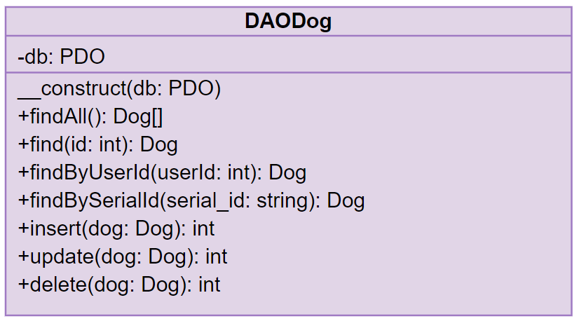

# Travail de diplôme - Documentation technique

- [Travail de diplôme - Documentation technique](#travail-de-diplôme---documentation-technique)
  - [API REST](#api-rest)
    - [Arborescence](#arborescence)
      - [app/Models](#appmodels)
      - [app/DataAccessObject](#appdataaccessobject)
      - [app/Controllers](#appcontrollers)
      - [app/System](#appsystem)
      - [public](#public)
      - [storage](#storage)
      - [bootstrap.php](#bootstrapphp)
    - [Structure](#structure)
    - [Base de données](#base-de-données)
    - [Headers](#headers)
    - [Tests unitaires](#tests-unitaires)
    - [Librairies](#librairies)
      - [PHPMailer](#phpmailer)
      - [Dompdf](#dompdf)
    - [Endpoints](#endpoints)
  - [PWA](#pwa)
    - [Arborescence](#arborescence-1)
    - [Structure](#structure-1)
      - [Méthodes](#méthodes)
    - [Librairies](#librairies-1)
      - [Bootstrap](#bootstrap)
      - [Responsive-Scketchpad](#responsive-scketchpad)
      - [FullCalendar](#fullcalendar)

## API REST

### Arborescence

```
api/v1
│
└── app
│   └── Models
│   └── DataAccessObject
│   └── Controllers
│   └── System
└── public
└── storage
└── vendor
└── .env
└── bootstrap.php
```

#### app/Models

Le dossier Models contient les modèles de l'API REST. Chaque modèle est une représentation objet de sa table de base de données correspondante. La création de ces modèles me permet d'utiliser les données de ma base de données de manière objet.
Exemple de la classe `Dog` représentant la table `dog` de la base de données :


#### app/DataAccessObject

Le dossier DataAccessObject contient les data access object (DAO) de l'API REST. Ces DAO contiennent toutes les méthodes permettant un CRUD sur sa table de base de données correspondante. Les méthodes des DAO fonctionnent de manière à créer ou récupérer des modèles afin de respecter un maximum la structure objet de l'API REST.
Exemple de la classe `DAODog` :



#### app/Controllers

Le dossier Controllers contient les contrôleurs de l'API REST, comme leur nom l'indique. Le but des contrôleurs est de contrôler les différents cas d'utilisation et d'autorisation d'accès en utilisant, s'il le faut, les DAO afin de communiquer avec la base de données et en retournant les différents codes HTTP et messages en format JSON. 
Exemple de la classe `DogController` :


Dans ce dossier résident également les contrôleurs `ResponseController` et `HelperController`. Le `ResponseController` permet de retourner toutes les différentes réponses HTTP. Le `HelperController` permet l'utilisation de méthode dite d'aide et qui n'aurait pas leur place dans un contrôleur basique.
Classes `ResponseController` et `HelperController` :


#### app/System

Le dossier System contient la classe `DatabaseConnector` qui permet la connexion à la base de données en récupérant les variables d'environnements *PHP dotenv* et la classe `Constants` permettant de stocker les différentes constantes de l'API REST.
Classes `DatabaseConnector` et `Constants` :


#### public

Le dossier public contient les différents fichiers d'entrées de l'API REST. Les fichiers d'entrées récupèrent le `verb HTTP` d'une requête HTTP afin de pouvoir exécuter les bonnes méthodes des contrôleurs. Ces fichiers s'occupent également d'attribuer les headers et le body si nécessaire. 

#### storage

Dossier contenant les différents fichiers uploadés de l'API REST, comme les documents PDF ou les photos de chiens par exemple. 

#### bootstrap.php

Fichier de bootage de l'API REST inclus dans tous les fichiers d'entrées, celui-ci permet de : 

* Charger les dépendances PHP du dossier vendor
* Charger les variables d'environnements
* Créer la connexion à la base de données

### Structure


### Base de données


La base de données que j'ai développé et utilisé se décompose en deux parties.
La partie supérieure, donc les tables : `appoitment`, `user`, `document` et `dog` concernent toutes les données en lien avec les clients de l'application.
Tandis que la partie inférieure, donc les tables : `weekly_schedule`,`time_slot`, `schedule_override` et `absence` concernent les données de planning des éducateurs canins de la société.

La table `appoitment` contient les informations des rendez-vous entre un éducateur canin et un client :

<table>
    <tr>
    	<th  style="text-align:center;" COLSPAN="5">appoitment</th>
    </tr>
    <tr>
        <th style="text-align:center;">NOM</th>
        <th style="text-align:center;">TYPE</th>
        <th style="text-align:center;">NOT NULL</th>
        <th style="text-align:center;">DESCRIPTION</th>
    </tr>
    <tr>
        <td>datetime_appoitment</td>
        <td>DATETIME</td>
        <td style="text-align:center;">X</td>
        <td>la date ainsi que l'heure du rendez-vous entre un client et un éducateur canin.</td>
    </tr>
    <tr>
        <td>duration_in_hour</td>
        <td>INT</td>
        <td style="text-align:center;">X</td>
        <td>La durée en heure du rendez-vous.</td>
    </tr>
    <tr>
        <td>note_text</td>
        <td>TEXT</td>
        <td style="text-align:center;"></td>
        <td>Les notes textuelles du rendez-vous.</td>
    </tr>
    <tr>
        <td>note_graphical_serial_id</td>
        <td>VARCHAR</td>
        <td style="text-align:center;"></td>
        <td>L'identifiant de série de la note graphique uploadé sur le serveur du rendez-vous.</td>
    </tr>
    <tr>
        <td>summary</td>
        <td>TEXT</td>
        <td style="text-align:center;"></td>
        <td>Le résumé d'un rendez-vous.</td>
    </tr>
    <tr>
        <td>datetime_deletion</td>
        <td>DATETIME</td>
        <td style="text-align:center;"></td>
        <td>La date ainsi que l'heure de la suppression du rendez-vous.</td>
    </tr>
    <tr>
        <td>user_id_customer</td>
        <td>INT</td>
        <td style="text-align:center;">X</td>
        <td>L'identifiant de l'utilisateur de type client du rendez-vous.</td>
    </tr>
    <tr>
        <td>user_id_educator</td>
        <td>INT</td>
        <td style="text-align:center;">X</td>
        <td>L'identifiant de l'utilisateur de type éducateur canin du rendez-vous.</td>
    </tr>
    <tr>
        <td>user_id_deletion</td>
        <td>INT</td>
        <td style="text-align:center;"></td>
        <td>L'identifiant de l'utilisateur ayant supprimé le rendez-vous.</td>
    </tr>
</table>


*Remarques*

Les données des champs `datetime_deletion` et `user_id_deletion` sont uniquement ajoutées lors de la suppression non-définitive du rendez-vous par un éducateur canin ou un client.

---

La table `user` contient les informations des différents utilisateurs :

<table>
    <tr>
    	<th  style="text-align:center;" COLSPAN="5">user</th>
    </tr>
    <tr>
        <th style="text-align:center;">NOM</th>
        <th style="text-align:center;">TYPE</th>
        <th style="text-align:center;">NOT NULL</th>
        <th style="text-align:center;">DESCRIPTION</th>
    </tr>
    <tr>
        <td>email</td>
        <td>VARCHAR</td>
        <td style="text-align:center;">X</td>
        <td>L'adresse e-mail de l'utilisateur.</td>
    </tr>
    <tr>
        <td>firstname</td>
        <td>VARCHAR</td>
        <td style="text-align:center;">X</td>
        <td>Le prénom de l'utilisateur.</td>
    </tr>
    <tr>
        <td>lastname</td>
        <td>VARCHAR</td>
        <td style="text-align:center;">X</td>
        <td>Le nom de famille de l'utilisateur.</td>
    </tr>
    <tr>
        <td>phonenumber</td>
        <td>VARCHAR</td>
        <td style="text-align:center;">X</td>
        <td>Le numéro de téléphone de l'utilisateur.</td>
    </tr>
    <tr>
        <td>address</td>
        <td>VARCHAR</td>
        <td style="text-align:center;">X</td>
        <td>L'adresse du domicile de l'utilisateur.</td>
    </tr>
    <tr>
        <td>api_token</td>
        <td>VARCHAR</td>
        <td style="text-align:center;">X</td>
        <td>Le token d'authentification de l'utilisateur.</td>
    </tr>
    <tr>
        <td>code_role</td>
        <td>VARCHAR</td>
        <td style="text-align:center;">X</td>
        <td>Le code du rôle de l'utilisateur (client, administrateur, autre).</td>
    </tr>
    <tr>
        <td>password_hash</td>
        <td>VARCHAR</td>
        <td style="text-align:center;"></td>
        <td>Le hash du mot de passe de l'utilisateur.</td>
    </tr>
</table>

*Remarques*

La table ne contient pas de sel pour le mot de passe car depuis PHP 7.0.0, il est conseillé d'utiliser le sel généré par défaut.

---

La table `document` contient les informations des documents des utilisateurs :

<table>
    <tr>
    	<th  style="text-align:center;" COLSPAN="5">document</th>
    </tr>
    <tr>
        <th style="text-align:center;">NOM</th>
        <th style="text-align:center;">TYPE</th>
        <th style="text-align:center;">NOT NULL</th>
        <th style="text-align:center;">DESCRIPTION</th>
    </tr>
    <tr>
        <td>document_serial_id</td>
        <td>VARCHAR</td>
        <td style="text-align:center;">X</td>
        <td>L'identifiant de série du document uploadé sur le serveur.</td>
    </tr>
    <tr>
        <td>type</td>
        <td>ENUM</td>
        <td style="text-align:center;">X</td>
        <td>Le type du document (conditions d'inscription, poster, autre).</td>
    </tr>
    <tr>
        <td>user_id</td>
        <td>INT</td>
                <td style="text-align:center;">X</td>
        <td>L'identifiant de l'utilisateur propriétaire du document.</td>
    </tr>
</table>


---

La table `dog` contient les informations des chiens des utilisateurs :

<table>
    <tr>
    	<th  style="text-align:center;" COLSPAN="5">dog</th>
    </tr>
    <tr>
        <th style="text-align:center;">NOM</th>
        <th style="text-align:center;">TYPE</th>
        <th style="text-align:center;">NOT NULL</th>
        <th style="text-align:center;">DESCRIPTION</th>
    </tr>
    <tr>
        <td>name</td>
        <td>VARCHAR</td>
        <td style="text-align:center;">X</td>
        <td>Le nom du chien.</td>
    </tr>
    <tr>
        <td>breed</td>
        <td>VARCHAR</td>
        <td style="text-align:center;">X</td>
        <td>La race du chien.</td>
    </tr>
    <tr>
        <td>sex</td>
        <td>VARCHAR</td>
        <td style="text-align:center;">X</td>
        <td>Le sexe du chien.</td>
    </tr>
    <tr>
        <td>picture_serial_id</td>
        <td>VARCHAR</td>
        <td style="text-align:center;">X</td>
        <td>L'identifiant de série de la photo du chien uploadé sur le serveur.</td>
    </tr>
   	<tr>
        <td>chip_id</td>
        <td>VARCHAR</td>
        <td style="text-align:center;"></td>
        <td>L'identifiant de la puce sous-cutanée du chien.</td>
    </tr>
    <tr>
        <td>user_id</td>
        <td>INT</td>
        <td style="text-align:center;">X</td>
        <td>L'identifiant de l'utilisateur propriétaire du chien.</td>
    </tr>
</table>


---

La table `weekly_schedule` contient les informations des calendriers hebdomadaires des éducateurs canins :

<table>
    <tr>
    	<th  style="text-align:center;" COLSPAN="5">weekly_schedule</th>
    </tr>
    <tr>
        <th style="text-align:center;">NOM</th>
        <th style="text-align:center;">TYPE</th>
        <th style="text-align:center;">NOT NULL</th>
        <th style="text-align:center;">DESCRIPTION</th>
    </tr>
    <tr>
        <td>date_valid_from</td>
        <td>DATE</td>
        <td style="text-align:center;">X</td>
        <td>La date de début du calendrier hebdomadaire.</td>
    </tr>
    <tr>
        <td>date_valid_to</td>
        <td>DATE</td>
        <td style="text-align:center;"></td>
        <td>La date de fin du calendrier hebdomadaire.</td>
    </tr>
    <tr>
        <td>is_deleted</td>
        <td>TINYINT</td>
        <td style="text-align:center;">X</td>
        <td>Le statut du calendrier hébdomadaire.</td>
    </tr>
    <tr>
        <td>id_educator</td>
        <td>INT</td>
        <td style="text-align:center;">X</td>
        <td>L'identifiant de l'éducateur canin propriétaire du calendrier hébdomadaire.</td>
    </tr>
</table>

*Remarques*

Le système s'assure qu'il n'y ait pas de chevauchement entre les différentes lignes non supprimées de cette table (`date_valid_from` et `date_valid_to`) appartenant au même éducateur canin.
Une seule ligne non supprimée d'un éducateur canin peut avoir comme valeur `null` le champ `date_valid_to`. Cette ligne correspondra donc à l'unique calendrier permanant d'un éducateur canin.

---

La table `schedule_override` contient les informations des exceptions d'horaires des éducateurs canins :

<table>
    <tr>
    	<th  style="text-align:center;" COLSPAN="5">schedule_override</th>
    </tr>
    <tr>
        <th style="text-align:center;">NOM</th>
        <th style="text-align:center;">TYPE</th>
        <th style="text-align:center;">NOT NULL</th>
        <th style="text-align:center;">DESCRIPTION</th>
    </tr>
    <tr>
        <td>date_schedule_override</td>
        <td>DATE</td>
        <td style="text-align:center;">X</td>
        <td>La date de l'exception d'horaire.</td>
    </tr>
    <tr>
        <td>is_deleted</td>
        <td>TINYINT</td>
        <td style="text-align:center;">X</td>
        <td>Le statut de l'exception d'horaire.</td>
    </tr>
    <tr>
        <td>id_educator</td>
        <td>INT</td>
        <td style="text-align:center;">X</td>
        <td>L'identifiant de l'éducateur canin propriétaire de l'exception d'horaire.</td>
    </tr>
</table>

*Remarques*

Le système s'assure qu'il n'y ait pas deux fois la même date entre les différentes lignes non supprimées de cette table (`date_schedule_override`) appartenant au même éducateur canin.

---

La table `time_slot` contient les informations des créneaux horaires des éducateurs canins :

<table>
    <tr>
    	<th  style="text-align:center;" COLSPAN="5">time_slot</th>
    </tr>
    <tr>
        <th style="text-align:center;">NOM</th>
        <th style="text-align:center;">TYPE</th>
        <th style="text-align:center;">NOT NULL</th>
        <th style="text-align:center;">DESCRIPTION</th>
    </tr>
    <tr>
        <td>code_day</td>
        <td>TINYINT</td>
        <td style="text-align:center;">X</td>
        <td>Le code correspondant à un jour de la semaine du créneau horaire.</td>
    </tr>
    <tr>
        <td>time_start</td>
        <td>TIME</td>
        <td style="text-align:center;">X</td>
        <td>L'heure de début du créneau horaire.</td>
    </tr>
    <tr>
        <td>time_end</td>
        <td>TIME</td>
        <td style="text-align:center;">X</td>
        <td>L'heure de fin du créneau horaire.</td>
    </tr>
        <tr>
        <td>is_deleted</td>
        <td>TINYINT</td>
        <td style="text-align:center;">X</td>
        <td>Le statut du créneau horaire.</td>
    </tr>
    <tr>
        <td>id_weekly_schedule</td>
        <td>INT</td>
        <td style="text-align:center;"></td>
        <td>L'identifiant du calendrier hebdomadaire.</td>
    </tr>
    <tr>
        <td>id_schedule_override</td>
        <td>INT</td>
        <td style="text-align:center;"></td>
        <td>L'identifiant de l'exception d'horaire.</td>
    </tr>
    <tr>
        <td>id_educator</td>
        <td>VARCHAR</td>
        <td style="text-align:center;">X</td>
        <td>L'identifiant de l'éducateur canin propriétaire du créneau horaire.</td>
    </tr>
</table>

*Remarques*

Le système s'assure qu'il n'y ait pas de chevauchement entre les différentes lignes non supprimées de cette table (`time_start` et `time_end`) pour le même parent (`id_weekly_schedule` ou `id_schedule_override`) appartenant au même éducateur canin.
Le système s'assure qu'un créneau horaire appartienne à un calendrier hebdomadaire OU à une exception d'horaire, il ne doit pas appartenir aux deux ni à aucun.

---

La table `absence` contient les informations des vacances des éducateurs canins :

<table>
    <tr>
    	<th  style="text-align:center;" COLSPAN="5">absence</th>
    </tr>
    <tr>
        <th style="text-align:center;">NOM</th>
        <th style="text-align:center;">TYPE</th>
        <th style="text-align:center;">NOT NULL</th>
        <th style="text-align:center;">DESCRIPTION</th>
    </tr>
    <tr>
        <td>date_absence_from</td>
        <td>DATE</td>
        <td style="text-align:center;">X</td>
        <td>La date de début de vacances.</td>
    </tr>
    <tr>
        <td>date_absence_to</td>
        <td>DATE</td>
        <td style="text-align:center;"></td>
        <td>La date de fin de vacances.</td>
    </tr>
    <tr>
        <td>description</td>
        <td>VARCHAR</td>
        <td style="text-align:center;"></td>
        <td>La description de vacances.</td>
    </tr>
        <tr>
        <td>is_deleted</td>
        <td>TINYINT</td>
        <td style="text-align:center;">X</td>
        <td>Le statut des vacances.</td>
    </tr>
    <tr>
        <td>id_educator</td>
        <td>INT</td>
        <td style="text-align:center;">X</td>
        <td>L'identifiant de l'éducateur canin propriétaire des vacances.</td>
    </tr>
</table>

*Remarques*

La valeur du champ `date_absence_to` peut être `null` si le service est suspendu pour un moment.

### Headers

### Tests unitaires

Afin de tester l'API REST, j'ai utilisé l'outil Postman qui m'a permis d'exécuter des scripts de test pour chaque endpoint de mon API REST. Ces tests sont réalisables en JavaScript en utilisant la bibliothèque `pm`. Tous les tests unitaires de mon API REST sont identifiables grâce à un code qui leur est propre dans l'annexe [`unit_tests.md`](./unit_tests.md).

**Format de code**


**Définition**

<table>
    <tr>
    	<th style="text-align:center; font-size: 24px;" COLSPAN="2">Code des noms de modèles</th>
    </tr>
    <tr>
        <th>Modèle</th>
        <th>CODE</th>
    </tr>
    <tr>
        <td>User</td>
        <td>USE</td>
    </tr>
    <tr>
        <td>Dog</td>
        <td>DOG</td>
    </tr>
    <tr>
        <td>Document</td>
        <td>Doc</td>
    </tr>
    <tr>
        <td>Absence</td>
        <td>ABS</td>
    </tr>
    <tr>
        <td>WeeklySchedule</td>
        <td>WEE</td>
    </tr>
    <tr>
        <td>ScheduleOverride</td>
        <td>SCH</td>
    </tr>
    <tr>
        <td>TimeSlot</td>
        <td>TIM</td>
    </tr>
    <tr>
        <td>Appoitment</td>
        <td>APP</td>
    </tr>
</table>

---

<table>
    <tr>
    	<th style="text-align:center; font-size: 24px;" COLSPAN="2">Code des actions</th>
    </tr>
    <tr>
        <th>Action</th>
        <th>CODE</th>
    </tr>
    <tr>
        <td>Get all</td>
        <td>GA</td>
    </tr>
    <tr>
        <td>Get one</td>
        <td>GO</td>
    </tr>
    <tr>
        <td>Create one</td>
        <td>CO</td>
    </tr>
    <tr>
        <td>Update one</td>
        <td>UO</td>
    </tr>
    <tr>
        <td>Delete one</td>
        <td>DO</td>
    </tr>
    <tr>
        <td>Connection</td>
        <td>C</td>
    </tr>
    <tr>
        <td>Get user authenticated</td>
        <td>GUA</td>
    </tr>
    <tr>
        <td>Upload dog picture</td>
        <td>UDP</td>
    </tr>
    <tr>
        <td>Download dog picture</td>
        <td>DDP</td>
    </tr>
    <tr>
        <td>Download document</td>
        <td>DD</td>
    </tr>
    <tr>
        <td>Upload note graphical</td>
        <td>UNG</td>
    </tr>
    <tr>
        <td>Download note graphical</td>
        <td>DNG</td>
    </tr>
</table>

### Composer

[à compléter]

### Librairies

[à compléter]

#### PHPMailer

[à compléter]

#### Dompdf

Installé avec la commande `composer require dompdf/dompdf/`, Dompdf est un moteur de mise en page et de rendu HTML. Son objectif est de télécharger et lire les feuilles de style externes, les balises de style et les attributs de style des éléments HTML individuels pour convertir le résultat en PDF.  

### Endpoints

* `POST api/v1/users`
* `GET api/v1/users`
* `GET api/v1/users/{idUser}`
* `PATCH api/v1/users/{idUser}`
* `DELETE api/v1/users/{idUser}`
* `POST api/v1/connection`
* `GET api/v1/users/me`
* `GET api/v1/users/educators`

------

* `POST api/v1/dogs`
* `GET api/v1/dogs`
* `GET api/v1/dogs/{idDog}`
* `PATCH api/v1/dogs/{idDog}`
* `DELETE api/v1/dogs/{idDog}`
* `POST api/v1/dogs/uploadPicture`
* `GET api/v1/dogs/downloadPicture/{serial_number}`

------

* `POST api/v1/documents`
* `GET api/v1/documents`
* `GET api/v1/documents/{idDocument}`
* `PATCH api/v1/documents/{idDocument}`
* `DELETE api/v1/documents/{idDocument}`
* `GET api/v1/documents/downloadDocument/{serial_number}`

------

* `POST api/v1/absences`
* `GET api/v1/absences`
* `GET api/v1/absences/{idAbsence}`
* `PATCH api/v1/absences/{idAbsence}`
* `DELETE api/v1/absences/{idAbsence}`

------

* `POST api/v1/weeklySchedules`
* `GET api/v1/weeklySchedules`
* `GET api/v1/weeklySchedules/{idWeeklySchedule}`
* `PATCH api/v1/weeklySchedules/{idWeeklySchedule}`
* `DELETE api/v1/weeklySchedules/{idWeeklySchedule}`

------

* `POST api/v1/scheduleOverrides`
* `GET api/v1/scheduleOverrides`
* `GET api/v1/scheduleOverrides/{idScheduleOverride}`
* `PATCH api/v1/scheduleOverrides/{idScheduleOverride}`
* `DELETE api/v1/scheduleOverrides/{idScheduleOverride}`

------

* `POST api/v1/timeSlots`
* `GET api/v1/timeSlots`
* `GET api/v1/timeSlots/{idTimeSlot}`
* `PATCH api/v1/timeSlots/{idTimeSlot}`
* `DELETE api/v1/timeSlots/{idTimeSlot}`

------

* `POST api/v1/appoitments`
* `GET api/v1/appoitments`
* `GET api/v1/appoitments/{idTimeSlot}`
* `PATCH api/v1/appoitments/{idTimeSlot}`
* `DELETE api/v1/appoitments/{idTimeSlot}`
* `POST api/v1/appoitments/uploadNoteGraphical`
* `POST api/v1/appoitments/downloadNoteGraphical/{serial_number}`
* `GET api/v1/plannings/{idEducator}`

Pour plus d'informations, rendez-vous dans l'annexe [`endpoints.md`](./endpoints.md).

## PWA

### Vuejs

#### Arborescence

[à compléter]

#### Structure

[à compléter]

#### Composants

[à compléter]

#### Librairies

##### Vue Router

[à compléter]

##### Vuex

[à compléter]

##### Axios

[à compléter]

##### Jquery

[à compléter]

##### BootstrapVue

[à compléter]

##### Responsive-Sketchpad

[à compléter]

##### FullCalendar

[à compléter]

##### Webpack

[à compléter]


