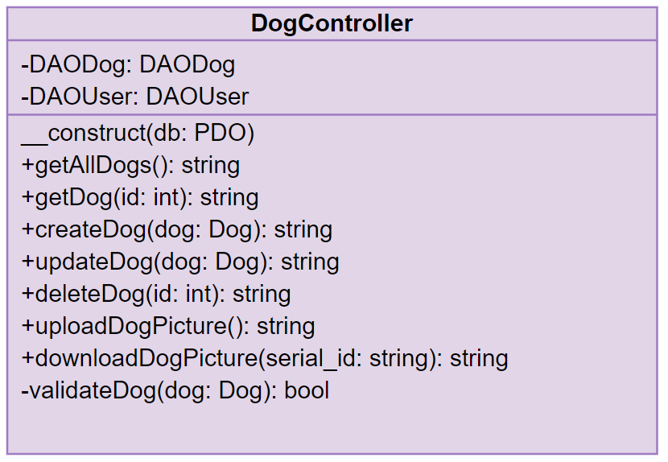

# Travail de diplôme - Documentation technique

## API REST

### Arborescence

```
api/v1
│
└── app
│   └── Models
│   └── DataAccessObject
│   └── Controllers
│   └── System
└── public
└── storage
└── vendor
└── .env
└── bootstrap.php
```

#### app/Models

Le dossier Models contient les modèles de l'API REST, chaque modèles est une représentation objet de sa table de base de données correspondante. La création de ces modèles me permettent d'utiliser les données de ma base de données de manière objet.
Exemple de la classe `Dog` représentant la table `dog` de la base de donnée :


#### app/DataAccessObject

Le dossier DataAccessObject contient les data access object (DAO) de l'API REST, ces DAO contiennent toutes les méthodes permettant un CRUD sur sa table de base de données correspondante. Les méthodes des DAO fonctionnent de manière à créer ou récupérer des modèles afin de respecter un maximum la structure objet de l'API REST.
Exemple de la classe `DAODog` :


#### app/Controllers

Le dossier Controllers contient les contrôleurs de l'API REST, comme leur noms l'indique, le but des contrôleurs est de contrôler les différents cas d'utilisation et autorisations d'accès en utilisant, s'il le faut, les DAO afin de communiquer avec la base de données et en retournant les différents codes HTTP et messages en format JSON. 
Exemple de la classe `DogController` :



Dans ce dossier réside également les contrôleurs `ResponseController` et `HelperController`. Le `ResponseController` permet de retourner toutes les différentes réponses HTTP. Le `HelperController` permet l'utilisation de méthode dite d'aide et qui n'aurait pas leur place dans un contrôleur basique.
Classes `ResponseController` et `HelperController` :


#### app/System

Le dossier System contient la classe `DatabaseConnector` qui permet la connexion à la base de données en récupérant les variables d'environnements *PHP dotenv* et la classe `Constants` permettant de stocker les différentes constantes de l'API REST.
Classes `DatabaseConnector` et `Constants` :


#### public

Le dossier public contient les différents fichiers d'entrées de l'API REST. Les fichiers d'entrées récupère le `verb HTTP` d'une requête HTTP afin de pouvoir exécuter les bonnes méthodes de contrôleur. Ces fichiers s'occupent également d'attribuer les headers et le body si nécessaire. 

#### storage

Dossier contenant les différents fichiers uploadés de l'API REST, comme les documents PDF ou les photos de chien par exemple. 

#### bootstrap.php

Fichier de bootage de l'API REST inclus dans tout les fichiers d'entrées, celui-ci permet de : 

* Charger les dépendances PHP dans le dossier vendor
* Charger les variables d'environnements
* Créer la connexion à la base données

### Structure


### Tests unitaires

Afin de tester l'API REST j'ai utilisé l'outil Postman qui m'a permis d'exécuter des scripts de test pour chaque endpoint de mon API REST. Ces tests sont réalisable en JavaScript en respectant un format bien unique à Postman bien évidemment. Tout les tests unitaires de mon API REST sont identifiable grâce à un code qui leur est propre.

**Format de code**


**Définition**

<table>
    <tr>
    	<th style="text-align:center; font-size: 24px;" COLSPAN="2">Code des noms de modèles</th>
    </tr>
    <tr>
        <th>Modèle</th>
        <th>CODE</th>
    </tr>
    <tr>
        <td>User</td>
        <td>USE</td>
    </tr>
    <tr>
        <td>Dog</td>
        <td>DOG</td>
    </tr>
    <tr>
        <td>Document</td>
        <td>Doc</td>
    </tr>
    <tr>
        <td>Absence</td>
        <td>ABS</td>
    </tr>
    <tr>
        <td>WeeklySchedule</td>
        <td>WEE</td>
    </tr>
    <tr>
        <td>ScheduleOverride</td>
        <td>SCH</td>
    </tr>
    <tr>
        <td>TimeSlot</td>
        <td>TIM</td>
    </tr>
    <tr>
        <td>Appoitment</td>
        <td>APP</td>
    </tr>
</table>

---

<table>
    <tr>
    	<th style="text-align:center; font-size: 24px;" COLSPAN="2">Code des actions</th>
    </tr>
    <tr>
        <th>Action</th>
        <th>CODE</th>
    </tr>
    <tr>
        <td>Get all</td>
        <td>GA</td>
    </tr>
    <tr>
        <td>Get one</td>
        <td>GO</td>
    </tr>
    <tr>
        <td>Create one</td>
        <td>CO</td>
    </tr>
    <tr>
        <td>Update one</td>
        <td>UO</td>
    </tr>
    <tr>
        <td>Delete one</td>
        <td>DO</td>
    </tr>
    <tr>
        <td>Connection</td>
        <td>C</td>
    </tr>
    <tr>
        <td>Get user authenticated</td>
        <td>GUA</td>
    </tr>
    <tr>
        <td>Upload dog picture</td>
        <td>UDP</td>
    </tr>
    <tr>
        <td>Download dog picture</td>
        <td>DDP</td>
    </tr>
    <tr>
        <td>Download document</td>
        <td>DD</td>
    </tr>
</table>

### Endpoints

####  POST api/v1/users

##### Objectif

Créer un utilisateur dans la base de données.

##### Utilisation concrète

Cet endpoint permet l'inscription d'un client de deux manière différentes afin que celui-ci puisse accéder aux fonctionnalités de l'application :

* Inscription client de manière autonome
* Inscription client par l'éducateur canin lors d'un appel téléphonique, un mail contenant un mot de passe généré aléatoirement est également envoyé par mail

Body de la requête :

| Clef        | Définition                              | Obligatoire | Format                            |
| ----------- | --------------------------------------- | :---------: | --------------------------------- |
| email       | L'adresse e-mail de l'utilisateur       |      X      | l'adresse e-mail doit être valide |
| firstname   | Le prénom de l'utilisateur              |      X      |                                   |
| lastname    | Le nom de l'utilisateur                 |      X      |                                   |
| phonenumber | Le numéro de téléphone de l'utilisateur |      X      |                                   |
| address     | L'adresse de l'utilisateur              |      X      |                                   |
| password    | Le mot de passe de l'utilisateur        |             |                                   |

##### Use case


##### Flow chart


##### Tests unitaires

**[USE_CO1] Create one user without email**

```javascript
pm.test("Right code for invalid attributes", function () {
    pm.response.to.have.status(400);
});
pm.test("Right message for request without email", function () {
    const responseJson = pm.response.json();
    pm.expect(responseJson.error).to.eql("Attributs invalides.");
});
```

**[USE_CO2] Create one user without firstname**

```javascript
pm.test("Right code for invalid attributes", function () {
    pm.response.to.have.status(400);
});
pm.test("Right message for request without firstname", function () {
    const responseJson = pm.response.json();
    pm.expect(responseJson.error).to.eql("Attributs invalides.");
});
```

**[USE_CO3] Create one user without lastname**

```javascript
pm.test("Right code for invalid attributes", function () {
    pm.response.to.have.status(400);
});
pm.test("Right message for request without lastname", function () {
    const responseJson = pm.response.json();
    pm.expect(responseJson.error).to.eql("Attributs invalides.");
});
```

**[USE_CO4] Create one user without phonenumber**

```javascript
pm.test("Right code for invalid attributes", function () {
    pm.response.to.have.status(400);
});
pm.test("Right message for request without phone number", function () {
    const responseJson = pm.response.json();
    pm.expect(responseJson.error).to.eql("Attributs invalides.");
});
```

**[USE_CO5] Create one user without address**

```javascript
pm.test("Right code for invalid attributes", function () {
    pm.response.to.have.status(400);
});
pm.test("Right message for request without address", function () {
    const responseJson = pm.response.json();
    pm.expect(responseJson.error).to.eql("Attributs invalides.");
});
```

**[USE_CO6] Create one user with invalid email format**

```javascript
pm.test("Right code for invalid email format", function () {
    pm.response.to.have.status(400);
});
pm.test("Right message for for invalid email format", function () {
    const responseJson = pm.response.json();
    pm.expect(responseJson.error).to.eql("Format d'adresse email invalide.");
});
```

**[USE_CO7] Create one user without problems**

```javascript
pm.test("Right code for successful created ressource", function () {
    pm.response.to.have.status(201);
});
```

####  GET api/v1/users

##### Objectif

Récupère tout les utilisateurs avec le `code_role` 1 (client) de la base de données.

##### Utilisation concrète

Cet endpoint permet de récupérer tous les clients de l'application. L'endpoint est accessible uniquement par les administrateurs.

##### Flow chart


##### Tests unitaires

**[USE-GA1] Get all users with a user api token**

```javascript
pm.test("Authorization header is present", () => {
  pm.request.to.have.header("Authorization");
});
pm.test("Authorization header is false", function () {
    pm.response.to.have.status(403);
});
pm.test("Right message for access without permission", function () {
    const responseJson = pm.response.json();
    pm.expect(responseJson.error).to.eql("Vous n'avez pas les permissions.");
});
```

**[USE-GA2] Get right users with admin api token**

```javascript
pm.test("Authorization header is present", () => {
  pm.request.to.have.header("Authorization");
});
pm.test("Authorization header is right", function () {
    pm.response.to.have.status(200);
});
pm.test("The data structure of the response is correct", () => {
  pm.response.to.have.jsonSchema({
      "type": "array",
      "items": [{
          "type": "object",
          "properties": {
              "id" : {"type" : "integer"},
              "email" : {"type" : "string"},
              "firstname" : {"type" : "string"},
              "lastname" : {"type" : "string"},
              "phonenumber" : {"type" : "string"},
              "address" : {"type" : "string"},
              "api_token" : {"type" : "null"},
              "code_role" : {"type" : "null"},
              "password_hash" : {"type" : "null"}
          },
          "required": ["id","email","firstname","lastname","phonenumber","address","api_token","code_role","password_hash"]
      }]
  })
});
```


#### GET api/v1/users/{idUser}

##### Objectif

Récupère un utilisateur de la base de données grâce à son identifiant .

##### Utilisation concrète

Cet endpoint permet de récupérer un client spécifique de l'application. L'endpoint est accessible uniquement par les administrateurs.

##### Flow chart


##### Tests unitaires

**[USE-GO1] Get one user with a user api token**

```javascript
pm.test("Authorization header is present", () => {
  pm.request.to.have.header("Authorization");
});
pm.test("Authorization header is false", function () {
    pm.response.to.have.status(403);
});
pm.test("Right message for access without permission", function () {
    const responseJson = pm.response.json();
    pm.expect(responseJson.error).to.eql("Vous n'avez pas les permissions.");
});
```

**[USE_GO2] Get one non-existent user**

```javascript
pm.test("User not found", function () {
    pm.response.to.have.status(404);
});
pm.test("Right message for not found response", function () {
    const responseJson = pm.response.json();
    pm.expect(responseJson.error).to.eql("Le serveur n'a pas trouvé la ressource demandée.");
});
```

**[USE-GO3] Get right user wtih admin api token**

```javascript
pm.test("Authorization header is present", () => {
  pm.request.to.have.header("Authorization");
});
pm.test("Authorization header is right", function () {
    pm.response.to.have.status(200);
});
pm.test("The data structure of the response is correct", () => {
  pm.response.to.have.jsonSchema({
          "type": "object",
          "properties": {
              "id" : {"type" : "integer"},
              "email" : {"type" : "string"},
              "firstname" : {"type" : "string"},
              "lastname" : {"type" : "string"},
              "phonenumber" : {"type" : "string"},
              "address" : {"type" : "string"},
              "api_token" : {"type" : "string"},
              "code_role" : {"type" : "integer"},
              "password_hash" : {"type" : ["string","null"]}
          },
          "required": ["id","email","firstname","lastname","phonenumber","address","api_token","code_role","password_hash"]
  })
});
```

####  PATCH api/v1/users/{idUser}

##### Objectif

Modifier un utilisateur dans la base de données.

##### Utilisation concrète

Cet endpoint permet la modification des informations d'un utilisateur.
Body de la requête :

| Clef        | Définition                              | Obligatoire | Format                            |
| ----------- | --------------------------------------- | :---------: | --------------------------------- |
| email       | L'adresse e-mail de l'utilisateur       |             | l'adresse e-mail doit être valide |
| firstname   | Le prénom de l'utilisateur              |             |                                   |
| lastname    | Le nom de l'utilisateur                 |             |                                   |
| phonenumber | Le numéro de téléphone de l'utilisateur |             |                                   |
| address     | L'adresse de l'utilisateur              |             |                                   |

##### Flow chart


##### Tests unitaires

**[USE_UO1] Update one user with a user api token**

```javascript
pm.test("Authorization header is present", () => {
  pm.request.to.have.header("Authorization");
});
pm.test("Authorization header is false", function () {
    pm.response.to.have.status(403);
});
pm.test("Right message for access without permission", function () {
    const responseJson = pm.response.json();
    pm.expect(responseJson.error).to.eql("Vous n'avez pas les permissions.");
});
```

**[USE_UO2] Update one non-existent user**

```javascript
pm.test("User not found", function () {
    pm.response.to.have.status(404);
});
pm.test("Right message for not found response", function () {
    const responseJson = pm.response.json();
    pm.expect(responseJson.error).to.eql("Le serveur n'a pas trouvé la ressource demandée.");
});
```

**[USE_UO3] Update one user with invalid email format**

```javascript
pm.test("Right code for invalid email format", function () {
    pm.response.to.have.status(400);
});
pm.test("Right message for for invalid email format", function () {
    const responseJson = pm.response.json();
    pm.expect(responseJson.error).to.eql("Format d'adresse email invalide.");
});
```

**[USE_UO4] Update one user without problems**

```javascript
pm.test("Right code for successful updated ressource", function () {
    pm.response.to.have.status(200);
});
```

####  DELETE api/v1/users/{idUser}

##### Objectif

Supprimer un utilisateur dans la base de données.

##### Utilisation concrète

Cet endpoint permet la suppression définitif d'un utilisateur.

##### Flow chart


##### Tests unitaires

**[USE-DO1] Delete one user with a user api token**

```javascript
pm.test("Authorization header is present", () => {
  pm.request.to.have.header("Authorization");
});
pm.test("Authorization header is false", function () {
    pm.response.to.have.status(403);
});
pm.test("Right message for access without permission", function () {
    const responseJson = pm.response.json();
    pm.expect(responseJson.error).to.eql("Vous n'avez pas les permissions.");
});
```

**[USE_DO2] Delete one non-existent user**

```javascript
pm.test("User not found", function () {
    pm.response.to.have.status(404);
});
pm.test("Right message for not found response", function () {
    const responseJson = pm.response.json();
    pm.expect(responseJson.error).to.eql("Le serveur n'a pas trouvé la ressource demandée.");
});
```

**[USE-DO3] Delete one user without problems**

```javascript
pm.test("Right code for successful deleted ressource", function () {
    pm.response.to.have.status(200);
});
```

