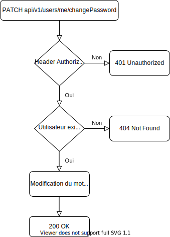
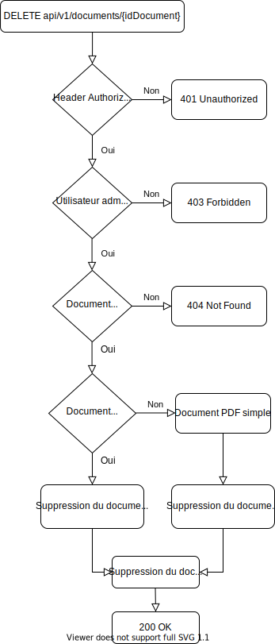
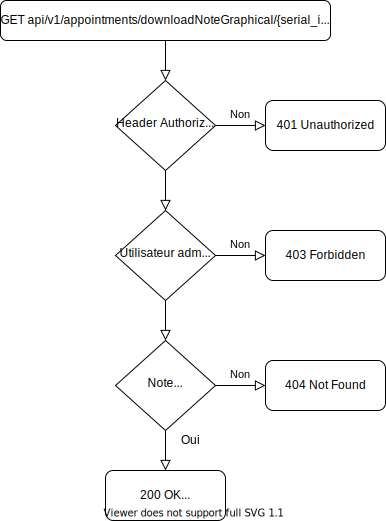

####  POST api/v1/users

##### Objectif

Créer un utilisateur dans la base de données et retourner son code de rôle ainsi que son api token.

##### Utilisation concrète

Cet endpoint permet l'inscription d'un client de deux manières différentes afin que celui-ci puisse accéder aux fonctionnalités de l'application :

* Inscription client de manière autonome
* Inscription client par l'éducateur canin lors d'un appel téléphonique, un e-mail contenant un mot de passe généré aléatoirement est également envoyé par e-mail

Body de la requête :

| Clef        | Définition                              | Obligatoire | Format                            |
| ----------- | --------------------------------------- | :---------: | --------------------------------- |
| email       | L'adresse e-mail de l'utilisateur       |      X      | L'adresse e-mail doit être valide |
| firstname   | Le prénom de l'utilisateur              |      X      |                                   |
| lastname    | Le nom de l'utilisateur                 |      X      |                                   |
| phonenumber | Le numéro de téléphone de l'utilisateur |      X      |                                   |
| address     | L'adresse de l'utilisateur              |      X      |                                   |
| password    | Le mot de passe de l'utilisateur        |             |                                   |

##### Use case

##### Flow chart

##### Tests unitaires

* **[USE_CO1] Create one user without email**
* **[USE_CO2] Create one user without firstname**
* **[USE_CO3] Create one user without lastname**
* **[USE_CO4] Create one user without phonenumber**
* **[USE_CO5] Create one user without address**
* **[USE_CO6] Create one user with invalid email format**
* **[USE-CO7] Create one user with email address already exists**
* **[USE_CO8] Create one user without problems**

####  GET api/v1/users

##### Objectif

Récupérer tous les utilisateurs avec le `code_role` 1 (client) avec leurs chiens de la base de données.

##### Utilisation concrète

Cet endpoint permet de récupérer tous les clients ainsi que leurs chiens de l'application. L'endpoint est accessible uniquement par les administrateurs.

##### Flow chart

##### Tests unitaires

* **[USE-GA1] Get all users with a user api token**

* **[USE-GA2] Get right users with admin api token**

#### GET api/v1/users/{idUser}

##### Objectif

Récupérer un utilisateur avec ses chiens et ses documents de la base de données grâce à son identifiant.

##### Utilisation concrète

Cet endpoint permet de récupérer un client spécifique de l'application avec ses chiens et ses documents. L'endpoint est accessible uniquement par les administrateurs.

##### Flow chart

##### Tests unitaires

* **[USE-GO1] Get one user with a user api token**

* **[USE_GO2] Get one non-existent user**

* **[USE-GO3] Get right user wtih admin api token**

####  PATCH api/v1/users/{idUser}

##### Objectif

Modifier un utilisateur dans la base de données.

##### Utilisation concrète

Cet endpoint permet la modification des informations d'un utilisateur. L'endpoint est accessible uniquement par les administrateurs.
Body de la requête :

| Clef        | Définition                              | Obligatoire | Format                            |
| ----------- | --------------------------------------- | :---------: | --------------------------------- |
| email       | L'adresse e-mail de l'utilisateur       |             | L'adresse e-mail doit être valide |
| firstname   | Le prénom de l'utilisateur              |             |                                   |
| lastname    | Le nom de l'utilisateur                 |             |                                   |
| phonenumber | Le numéro de téléphone de l'utilisateur |             |                                   |
| address     | L'adresse de l'utilisateur              |             |                                   |

##### Flow chart

##### Tests unitaires

* **[USE_UO1] Update one user with a user api token**
* **[USE_UO2] Update one non-existent user**
* **[USE_UO3] Update one user with invalid email format**
* **[USE_UO4] Update one user without problems**

####  DELETE api/v1/users/{idUser}

##### Objectif

Supprimer un utilisateur dans la base de données.

##### Utilisation concrète

Cet endpoint permet la suppression définitive d'un utilisateur. L'endpoint est accessible uniquement par les administrateurs.

##### Flow chart

##### Tests unitaires

* **[USE-DO1] Delete one user with a user api token**
* **[USE_DO2] Delete one non-existent user**
* **[USE-DO3] Delete one user without problems**

####  GET api/v1/users/me

##### Objectif

Récupérer toutes les informations de l'utilisateur authentifié grâce à son api token dans le header `Authorization`.

##### Utilisation concrète

Cet endpoint permet de récupérer toutes les données de l'utilisateur authentifié (chiens, documents, rendez-vous).

##### Flow chart

##### Tests unitaires

* **[USE-GUA1] Get all user information of the current logged in non-existent user**
* **[USE-GUA2] Get all user information of the current logged in user**

####  PATCH api/v1/users/me/changePassword

##### Objectif

Modifier le mot de passe de l'utilisateur authentifié grâce à son api token dans le header `Authorization`.

##### Utilisation concrète

Cet endpoint permet de modifier le mot de passe de l'utilisateur authentifié.
Body de la requête :

| Clef     | Définition              | Obligatoire | Format |
| -------- | ----------------------- | :---------: | ------ |
| password | Le nouveau mot de passe |             |        |

##### 

##### Flow chart

##### Tests unitaires

* **[USE-UPAU1] Update password of the current logged in non-existent user**
* **[USE-UPAU2] Update password of the current logged in user without problems**

####  POST api/v1/connection

##### Objectif

Récupérer l'api token d'un utilisateur dans la base de données grâce à son adresse e-mail ainsi que son mot de passe.

##### Utilisation concrète

Cet endpoint permet la récupération de l'api token afin de permettre à l'utilisateur d'accéder aux différentes fonctionnalités de l'application. 
Body de la requête :

| Clef     | Définition                        | Obligatoire | Format |
| -------- | --------------------------------- | :---------: | ------ |
| email    | L'adresse e-mail de l'utilisateur |      X      |        |
| password | Le prénom de l'utilisateur        |      X      |        |

##### Flow chart

##### Tests unitaires

* **[USE-C1] Connect user without email**
* **[USE-C2] Connect user with an unrecognized email**
* **[USE-C3] Connect user with wrong password**
* **[USE-C4] Successful connection**

####  POST api/v1/dogs

##### Objectif

Créer un chien pour un utilisateur dans la base de données.

##### Utilisation concrète

Cet endpoint permet d'ajouter un chien à un utilisateur. L'endpoint est accessible uniquement par les administrateurs.
Body de la requête :

| Clef              | Définition                                           | Obligatoire | Format |
| ----------------- | ---------------------------------------------------- | :---------: | ------ |
| name              | Le nom du chien                                      |      X      |        |
| breed             | La race du chien                                     |      X      |        |
| sex               | Le sexe du chien                                     |      X      |        |
| picture_serial_id | L'identifiant de série de la photo du chien          |             |        |
| chip_id           | Le numéro de puce sous-cutanée du chien              |             |        |
| user_id           | L'identifiant de l'utilisateur propriétaire du chien |      X      |        |

##### Flow chart

##### Tests unitaires

* **[DOG_CO1] Create one dog with a user api token**
* **[DOG_CO2] Create one dog without name**
* **[DOG_CO3] Create one dog without breed**
* **[DOG_CO4] Create one dog without sex**
* **[DOG_CO5] Create one dog without user_id**
* **[DOG_CO6] Create one dog for non-existent user**
* **[DOG_CO7] Create one dog without problems**

####  GET api/v1/dogs

##### Objectif

Récupérer tous les chiens de la base de données.

##### Utilisation concrète

Cet endpoint permet de récupérer tous les chiens existants de l'application. L'endpoint est accessible uniquement par les administrateurs.

##### Flow chart

##### Tests unitaires

* **[DOG-GA1] Get all dogs with a user api token**
* **[DOG-GA2] Get right dogs with admin api token**

#### GET api/v1/dogs/{idDog}

##### Objectif

Récupérer un chien de la base de données grâce à son identifiant.

##### Utilisation concrète

Cet endpoint permet de récupérer un chien spécifique de l'application. L'endpoint est accessible uniquement par les administrateurs.

##### Flow chart

##### Tests unitaires

* **[DOG-GO1] Get one dog with a user api token**
* **[DOG_GO2] Get one non-existent dog**
* **[DOG-GO3] Get right dog with admin api token**

####  PATCH api/v1/dogs/{idDog}

##### Objectif

Modifier un chien dans la base de données.

##### Utilisation concrète

Cet endpoint permet la modification des informations d'un chien. L'endpoint est accessible uniquement par les administrateurs.
Body de la requête :

| Clef              | Définition                              | Obligatoire | Format |
| ----------------- | --------------------------------------- | :---------: | ------ |
| name              | Le nom du chien                         |             |        |
| breed             | La race du chien                        |             |        |
| sex               | Le sexe du chien                        |             |        |
| picture_serial_id | Le numéro de série de la photo du chien |             |        |
| chip_id           | Le numéro de puce sous-cutanée du chien |             |        |

##### Flow chart

##### Tests unitaires

* **[DOG_UO1] Update one dog with a user api token**
* **[DOG_UO2] Update one non-existent dog**
* **[DOG_UO3] Update one dog without problems**

####  DELETE api/v1/dogs/{idDog}

##### Objectif

Supprimer un chien dans la base de données.

##### Utilisation concrète

Cet endpoint permet la suppression définitive d'un chien. L'endpoint est accessible uniquement par les administrateurs.

##### Flow chart

##### Tests unitaires

* **[DOG-DO1] Delete one dog with a user api token**
* **[DOG-DO2] Delete one non-existent dog**
* **[DOG-DO3] Delete one dog without problems**

####  POST api/v1/dogs/uploadPicture

##### Objectif

Upload une image sur le serveur et l'attribue à un chien de la base de données.

##### Utilisation concrète

Cet endpoint permet d'ajouter une photo à un chien. L'endpoint est accessible uniquement par les administrateurs.
Body de la requête :

| Clef        | Définition             | Obligatoire | Format      |
| ----------- | ---------------------- | :---------: | ----------- |
| dog_picture | La photo du chien      |      X      | PNG ou JPEG |
| dog_id      | L'identifiant du chien |      X      |             |

##### Flow chart

##### Tests unitaires

* **[DOG-UDP1] Upload dog picture with a user api token**
* **[DOG_UDP2] Upload dog picture without dog_picture**
* **[DOG_UDP3] Upload dog picture without dog_id**
* **[DOG_UDP4] Upload dog picture for non-existant dog**
* **[DOG_UDP5] Upload dog picture with invalid image type format**
* **[DOG-UDP6] Upload dog picture without problems**

####  GET api/v1/dogs/downloadPicture/{serial_id}

##### Objectif

Récupérer l'image d'un chien stockée dans le serveur.

##### Utilisation concrète

Cet endpoint permet de récupérer la photo d'un chien grâce à son identifiant de série. L'endpoint est accessible par n'importe quel type d'utilisateur.

##### Flow chart

##### Tests unitaires

* **[DOG-DDP1] Download non-existant dog picture**
* **[DOG-DDP2] Download dog picture without problems**

####  POST api/v1/documents

##### Objectif

Créer un document pour un utilisateur dans la base de données ainsi que de le stocker sur le serveur.

##### Utilisation concrète

Cet endpoint permet d'ajouter un document à un utilisateur. Si le document est de type `conditions_inscription` le système génère les conditions d'inscription avec la signature et le numéro de forfait passé en body de la requête. L'endpoint est accessible uniquement par les administrateurs.
Body de la requête :

| Clef             | Définition                                              |                Obligatoire                | Format                                                 |
| ---------------- | ------------------------------------------------------- | :---------------------------------------: | ------------------------------------------------------ |
| type             | Le type de document à créer                             |                     X                     | Le type doit être "conditions_inscription" ou "poster" |
| user_id          | L'identifiant de l'utilisateur propriétaire du document |                     X                     |                                                        |
| package_number   | Le numéro de forfait des conditions d'inscription       | X si le type est "conditions_inscription" | Le numéro de forfait doit être de 1 à 5                |
| signature_base64 | La signature des conditions d'inscription               | X si le type est "conditions_inscription" |                                                        |
| document         | Le document PDF à upload                                |         X si le type est "poster"         | Le fichier doit être de type PDF                       |

##### Flow chart

##### Tests unitaires

* **[DOC-CO1] Create one document with a user api token**
* **[DOC-CO2] Create one document without type**
* **[DOC-CO3] Create one document without user_id**
* **[DOC-CO4] Create one document with invalid document type format**
* **[DOC-CO5] Create one document for non-existent user**
* **[DOC-CO6] Create one conditions of registration with invalid paramater**
* **[DOC-CO7] Create one conditions of registration with invalid package number**
* **[DOC-CO8] Create one conditions of registration without problems**
* **[DOC-CO9] Create one PDF with invalid document format**
* **[DOC-CO10] Create one PDF without problems**

####  GET api/v1/documents

##### Objectif

Récupérer tous les documents de la base de données.

##### Utilisation concrète

Cet endpoint permet de récupérer tous les documents existants de tous les clients. L'endpoint est accessible uniquement par les administrateurs.

##### Flow chart

##### Tests unitaires

* **[DOC-GA1] Get all documents with a user api token**
* **[DOC-GA2] Get right documents with admin api token**

####  GET api/v1/documents/{idDocument}

##### Objectif

Récupérer un document de la base de données grâce à son identifiant.

##### Utilisation concrète

Cet endpoint permet de récupérer un document spécifique de l'application. L'endpoint est accessible uniquement par les administrateurs.

##### Flow chart

##### Tests unitaires

* **[DOC-GO1] Get one document with a user api token**
* **[DOC-GO2] Get one non-existent document**
* **[DOC-GO3] Get right document with admin api token**

####  PATCH api/v1/documents/{idDocument}

##### Objectif

Modifier un document dans la base de données.

##### Utilisation concrète

Cet endpoint permet la modification des informations d'un document. Néanmoins, cet endpoint n'a pas vraiment de but concret car modifier un document existant ne devrait pas être possible. L'endpoint est accessible uniquement par les administrateurs.
Body de la requête :

| Clef               | Définition                         | Obligatoire | Format                                                 |
| ------------------ | ---------------------------------- | :---------: | ------------------------------------------------------ |
| type               | Le type de document à créer        |             | Le type doit être "conditions_inscription" ou "poster" |
| document_serial_id | L'identifiant de série du document |             |                                                        |

##### Flow chart

##### Tests unitaires

* **[DOC-UO1] Update one document with a user api token**
* **[DOC-UO2] Update one non-existent document**
* **[DOC-CO3] Update one document with invalid document type format**
* **[DOC-UO4] Update one document without problems**

####  DELETE api/v1/documents/{idDocument}

##### Objectif

Supprimer un document dans la base de données.

##### Utilisation concrète

Cet endpoint permet la suppression définitive d'un document avec son document sur le serveur s'il existe. L'endpoint est accessible uniquement par les administrateurs.

##### Flow chart

##### Tests unitaires

* **[DOC-DO1] Delete one document with a user api token**
* **[DOC-DO2] Delete one non-existent document**
* **[DOC-DO3] Delete one document without problems**

####  GET api/v1/dogs/documents/downloadDocument/{serial_id}

##### Objectif

Récupérer un document stocké dans le serveur.

##### Utilisation concrète

Cet endpoint permet de récupérer le document d'un client. L'endpoint est accessible par l'utilisateur propriétaire authentifié.

##### Flow chart

##### Tests unitaires

* **[DOC-DD2] Download document without problems**
* **[DOC-DD1] Download non-existent or non-owner document**

####  POST api/v1/absences

##### Objectif

Créer une donnée de vacance pour l'éducateur canin authentifié dans la base de données.

##### Utilisation concrète

Cet endpoint permet d'ajouter une donnée de vacance. Cette donnée aura une date de début, une date de fin ainsi qu'une description. Les vacances permettront de spécifier une distance temporelle où l'éducateur canin l'ayant créé ne travaillera pas. L'endpoint est accessible uniquement par les administrateurs.
Body de la requête :

| Clef              | Définition                      | Obligatoire | Format                                                       |
| ----------------- | ------------------------------- | :---------: | ------------------------------------------------------------ |
| date_absence_from | La date de début des vacances   |      X      | La date doit respecter le format de date (YYYY-MM-DD)        |
| date_absence_to   | La date de fin des vacances     |      X      | La date doit respecter le format de date (YYYY-MM-DD) et ne pas être située avant la date de début des vacances |
| description       | La description/nom des vacances |             |                                                              |

##### Flow chart

##### Tests unitaires

* **[ABS-CO1] Create one absence with a user api token**
* **[ABS-CO2] Create one absence without date_from**
* **[ABS-CO3] Create one absence without date_to**
* **[ABS-CO4] Create one absence with invalid date_from format (dateAndTimeTestData.csv)**
* **[ABS-CO5] Create one absence with invalid date_to format (dateAndTimeTestData.csv)**
* **[ABS-CO6] Create one absence with chronological date problem**
* **[ABS-CO7] Create one absence without problems**

####  GET api/v1/absences

##### Objectif

Récupérer toutes les données de vacances de l'utilisateur authentifié de la base de données.

##### Utilisation concrète

Cet endpoint permet de récupérer toutes les vacances existantes de l'éducateur canin authentifié. L'endpoint est accessible uniquement par les administrateurs.

##### Flow chart

##### Tests unitaires

* **[ABS-GA1] Get all absences with a user api token**
* **[ABS-GA2] Get right absences with admin api token**

####  GET api/v1/absences/{idAbsence}

##### Objectif

Récupérer une donnée d'absence de l'utilisateur authentifié de la base de données grâce à son identifiant.

##### Utilisation concrète

Cet endpoint permet de récupérer une vacance spécifique de l'éducateur canin authentifié. L'endpoint est accessible uniquement par les administrateurs.

##### Flow chart

##### Tests unitaires

* **[ABS-GO1] Get one absence with a user api token**
* **[ABS-GO2] Get one non-existent absence**
* **[ABS-GO3] Get right absence with admin api token**

####  PATCH api/v1/absences/{idAbsence}

##### Objectif

Modifier une donnée de vacance de l'utilisateur authentifié dans la base de données.

##### Utilisation concrète

Cet endpoint permet la modification des informations d'une vacance de l'éducateur canin authentifié. L'endpoint est accessible uniquement par les administrateurs.
Body de la requête :

| Clef              | Définition                      | Obligatoire | Format                                                       |
| ----------------- | ------------------------------- | :---------: | ------------------------------------------------------------ |
| date_absence_from | La date de début des vacances   |             | La date doit respecter le format de date (YYYY-MM-DD)        |
| date_absence_to   | La date de fin des vacances     |             | La date doit respecter le format de date (YYYY-MM-DD) et ne pas être située avant la date de début des vacances |
| description       | La description/nom des vacances |             |                                                              |

##### Flow chart

##### Tests unitaires

* **[ABS-UO1] Update one absence with a user api token**
* **[ABS-UO2] Update one non-existent absence**
* **[ABS-UO3] Update one absence with invalid date_from format (dateAndTimeTestData.csv)**
* **[ABS-UO4] Update one absence with invalid date_to format (dateAndTimeTestData.csv)**
* **[ABS-UO5] Update one absence with chronological date problem**
* **[ABS-UO6] Update one absence without problems**

####  DELETE api/v1/absences/{idAbsence}

##### Objectif

Supprimer une donnée de vacance de manière non définitive de l'utilisateur authentifié dans la base de données.

##### Utilisation concrète

Cet endpoint permet la suppression non définitive d'une vacance de l'éducateur canin authentifié. L'endpoint est accessible uniquement par les administrateurs.

##### Flow chart

##### Tests unitaires

* **[ABS-DO1] Delete one absence with a user api token**
* **[ABS-DO2] Delete one non-existent absence**
* **[ABS-DO3] Delete one absence without problems**

####  POST api/v1/weeklySchedules

##### Objectif

Créer un calendrier hebdomadaire pour l'utilisateur authentifié dans la base de données.

##### Utilisation concrète

Cet endpoint permet d'ajouter un calendrier hebdomadaire pour l'éducateur canin authentifié. Ce calendrier hebdomadaire doit avoir une date de début mais peut avoir une date de fin. C'est-à-dire qu'un calendrier hebdomadaire sans date de fin est un calendrier hebdomadaire permanent. De ce fait, il peut y avoir qu'un seul calendrier permanent existant pour un éducateur canin. Les calendriers hebdomadaires permettront de créer des créneaux horaires hebdomadaires sur une certaine durée. L'endpoint est accessible uniquement par les administrateurs.
Body de la requête :

| Clef            | Définition                                  | Obligatoire | Format                                                       |
| --------------- | ------------------------------------------- | :---------: | ------------------------------------------------------------ |
| date_valid_from | La date de début du calendrier hebdomadaire |      X      | La date doit respecter le format de date (YYYY-MM-DD)        |
| date_valid_to   | La date de fin du calendrier hebdomadaire   |             | La date doit respecter le format de date (YYYY-MM-DD) et ne pas être située avant la date de début du calendrier hebdomadaire |

##### Flow chart

##### Tests unitaires

* **[WEE-CO1] Create one weekly schedule with a user api token**
* **[WEE-CO2] Create one weekly schedule without date_from**
* **[WEE-CO3] Create one weekly schedule with invalid date_from format (dateAndTimeTestData.csv)**
* **[WEE-CO4] Create one weekly schedule with invalid date_to format (dateAndTimeTestData.csv)**
* **[WEE-CO5] Create one weekly schedule with chronological date problem**
* **[WEE-CO6] Create one weekly schedule permanant when one already exists**
* **[WEE-CO7] Create one weekly schedule with overlap problem**
* **[WEE-CO8] Create one weekly schedule without problems**

####  GET api/v1/weeklySchedules

##### Objectif

Récupérer tous les calendriers hebdomadaires ainsi que leurs créneaux horaires de l'utilisateur authentifié de la base de données.

##### Utilisation concrète

Cet endpoint permet de récupérer tous les calendriers hebdomadaires existants ainsi que leurs créneaux horaires de l'éducateur canin authentifié. L'endpoint est accessible uniquement par les administrateurs.

##### Flow chart

##### Tests unitaires

* **[WEE-GA1] Get all weekly schedules with a user api token**
* **[WEE-GA2] Get right weekly schedules with admin api token**

####  GET api/v1/weeklySchedules/{idWeeklySchedule}

##### Objectif

Récupérer un calendrier hebdomadaire de l'utilisateur authentifié de la base de données grâce à son identifiant.

##### Utilisation concrète

Cet endpoint permet de récupérer un calendrier hebdomadaire spécifique de l'éducateur canin authentifié. L'endpoint est accessible uniquement par les administrateurs.

##### Flow chart

##### Tests unitaires

* **[WEE-GO1] Get one weekly schedule with a user api token**
* **[WEE-GO2] Get one non-existent weekly schedule**
* **[WEE-GO3] Get right weekly schedule with admin api token**

####  DELETE api/v1/weeklySchedules/{idWeeklySchedule}

##### Objectif

Supprimer un calendrier hebdomadaire de manière non définitive de l'utilisateur authentifié dans la base de données.

##### Utilisation concrète

Cet endpoint permet la suppression non définitive d'un calendrier hebdomadaire de l'éducateur canin authentifié. L'endpoint est accessible uniquement par les administrateurs.

##### Flow chart

##### Tests unitaires

* **[WEE-DO1] Delete one weekly schedule with a user api token**
* **[WEE-DO2] Delete one non-existent weekly schedule**
* **[WEE-DO3] Delete one weekly schedule without problems**

####  POST api/v1/scheduleOverrides

##### Objectif

Créer une exception d'horaire de l'utilisateur authentifié dans la base de données.

##### Utilisation concrète

Cet endpoint permet d'ajouter une exception d'horaire de l'éducateur canin authentifié. Cette exception d'horaire est une date unique. Les exceptions d'horaires permettront de créer des créneaux horaires hebdomadaires sur un jour unique particulier. L'endpoint est accessible uniquement par les administrateurs.
Body de la requête :

| Clef                   | Définition                       | Obligatoire | Format                                                |
| ---------------------- | -------------------------------- | :---------: | ----------------------------------------------------- |
| date_schedule_override | La date de l'exception d'horaire |      X      | La date doit respecter le format de date (YYYY-MM-DD) |

##### Flow chart

##### Tests unitaires

* **[SCH-CO1] Create one schedule override with a user api token**
* **[SCH-CO2] Create one schedule override without date**
* **[SCH-CO3] Create one schedule override with invalid date format (dateAndTimeTestData.csv)**
* **[SCH-CO4] Create one schedule override with overlap problem**
* **[SCH-CO5] Create one schedule override without problems**

####  GET api/v1/scheduleOverrides

##### Objectif

Récupérer toutes les exceptions d'horaires ainsi que leurs créneaux horaires de l'utilisateur authentifié de la base de données.

##### Utilisation concrète

Cet endpoint permet de récupérer toutes les exceptions d'horaires existantes ainsi que leurs créneaux horaires de l'éducateur canin authentifié. L'endpoint est accessible uniquement par les administrateurs.

##### Flow chart

##### Tests unitaires

* **[SCH-GA1] Get all schedule overrides with a user api token**
* **[SCH-GA2] Get right schedule overrides with admin api token**

####  GET api/v1/scheduleOverrides/{idScheduleOverride}

##### Objectif

Récupérer une exception d'horaire de l'utilisateur authentifié de la base de données grâce à son identifiant.

##### Utilisation concrète

Cet endpoint permet de récupérer une exception d'horaire spécifique de l'éducateur canin authentifié. L'endpoint est accessible uniquement par les administrateurs.

##### Flow chart

##### Tests unitaires

* **[SCH-GO1] Get one schedule override with a user api token**
* **[SCH-GO2] Get one non-existent schedule override**
* **[SCH-GO3] Get right schedule override with admin api token**

####  DELETE api/v1/scheduleOverrides/{idScheduleOverride}

##### Objectif

Supprimer une exception d'horaire de manière non définitive de l'utilisateur authentifié dans la base de données.

##### Utilisation concrète

Cet endpoint permet la suppression non définitive d'une exception d'horaire de l'éducateur canin authentifié. L'endpoint est accessible uniquement par les administrateurs.

##### Flow chart

##### Tests unitaires

* **[SCH-DO1] Delete one schedule override with a user api token**
* **[SCH-DO2] Delete one non-existent schedule override**
* **[SCH-DO3] Delete one schedule override without problems**

####  POST api/v1/timeSlots

##### Objectif

Créer un créneau horaire pour l'utilisateur authentifié dans la base de données.

##### Utilisation concrète

Cet endpoint permet d'ajouter un créneau horaire pour un calendrier hebdomadaire ou pour une exception d'horaire de l'éducateur canin authentifié. Ce créneau horaire doit avoir une heure de début, une heure de fin et un code correspondant à la journée de la semaine désirée. L'endpoint est accessible uniquement par les administrateurs.
Body de la requête :

| Clef                 | Définition                                    |            Obligatoire             | Format                                                       |
| -------------------- | --------------------------------------------- | :--------------------------------: | ------------------------------------------------------------ |
| code_day             | Le code du jour de la semaine                 |                 X                  | Le code doit être entre 1 et 7 (1 = Dimanche, 2 = Lundi, 3 = Mardi, 4 = Mercredi, 5 = Jeudi, 6 = Vendredi, 7 = Samedi) |
| time_start           | L'heure de début du créneau horaire           |                 X                  | L'heure doit respecter le format d'heure (HH-MM-SS)          |
| time_end             | L'heure de fin du créneau horaire             |                 X                  | L'heure doit respecter le format d'heure (HH-MM-SS) et ne pas être située avant l'heure de début du créneau horaire |
| id_schedule_override | L'exception d'horaire du créneau horaire      |  X si id_weekly_schedule est null  |                                                              |
| id_weekly_schedule   | Le calendrier hebdomadaire du créneau horaire | X si id_schedule_override est null |                                                              |

##### Flow chart

##### Tests unitaires

* **[TIM-CO1] Create one time slot with a user api token**
* **[TIM-CO2] Create one time slot without code day**
* **[TIM-CO3] Create one time slot without time start**
* **[TIM-CO4] Create one time slot without time end**
* **[TIM-CO5] Create one time slot without the id weekly schedule and the id schedule override**
* **[TIM-CO6] Create one time slot with the id weekly schedule and the id schedule override**
* **[TIM-CO7] Create one time slot for non-existent weekly schedule**
* **[TIM-CO8] Create one time slot for non-existent schedule override**
* **[TIM-CO9] Create one time slot with invalid code_day format**
* **[TIM-CO10] Create one time slot with invalid time_start format (dateAndTimeTestData.csv)**
* **[TIM-CO11] Create one time slot with invalid time_end format (dateAndTimeTestData.csv)**
* **[TIM-CO12] Create one time slot with chronological time problem**
* **[TIM-CO13] Create one time slot with time slot overlap in the same weekly schedule problem**
* **[TIM-CO14] Create one time slot with time slot overlap in the same schedule override problem**
* **[TIM-CO15] Create one time slot without problems**

####  GET api/v1/timeSlots

##### Objectif

Récupérer tous les créneaux horaires de l'utilisateur authentifié de la base de données.

##### Utilisation concrète

Cet endpoint permet de récupérer tous les créneaux horaires existants de l'éducateur canin authentifié. L'endpoint est accessible uniquement par les administrateurs.

##### Flow chart

##### Tests unitaires

* **[TIM-GA1] Get all time slots with a user api token**
* **[TIM-GA2] Get right time slots with admin api token**

####  GET api/v1/timeSlots/{idTimeSlot}

##### Objectif

Récupérer un créneau horaire de l'utilisateur authentifié de la base de données grâce à son identifiant.

##### Utilisation concrète

Cet endpoint permet de récupérer un créneau horaire spécifique de l'éducateur canin authentifié. L'endpoint est accessible uniquement par les administrateurs.

##### Flow chart

##### Tests unitaires

* **[TIM-GO1] Get one time slot with a user api token**
* **[TIM-GO2] Get one non-existent time slot**
* **[TIM-GO3] Get right time slot with admin api token**

####  DELETE api/v1/timeSlots/{idTimeSlot}

##### Objectif

Supprimer un créneau horaire de manière non définitive de l'utilisateur authentifié dans la base de données.

##### Utilisation concrète

Cet endpoint permet la suppression non définitive d'un créneau horaire de l'éducateur canin authentifié. L'endpoint est accessible uniquement par les administrateurs.

##### Flow chart

##### Tests unitaires

* **[TIM-DO1] Delete one time slot with a user api token**
* **[TIM-DO2] Delete one non-existent time slot**
* **[TIM-DO3] Delete one time slot without problems**

####  POST api/v1/appointments

##### Objectif

Créer un rendez-vous entre deux utilisateurs dans la base de données.

##### Utilisation concrète

Cet endpoint permet d'ajouter un rendez-vous entre un client et un éducateur canin. La création de rendez-vous insère uniquement les données temporelles du rendez-vous. L'endpoint est accessible par les utilisateurs authentifiés.
Body de la requête :

| Clef                | Définition                         | Obligatoire | Format                                                       |
| ------------------- | ---------------------------------- | :---------: | ------------------------------------------------------------ |
| datetime_appointment | La date et l'heure du rendez-vous  |      X      | La date et l'heure doivent respecter le format   (YYYY-MM-DD HH:MM:SS) |
| duration_in_hour    | La durée en heure du rendez-vous   |      X      |                                                              |
| user_id_customer    | L'identifiant du client            |      X      |                                                              |
| user_id_educator    | L'identifiant de l'éducateur canin |      X      |                                                              |

##### Flow chart

##### Tests unitaires

* **[APP-CO1] Create one appointment with unauthorized user**
* **[APP-CO2] Create one appointment without datetime_appointment**
* **[APP-CO3] Create one appointment without duration_in_hour**
* **[APP-C04] Create one appointment without user_id_customer**
* **[APP-C05] Create one appointment without user_id_educator**
* **[APP-C06] Create one appointment for non-existent customer user**
* **[APP-C07] Create one appointment for non-existent educator user**
* **[APP-CO8] Create one appointment with invalid datetime_appointment format (dateAndTimeTestData.csv)**
* **[APP-CO9] Create one appointment for invalid appointment slot**
* **[APP-CO10] Create one appointment without problems**

####  GET api/v1/appointments

##### Objectif

Récupérer tous les rendez-vous de l'utilisateur authentifié de la base de données.

##### Utilisation concrète

Cet endpoint permet de récupérer toutes les informations des rendez-vous de l'utilisateur authentifié. Si l'utilisateur est un client, l'endpoint ne retourne pas les notes de l'éducateur canin. L'endpoint est accessible par les utilisateurs authentifiés.

##### Flow chart

##### Tests unitaires

* **[APP-GA1] Get all appointments with unauthorized user**
* **[APP-GA2] Get right appointments for customer**
* **[APP-GA3] Get right appointments for educator**

####  GET api/v1/appointments/{idAppointment}

##### Objectif

Récupérer un rendez-vous de la base de données grâce à son identifiant.

##### Utilisation concrète

Cet endpoint permet de récupérer un rendez-vous spécifique. L'endpoint est accessible uniquement par les administrateurs.

##### Flow chart

##### Tests unitaires

* **[APP-GO1] Get one appointment with a user api token**
* **[APP-GO2] Get one non-existent appointment**
* **[APP-GO3] Get right appointment**

####  PATCH api/v1/appointments/{idAppointment}

##### Objectif

Modifier un rendez-vous de la base de données grâce à son identifiant.

##### Utilisation concrète

Cet endpoint permet la modification des informations d'un rendez-vous. Il est impossible de modifier les informations temporelles d'un rendez-vous, uniquement les notes textuelles et le résumé peuvent l'être. L'endpoint est accessible uniquement par les administrateurs.
Body de la requête :

| Clef      | Définition                          | Obligatoire | Format |
| --------- | ----------------------------------- | :---------: | ------ |
| note_text | Les notes textuelles du rendez-vous |             |        |
| summary   | Le résumé du rendez-vous            |             |        |

##### Flow chart

##### Tests unitaires

* **[APP-UO1] Update one appointment with a user api token**
* **[APP-UO2] Update one non-existent appointment**
* **[APP-UO3] Update one appointment without problems**

####  DELETE api/v1/appointments/{idAppointment}

##### Objectif

Supprimer un rendez-vous de manière non définitive dans la base de données.

##### Utilisation concrète

Cet endpoint permet la suppression non définitive d'un rendez-vous. Cette suppression non définitive permet d'identifier quand le rendez-vous a été supprimé et par quel utilisateur. L'endpoint est accessible uniquement par les utilisateurs authentifiés.

##### Flow chart

##### Tests unitaires

* **[APP-DO1] Delete one appointment with unauthorized user**
* **[APP-DO2] Delete one non-existent appointment**
* **[APP-DO3] Delete one appointment with unauthorized customer or educator**
* **[APP-DO4] Delete one appointment without problems**

####  POST api/v1/appointments/uploadNoteGraphical

##### Objectif

Upload une note graphique sur le serveur et l'attribue à un rendez-vous de la base de données.

##### Utilisation concrète

Cet endpoint permet d'ajouter une note graphique à un rendez-vous. L'endpoint est accessible uniquement par les administrateurs.
Body de la requête :

| Clef           | Définition                   | Obligatoire | Format |
| -------------- | ---------------------------- | :---------: | ------ |
| note_graphical | La note graphique            |      X      | PNG    |
| appointment_id  | L'identifiant du rendez-vous |      X      |        |

##### Flow chart

##### Tests unitaires

* **[APP-UNG1] Upload note graphical with a user api token**
* **[APP-UNG2] Upload note graphical without note_graphical**
* **[APP-UNG3] Upload note graphical without appointment_id**
* **[APP-UNG4] Upload note graphical for non-existant appointment**
* **[APP-UNG5] Upload note graphical with invalid image format**
* **[APP-UNG6] Upload note graphical without problems**

####  GET api/v1/appointments/downloadNoteGraphical/{serial_id}

##### Objectif

Récupérer une note graphique stockée dans le serveur.

##### Utilisation concrète

Cet endpoint permet de récupérer une note graphique en base64 grâce à son identifiant de série.

##### Flow chart

##### Tests unitaires

* **[APP-DNG1] Download note graphical with a user api token**
* **[APP-DNG2] Download non-existant note graphical**
* **[APP-DNG3] Download note graphical without problems**

####  GET api/v1/plannings/{idEducator}

##### Objectif

Récupérer le planning d'un éducateur canin grâce à son identifiant.

##### Utilisation concrète

Cet endpoint permet de récupérer le planning d'un éducateur canin. Le planning d'un éducateur canin contient toutes les dates et heures qui permettent un rendez-vous avec celui-ci. L'endpoint est accessible par n'importe quel type d'utilisateur.

##### Flow chart

##### Tests unitaires

* **[PLA-GO1] Get one planning for non-existent educator**
* **[PLA-GO2] Get right planning**