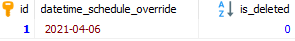
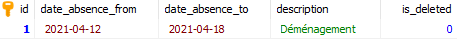
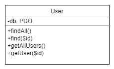
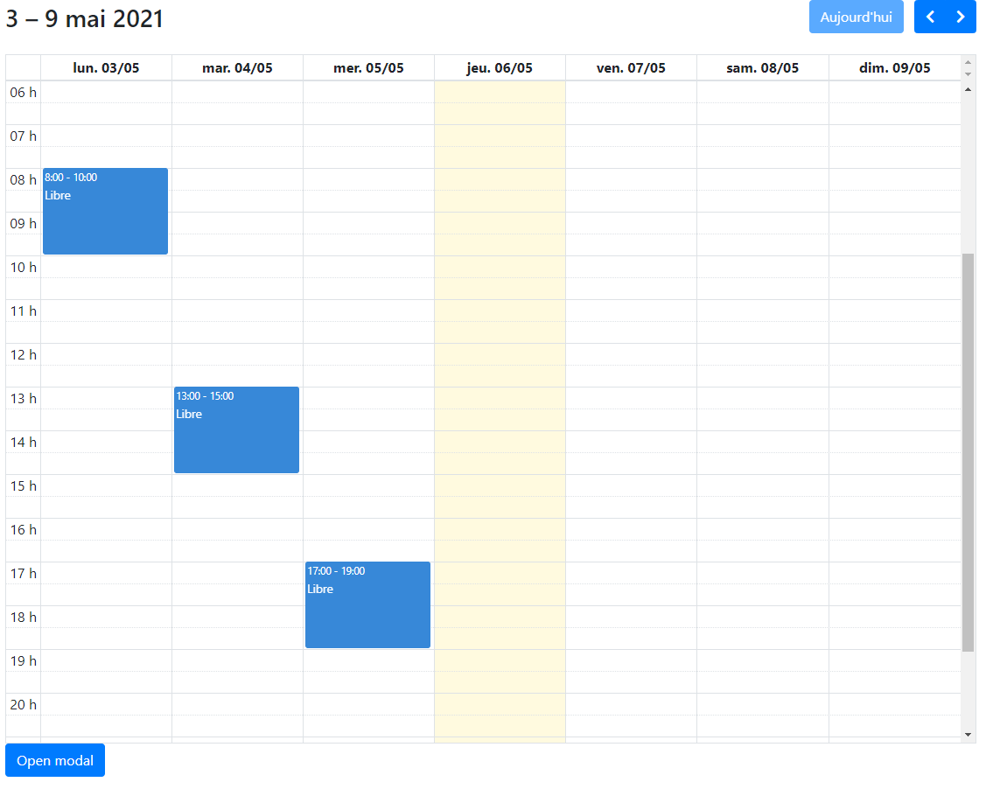
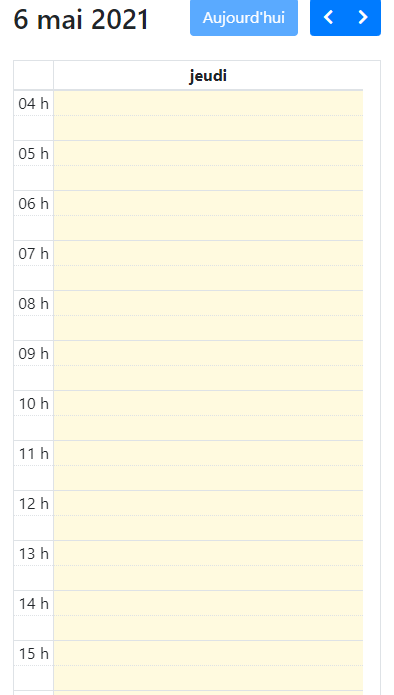

# Douceur de chien

## Log book travail de stage

### Mardi 30  mars 2021

#### Objectif du POC

Pour la réalisation de ce POC, Monsieur Mathieu et moi-même avons convenu de réaliser uniquement la partie planning de mon API REST.

C'est-à-dire, les tables suivantes :


L'objectif est de permettre à l'éducateur canin de créer ses différents créneaux horaires. Ces créneaux horaires (time_slot) pourront être réguliers pour une certaine distance (weekly_schedule) ou unique pour un jour (schedule_override). De plus, l'éducateur canin pourra spécifier des distances de vacances (absences) qui devront rendre indisponibles tous les créneaux horaires les incluant, le tout en gérant les différents problèmes de chevauchement que la création de planning pourra entraîner.

Exemple de données de planning allant du 30 mars 2021 jusqu'au 30 avril 2021 :

**weekly_schedule**


**schedule_override**



**time_slot**


**absence**



Croquis d'une représentation graphique du planning


L'objectif du POC sera de réaliser les différents endpoints de l'API afin de permettre à l'éducateur canin de réaliser son planning et de rendre possible la prise de rendez-vous avec celui-ci.

**Création de l'arborescence de l'API REST**

```
api-rest_douceur-de-chien
└───app
│	└───Controllers
│	└───Models
│	└───System
└───public
└───vendor
│   .env
│   bootstrap.php
│   composer.json
│   dbseed.php
```

**app/Controllers**

Dossier contenant les Controllers de l'API qui permettent l'exécution des fonctions CRUD adéquate pour les endpoints.
Exemple de Class Controller permettant les endpoints *users* ou *user/{id}* :


**app/Models**

Dossier contenant les Models de l'API qui permettent le traitement SQL des données.
Exemple de Class Model permettant de récupérer un utilisateur ou tous les utilisateurs :



**app/System**

Dossier contenant les fichiers de système de l'API.
Exemple de Class System permettant la connexion à la base de données :


**public**

Dossier contenant mes fichiers publics.
Exemple : index.php

**vendor**

Dossier contenant les librairies PHP utilisées.
Exemple:  Librairie PHP dotenv qui permet la génération de variables d'environnements. 

**bootstrap.php**

Fichier permettant le chargement des librairies et des variables d'environnements.

**composer.json**

Fichier permettant la mémorisation et la génération des différentes librairies à utiliser.

**dbseed.php**

Fichier permettant d'insérer des données de tests dans la base de données.

### Mercredi 31  mars 2021

**PHP dotenv**

Ajout de la librairie [PHP dotenv](https://github.com/vlucas/phpdotenv) permettant la génération et l'utilisation de variables d'environnements.
Création du fichier .env contenant les variables d'environnement de connexion à la base de données :

* DB_HOST
* DB_PORT
* DB_DATABASE
* DB_USERNAME
* DB_PASSWORD

**System DatabaseConnector**

Création de la class DatabaseConnector permettant la connexion à la base de données.
Pour cette première version, la class récupère les variables d'environnements de connexion et créér un objet PDO avec celles-ci dans son constructeur. Une méthode getConnection() permet de récupérer cette connexion PDO.

**Model User**

Création du premier Model User afin de tester la structure objet de l'API.
Le modèle récupère en paramètre la connexion à la PDO.

Méthodes développées :

* findAll()
  * Récupère toutes les informations de tous les clients hormis le mot de passe et son sel dans un tableau associatif.
* find($id)
  * Similaire à findAll() mais uniquement pour un utilisateur.
* getRole
  * Récupère le rôle d'un utilisateur par rapport à son api_token.

**UserController**

Création du premier Controller UserController.

Méthodes développées :

* processRequest()
  * Permet de traiter la requête correspondant à la méthode spécifiée dans le constructeur de l'objet.
    * GET
      * Sans l'attribut "userId" set, la méthode va appeler getAllUsers.
      * Avec l'attribut "userId" set, la méthode va appeler getUser($id).
* getAllUsers()
  * Récupère tous les utilisateurs en format JSON si la demande vient d'un utilisateur avec le rôle 2 (Éducateur canin).
* getUser($id)
  * Récupère l'utilisateur en format JSON correspondant à l'identifiant passé en paramètre. 

**bootstrap.php**

Création du fichier de bootage de l'API. Celui-ci permet pour l'instant de :

* Charger les différentes librairies ajoutées avec Composer grâce au fichier autoload.php généré par celui-ci.
* Charger les variables d'environnements PHP dotenv.
* Créer la connexion avec la base de données.

**index.php**

Point d'entrée des HTTP request de l'API.

* Charge le fichier bootstrap.php
* Ajoute les headers :
  * Access-Control-Allow-Origin: *
    * Permet à n'importe quelle ressource d'accéder aux ressources de l'API.
  * Content-Type: application/json; charset=UTF-8
    * Le type et l'encodage des réponses de l'API.
  * Access-Control-Allow-Methods: GET,POST,PATCH,DELETE
    * Permet les méthodes de request de type : GET, POST, PATCH et DELETE.
  * Access-Control-Max-Age: 3600
    * La durée maximum de la mise en cache des résultats de request. 
  * Access-Control-Allow-Headers: Content-Type, Access-Control-Allow-Headers, Authorization, X-Requested-With
    * Indique quelles en-tête HTTP peuvent être utilisées lors de la request.
* Traite la request pour envoyer la bonne réponse.
  * GET
    * index.php/users => getAllUsers()
    * index.php/user/{id} => getUser{$id}

### Jeudi 01 avril 2021

Ajout de commentaire sur les fichiers : 

* Controllers/UserController.php
* Models/User.php
* System/DatabaseConnector
* Bootstrap.php
* dbseed.php
* index.php

Ajout de type dans tous les paramètres de méthode et de constructeur de l'application.

Création du Model WeeklySchedule avec sa première fonction :

* findAll(bool $isDeleted)
  * Récupère tous les calendriers hebdomadaires encore utilisés ou non.

### Mardi 06 avril 2021

Ajout de fonction dans le Model WeeklySchedule :

* find($id)
  * Récupère un calendrier hebdomadaire grâce à son identifiant.
* insert(array $input)
  * Créé un nouveau calendrier hebdomadaire, le paramètre input correspond pour l'instant à un tableau associatif avec comme clef le nom des colonnes concernées.

Création du Controller WeeklyScheduleController du Model WeeklySchedule.

Méthodes développées :

* processRequest()
* getAllWeeklySchedules()
* getWeeklySchedule(int $id)

Création du Controller ResponseController permettant de retourner les différentes réponses HTTP de l'API.

Méthodes static développées :

* notFoundAuthorizationHeader()
  * Retourne le code 401 Unauthorized ainsi que le message : *L'en-tête d'autorisation n'est pas défini.*
* unauthorizedUser()
  * Retourne le code 401 Unauthorized ainsi que le message : *Vous n'avez pas les permissions.*
* notFoundResponse()
  * Retourne le code 404 Not Found ainsi que le message : *Le serveur n'a pas trouvé la ressource demandée*.
* successfulRequest($result)
  * Retourne le code 200 OK ainsi que la résultat de la réponse en format JSON.

### Mercredi 07 avril 2021

Ajout de fonction dans le Model WeeklySchedule :

* findOverlap(array $input)
  * Récupère les dates qui produisent des problèmes de chevauchement.

Ajout de fonction dans le Controller WeeklyScheduleController :

* createWeeklySchedule()
  * Permet de créer un nouveau calendrier hebdomadaire en vérifiant les points suivants :
    * Attributs obligatoires spécifiés dans la requête (date_valid_from)
    * Format de date valide pour l'attribut date_valid_from et date_valid_to si défini
    * Problème de chevauchement aves les autres dates de la base de données **( /!/ Vérifie pour l'instant uniquement les problèmes de chevauchements avec les deux attributs date_valid_from et date_valid_to définis /!/ )**
* validateWeeklySchedule($input)
  * Contrôle si l'attribut date_valid_from est bien défini.
* validateDateFormat($date)
  * Contrôle si une date est dans le bon format (DD-MM-YYYY).

Ajout et modification de fonction dans le Controller ResponseController :

* successfulRequest($result) => successfulGETRequest($result)
* successfulPOSTRequest()
  * Retourne le code 201 Created.

* unprocessableEntityResponse()
  * Retourne le code 422 Unprocessable Entity ainsi que le message : *Attributs invalides.*
* invalidDateFormat()
  * Retourne le code 422 Unprocessable Entity ainsi que le message : *Format de date invalide => (DD-MM-YYYY).*
* overlapProblem
  * Retourne le code 422 Unprocessable Entity ainsi que le message : *Les dates chevauchent d/'autres dates déjà existantes.*

### Jeudi 08 avril 2021

Création du Model ScheduleOverride.

Méthodes développées :

* findAll(bool $isDeleted)
  * Fonctionnement similaire aux précédents Models.
* find(int $id)
  * Fonctionnement similaire aux précédents Models.
* insert(array $input)
  * Fonctionnement similaire aux précédents Models.
* update(int $id, array $input)
  * Fonctionnement similaire aux précédents Models.
* delete(int $id)
  * Fonctionnement similaire aux précédents Models.
* findExistence(string $date)
  * Récupère les dates non-supprimées identiques à celles passées en paramètre afin de vérifier si l'utilisateur ne créé pas deux fois la même date.

Création du Model Absence.

Méthodes développées :

* CRUD similaire aux précédents Models.

Création des Controllers ScheduleOverrideController et AbsenceController qui ont un fonctionnement similaire aux précédents Controllers. 

Création d'un Controller HelperController permettant de contenir les fonctions d'aide de l'API.

* Déplacement de la fonction validateDateFormat($date) dans celui-ci.

Ajout des différents endpoints dans le fichier public : index.php

### Vendredi 09 avril 2021

Création du Model TimeSlot :

* CRUD similaire aux précédents Models.
* findOverlapInWeeklySchedule(array $input)
  * Méthode pour vérifier si la création d'un nouveau créneau horaire ne cause pas de chevauchement avec d'autres créneaux horaire du même calendrier hebdomadaire.

Création du Controller TimeSlotController qui a un fonctionnement similaire aux précédents Controllers. 

Ajout d'une méthode dans le HelperController :

* validateTimeFormat($time)
  * Contrôle si une donnée temporelle est dans le bon format (HH:MM:SS).

Ajout d'une méthode dans le Model WeeklySchedule :

* findActifPermanentSchedule()
  * Vérifie si un calendrier hebdomadaire permanant est déjà existant dans la base de données.

Ajout et modification de méthode dans le ResponseController

* permanentScheduleAlreadyExist()
  * Retourne le code 422 Unprocessable Entity ainsi que le message : *Un calendrier permanent a déjà été créé.*
* invalidTimeFormat()
  * Retourne le code 422 Unprocessable Entity ainsi que le message : *Format de temps invalide => (HH:MM:SS).*
* timeOverlapProblem()
  * Retourne le code 422 Unprocessable Entity ainsi que le message : *Les horaires chevauchent d'autres horaires déjà existants.*
* overlapProblem renommé en dateOverlapProblem

### Lundi 12 avril 2021

Rendez-vous GMeet avec M.Mathieu afin de répondre aux différentes questions :

* Lors de la création d'un TimeSlot, faut-il que la clef étrangère en attribut corresponde bien à un WeeklySchedule ou ScheduleOverride existant ?
  * Résumé de la réponse : Oui, il faut vérifier. Si l'id n'existe pas, il faut retourner un code d'erreur 404 Not Found. Il faut également modifier tous les codes 422 en 400 ou 404 car le code 422 utilise l'extension HTTP WebDAV et de ce fait ne respecte pas les principes architecturaux REST.
* Comment vérifier l'overlap avec un WeeklySchedule existant permanant (lorsque date_valid_from est set mais que date_valid_to est null) ?
  * Résumé de la réponse : pour commencer, il faut vérifier que la date_valid_from est bien plus petit ou égal à la date_valid_to. Ensuite, il faut tester si le nouveau date_valid_from est plus grand ou égal aux date_valid_from existants et que le date_valid_to est égal à null ou que le nouveau date_valid_from est plus petit ou égal aux date_valid_to existants. 
* Comment doit se comporter l'API lorsqu'un time slot n'est pas supprimé mais que le WeeklySchedule ou le ScheduleOverride est supprimé ?
  * Résumé de la réponse : Lorsque un TimeSlot est avec un WeeklySchedule ou un ScheduleOverride supprimé, alors le time slot n'est pas pris en compte.
* Comment tester de la bonne manière l'overlap des TimeSlots ?
  * Résumé de la réponse : changement du champ code_day : varchar ("lu","ma","mer",ect...) => int (1,2,3,ect...). Utilisation de la méthode SQL [DAYOFWEEK](https://sql.sh/fonctions/date-heure/dayofweek)  

Développement des points suivants dans la documentation :

* Introduction
* Rappel du cahier des charges
  * Objectifs
  * Environnement de travail
  * Organisation
  * Livrable
* Développement
  * Description des activités
    * Création de la structure de l'API REST
    * Création des différentes class de l'API REST (Création du diagramme de class UML)
* Bilan personnel du travail effectué
* Conclusion

### Mardi 13 avril 2021

Modification du Controller ResponseController

* Modification des codes 422 Unprocessable Entity en 400 Bad Request
* Création de la méthode chronologicalDateProblem() Retourne le code 400 Bad Request ainsi que le message : *La date ou l'heure de début est plus récente que la date ou l'heure de fin.*

Modification du Controller HelperController

* Création de la méthode validateChornologicalTime($firsttime, $secondtime)
  * Permet de vérifier si la première date n'est pas plus récente que la deuxième. 

Modification du Controller TimeSlotController

* Ajout du test de date chronologique dans la méthode de create et d'update.
* Modification de la méthode validateTimeSlot(array $input) afin de vérifier que l'attribut id_weekly_schedule ou id_schedule_override référence bien un champ existant dans la base de données.

Modification du Controller WeeklyScheduleController

* Ajout du test de date chronologique dans la méthode de create et d'update.

Ajout du contrôle chronologique des dates passées dans le body des entpoints dans les Controllers :

* AbsenceController
* WeeklyScheduleController

Modification de la méthode findAll (bool $idDeleted) du Model TimSlot. Dorénavant, la méthode ne prend plus en compte les time slots liés avec un weekly_schedule ou un schedule override supprimé.

Modification de la méthode findOverlap (array $input) du Model WeeklySchedule. Dorénavant, la méthode vérifie toutes les conditions de chevauchement lors d'un insert. Toutefois, la requête SQL génère un warning.

Modification de tous les endpoints afin de respecter les principes architecturaux REST. Dorénavant, tous les endpoints finissent par "s".

### Mercredi 14 avril 2021

Recherche et approfondissement de la requête destinée au dernier endpoint de la partie planning de l'API REST. Pour l'instant, la requête arrive à sortir toutes les dates avec les time slots. Il reste encore à retirer les dates de vacances.

Requête à ce jour développé :

Création des vues virtuelles permettant la génération de date entre (aujourd'hui - 9999 jours) et (aujourd'hui + 365 jours) :

```SQL
CREATE VIEW digits AS
  SELECT 0 AS digit UNION ALL
  SELECT 1 UNION ALL
  SELECT 2 UNION ALL
  SELECT 3 UNION ALL
  SELECT 4 UNION ALL
  SELECT 5 UNION ALL
  SELECT 6 UNION ALL
  SELECT 7 UNION ALL
  SELECT 8 UNION ALL
  SELECT 9;

CREATE VIEW numbers AS
  SELECT
    ones.digit + tens.digit * 10 + hundreds.digit * 100 AS number
  FROM
    digits as ones,
    digits as tens,
    digits as hundreds;

CREATE VIEW dates AS
  SELECT
    SUBDATE(ADDDATE(CURRENT_DATE(),365), number) AS date
  FROM
    numbers;
```

Traitement:

```sql
SELECT time_start,code_day, time_end,date_valid_from, date_valid_to,id_weekly_schedule,id_schedule_override,schedule_override.date_schedule_override, 
IF(dates.date IS NOT NULL, dates.date, schedule_override.date_schedule_override)

FROM time_slot
LEFT JOIN weekly_schedule
ON weekly_schedule.Id = time_slot.id_weekly_schedule

LEFT JOIN schedule_override
ON schedule_override.id = time_slot.id_schedule_override

LEFT JOIN dates
ON DAYOFWEEK(date) = time_slot.code_day 
AND date BETWEEN date_valid_from 
AND IF(date_valid_to IS NULL, DATE_ADD(NOW(), INTERVAL 365 DAY), date_valid_to) 

WHERE weekly_schedule.is_deleted = 0
OR schedule_override.is_deleted = 0


ORDER BY DATE
```


Création du rapport de stage en LaTeX initialement rédigé sur Google Docs.

* Utilisation du paquet LaTeX [rest-api](https://www.ctan.org/pkg/rest-api) permettant d'afficher les endpoints d'une API REST

Envoie d'un e-mail à M. Mathieu afin de répondre aux points suivants :

* Est-ce que mon rapport de stage répond bien aux attentes ?
* Est-ce qu'une requête qui fonctionne, mais qui génère des avertissements du côté SQL est acceptable ou non ?

### Jeudi 15 avril 2021

Modification du champ code_day de la base de données initialement de type varchar en tinyint. 

* "dim" => 1
* "lun" => 2
* "mar" => 3
* "mer" => 4
* "jeu" => 5
* "ven" => 6
* "sam" => 7

Modification du code d'erreur de la méthode unauthorizedUser()

* 401 Unauthorized => 403 Forbidden

Modification du Model TimeSlot :

* Ajout de la méthode generateViews() qui permet de générer les différentes vues virtuelles pour la génération de date.
* Ajout de la méthode findPlanningTimeSlots() qui permet la récupération de tous les créneaux horaires en prenant en compte les vacances, la requête finale ressemble à ça :

```SQL
SELECT time_start,time_end, IF(dates.date IS NOT NULL, dates.date, so.date_schedule_override) AS date

FROM time_slot AS ts
LEFT JOIN weekly_schedule AS ws
ON ws.Id = ts.id_weekly_schedule

LEFT JOIN schedule_override AS so
ON so.id = ts.id_schedule_override

LEFT JOIN dates
ON DAYOFWEEK(dates.date) = ts.code_day 
AND dates.date BETWEEN ws.date_valid_from 
AND IF(ws.date_valid_to IS NULL, DATE_ADD(NOW(), INTERVAL 365 DAY), ws.date_valid_to) 

WHERE ts.is_deleted = 0 AND (so.is_deleted = 0 OR ws.is_deleted = 0)
AND (SELECT COUNT(*) 
FROM absence AS ab
WHERE IF(so.date_schedule_override IS NULL,dates.date,so.date_schedule_override) BETWEEN ab.date_absence_from AND ab.date_absence_to LIMIT 1) = 0

ORDER BY DATE;
```

Création de la méthode getPlanningTimeSlots() dans le Controller TimeSlotController.

Modification de la requête de vérification de chevauchement de calendrier hebdomadaire qui générait un avertissement coté SQL afin que cela ne soit plus le cas.

Finalisation de la documentation technique.

## Log book travail de diplôme 

### Vendredi 20 novembre 2020

Rencontre physique avec le client du travail de diplôme afin de répondre à différentes questions pour la réalisation de la version 1 du cahier des charges.

**Question posée :**

Comment procéder de la meilleure des façons pour la création et la prise en charge d'un nouveau client ?

Quelles sont les données personnelles du client ?

Quelles sont les données personnelles du chien ?

Comment rechercher les clients dans l'application ?

À quel moment les différents e-mails doivent-ils être envoyés ? 

Quelles sont les informations du client que l'éducateur canin doit avoir la possibilité de consulter ?

Quelles sont les informations que le client doit avoir la possibilité de consulter ?

**Résumé de la discussion**

**Scénario de prise en charge d'un nouveau client**

**Étape 1 : Procédure d'ajout d'un nouveau client par téléphone**

1. Le client appelle l'éducateur canin avec son téléphone car il a besoin de ses services.
2. L'éducateur canin va se rendre sur l'application mobile et se connecter avec ses identifiants.
3. Il va se rendre sur l'interface de création d'une nouvelle fiche client.
4. Il va y rentrer les informations personnelles du client transmises par téléphone :
   - Nom du client
   - Prénom du client
   - Téléphone du client
   - Adresse e-mail du client
   - Adresse du domicile du client
   - Date de naissance du chien
   - Race du chien
   - Sexe du chien
   - Nom du chien
5. Il aura accès à son calendrier personnel afin de visualiser à quelle date il peut se rendre au domicile du client.
6. Le client ainsi que l'éducateur se mettront d'accord sur la date du rendez-vous.
7. L'éducateur canin sélectionnera cette date dans le calendrier.
8. Une fois la fiche client avec la date du premier rendez-vous remplie, un e-mail sera envoyé au client afin qu'il puisse créer son compte dans l'application et avoir accès à différentes fonctionnalités.

**Étape 2 : Rencontre physique avec le client**

1. L'éducateur canin se rend au domicile du client à la date spécifiée lors de l'appel téléphonique. 
2. Il va se rendre sur l'application mobile et se connecter avec ses identifiants.
3. Il va rechercher le client grâce à son nom et accéder à sa fiche client précédemment créée lors de l'appel téléphonique.
4. Il va montrer les données personnelles du client et lui demander une vérification de celle-ci.
5. Si elles sont fausses, modification de celle-ci.
6. Si elles sont correctes, l'éducateur canin devra prendre une photo du chien ainsi que de rentrer manuellement ou avec un lecteur RFID communiquant en Bluetooth avec l'application, les 15 chiffres du code de la puce sous-cutanée du chien.
7. Il pourra ensuite sauvegarder cette version finale de la fiche client.

**Scénario de rendez-vous avec le client**

1. L'éducateur canin peut à tout moment lors d'un rendez-vous, accéder à la fiche du client afin de pouvoir y rentrer différentes données :
   1. Note du cour sous format texte (accessible uniquement par l'éducateur).
   2. Note du cours sous format graphique (accessible uniquement par l'éducateur).
   3. Note récapitulative du cours (accessible par l'éducateur ainsi que le client).
   4. Si le rendez-vous est le premier, alors le client doit depuis l'application de l'éducateur :
      1. Choisir le forfait qu'il désire.
      2. Ajouter sa signature depuis l'application.
      3. Visualiser la version finale des conditions d'inscription. 
      4. Valider s'il est d'accord en cochant une case "Lu et approuvé".
      5. Les conditions d'inscription sous format PDF ainsi qu'une génération automatique d'une facture sous format PDF seront ajoutées au dossier partagé du client.


**Fonctionnalité disponible pour l'éducateur canin**

- Connexion à l'application.
- Accès au calendrier de ses rendez-vous.
- Affichage de tous les clients avec photo du chien/nom et prénom du client.
- Recherche spécifique d'un client par nom ou depuis un scan de puce sous-cutanée canine.
- Accès aux informations personnelles d'une fiche client depuis la recherche spécifique ou le calendrier de rendez-vous.
  - Nom du client
  - Prénom du client
  - Etc...
  - Document PDF du client (conditions d'inscriptions, fiche de cours, etc...)
- Création préliminaire d'une fiche client (*Étape 1 : Procédure d'ajout d'un nouveau client par téléphone*)
- Accès ou création de contenue séance d'une fiche client depuis la recherche spécifique ou le calendrier de rendez-vous.
  - Rendez-vous 1
    - Note du cours sous format texte
    - Note du cours sous format graphique
    - Note récapitulative du cours
    - (si premier cours, alors ajout conditions d'inscription, facture, etc...)
  - Rendez-vous 2
    - ...

**Fonctionnalité disponible pour le client**

- Inscription à l'application depuis le mail envoyé lors de la fin de *procédure d'ajout d'un nouveau client par téléphone*
- Connexion à l'application
- Accès au calendrier de ses rendez-vous
- Accès à ses informations personnelles (avec contrat signé)
- Accès à ses différents contenues séances (note récapitulative du cours ainsi que affiche PDF du cours)

### Lundi 23 novembre 2020

Feedback du cahier des charges de Monsieur Garcia lors du cours du lundi matin via Google Meet. Retour positif de celui-ci, mais il manque le planning prévisionnel.

Création des différentes tâches du planning prévisionnel sans attribution de temps.

Modification du modèle de données :

- Ajout d'un champ api_token dans la table user permettant l'authentification à l'API Rest d'un utilisateur.

### Mardi 24 novembre 2020

Attribution du temps aux tâches et attribution des tâches aux jours.

Ajout du planning prévisionnel au cahier des charges.

### Mercredi 16 décembre 2020

Modification du cahier des charges suite à des discussions avec les professeurs MM Bonvin et Garchery. Les différents points traités sont les suivants :

- L'application mobile devient une PWA (Progressive web app)
- Suppression de la fonctionnalité de lecture de données RFID par Bluetooth

### Samedi 9 janvier 2021

Rencontre physique avec le client afin de répondre au maximum aux exigences de celui-ci.

**Question posée :**

Calendrier natif ou intégrer à l'application ?

Qui peut modifier les informations personnelles d'un client ?

Quand faut-il envoyer le e-mail lors de l'ajout de document ?

**Résumé de la discussion**

Le client désire centraliser tous ses rendez-vous professionnels avec un calendrier intégré à l'application afin de ne pas mélanger les rendez-vous pro et les rendez-vous privés.

Les informations personnelles des clients pourront être modifiées uniquement par l'administrateur (éducateur canin).

Un e-mail devra être envoyé lors de la création/ajout de document. Celui-ci contiendra en pièce-jointe le/les documents en question.

### Lundi 19 avril 2021

Commencement officiel du travail de diplôme. Conférence avec M. Garcia afin de discuter du déroulement et du règlement du travail de diplôme.

Importation du travail effectué dans le POC simulant le travail de stage de l'année 2020 (Gestion de planning de l'unique éducateur canin de l'application).

Rendez-vous physique en C109 avec M. Mathieu afin de poser différentes questions par rapport au déroulement du travail de diplôme. Les questions posées étaient :

* Sous quel format devons-nous rédiger la documentation technique du travail de diplôme ?
  * Réponse : Nous sommes plutôt libres du format (MarkDown, Word, Latex, autres). Nous avons discuté de la documentation technique et avons convenu de la réaliser en MarkDown la documentation réellement technique dans le dépôt distant GIT et, dans un second document LaTeX ou Word, la documentation théorique.
* Est-il possible d'organiser des rendez-vous réguliers entre nous et M. Mathieu ?
  * Réponse : Cela n'a pas encore été validé, mais les jours de rencontres se dérouleront soit les mardis matins, soit les vendredis.
* Faut-il que je réalise des tests unitaires pour mon API REST ?
  * Réponse : Oui, réaliser des tests pour mon API REST est une bonne idée. Nous avons appris l'existence de la solution de test d'automatisation [Katalon](https://www.katalon.com/) permettant l'exécution de test automatique sur les futures vues de nos applications. M. Mathieu m'a également conseillé de tester mon API REST avec l'outil [Postman](https://www.postman.com/).
* Faut-il permettre à mon API REST d'être utilisé par plusieurs éducateurs canins ?
  * Réponse : Oui, c'est une bonne idée qui permettrait de rendre l'application plus complète.

Ajout d'une vérification du format du code day lors de la création ou la modification d'un time slot.

* Création de la méthode `validateCodeDayFormat(string $code_day)`dans le HelperController permettant de vérifier si le code day est entre 1 inclus et 7 inclus.
* Création de la méthode de réponse `invalidCodeDayFormat() `dans le ResponseController 
  * La méthode renvoie le code erreur 400 Bad Request avec le message :  Format de jour invalide => (1 jusqu/'à 7, dimanche = 1).

Modification de la base de données afin de permettre la création, l'utilisation et la gestion de planning pour plusieurs éducateurs canins. Les 4 tables permettant ces fonctionnalités détiennent dorénavant un champs `id_educator` :


Modification de tous les modèles et contrôleurs concernés.

* Les méthodes concernées des modèles contiennent maintenant en paramètre => `int $idEducator` afin de permettre aux différentes requêtes SQL de traiter uniquement les données pour un éducateur canin.

Envoie de e-mail à M. Mathieu afin de poser la question suivante: faut-il réaliser un Trello pour notre travail de diplôme malgré le fait qu'on soit seul à le réaliser ? 

Modification du script dbseed.php. Dorénavant, en plus de la création des 10 utilisateurs de test, le script permet d'insérer dans la base de données des données de test pour 3 éducateurs canins détenant 3 exemples de plannings différents.

Premier éducateur canin :


Deuxième éducateur canin :


Troisième éducateur canin :


Documentation et recherche de la fonctionnalité de test proposée par Postman afin de tester mon API REST.

### Mardi 20 avril 2021

Création des tests unitaires avec l'outil Postman des différents endpoints développés lors du travail de stage. 
[Lien de la documentation Postman](https://documenter.getpostman.com/view/9321886/TzJuAd3h)

Tests des endpoints du modèle Absence :


Tests des endpoints du modèle ScheduleOverride :


Tests des endpoints du modèle WeeklySchedule :


Tests des endpoints du modèle TimeSlot :


Pour tester la plupart des scénarios d'utilisations de mon API REST, j'ai rajouté dans le script dbseed.php d'autres données permettant de vérifier le maximum de scénarios d'utilisations possibles.

Dorénavant, avant le développement des futurs endpoints de l'API REST, je réaliserai leurs différents tests en essayant de couvrir le maximum de scénarios d'utilisations.   

Suite à la discussion avec M. Mathieu, je compte réaliser la documentation de mon travail de diplôme en 2 parties : 

* Une documentation théorique 
* Une documentation technique

Début de la documentation théorique en format LaTeX en utilisant l'éditeur en ligne Overleaf. Les points traités ont été les suivants :

* Résumé
* Rappel du cahier des charges (partiel)

### Mercredi 21 avril 2021

Création des tests unitaires du endpoint permettant la récupération du planning final de l'éducateur canin authentifié.


Modification des commentaires des modèles de planning (Absence, ScheduleOverride, WeeklySchedule et TimeSlot) qui ne contenait pas le commentaire de paramètre `$idEducator` . 
Modification de toutes les méthodes `findAll(bool $deleted,int $idEducator)` des modèles de planning afin de réaliser un bindparam sur le paramètre `$deleted`. 

Avant :

```SQL
SELECT id, date_absence_from, date_absence_to, description
FROM absence
WHERE is_deleted=".(int)$isDeleted."
AND id_educator = :ID_EDUCATOR;
```

Après : 

```sql
SELECT id, date_absence_from, date_absence_to, description
FROM absence
WHERE is_deleted= :DELETED
AND id_educator = :ID_EDUCATOR;
```

Suppression du champs `password_salt` dans la table `user` de la base de données afin de suivre l'avertissement de PHP 7.
*Avertissement : L'option Salt a été désapprouvée à partir de PHP 7.0.0. Il est maintenant préférable d'utiliser simplement le sel qui est généré par défaut.* [source](https://www.php.net/manual/fr/function.password-hash.php)
En effet, PHP recommande de ne plus utiliser de salt personnel mais d'utiliser la méthode PHP `password_hash`. La méthode prend en paramètres différents algorithmes de hachage, je compte utiliser la constante PHP `PASSWORD_DEFAULT` qui utilise l'algorithme bcrypt. Constante évoluant avec son temps afin de trouver des algorithmes de plus en plus robustes, PHP nous conseille également de stocker le résultat dans une colonne de la base de données qui peut contenir au moins 60 caractères. J'ai donc modifié la taille de type VARCHAR du champs `password_hash` initialement 45 en 60.

Création d'un champs `user_id_educator` dans la table `appoitment` lié à l'id de la table `user` de la base de données afin de permettre aux clients de l'application de prendre rendez-vous avec l'éducateur canin de leurs choix car l'application doit maintenant le permettre.

Ajout d'un code à chaque test unitaire de l'API REST. Exemple de code :

[ABS-GA1] 

* ABS => Modèle Absence
* GA => Get all
* 1 => Numéro de test

[SCH-UO2]

* SCH => Modèle ScheduleOverride
* UO => Update one
* 2 => Numéro de test

Création de la Class Constants dans le fichier `app/system/Constants.php` permettant l'utilisation des différentes constantes de l'application.

Création des tests unitaires des endpoints du modèle User :


Développement du modèle User et du contrôleur UserController permettant un CRUD nécessitant les droits administrateurs.

Blocage pour la conceptualisation des endpoints qui devront permettre de récupérer uniquement les informations de l'utilisateur grâce à son api token (Données de rendez-vous, informations personnelles, documents, informations du/des chiens). En effet, la structure de l'API REST développée jusque là est difficilement adaptable.  

### Jeudi 22 avril 2021

Modification de toutes les méthodes update des différents contrôleurs déjà développés de l'API, de la méthode de vérification de format de date et des différents tests unitaires. En effet, les endpoints d'update de l'API demandait obligatoirement la présence de tous les champs dans le body afin de ne pas créer d'incohérence ou de problème. Dorénavant, les endpoints d'update peuvent maintenant modifier 1 ou plusieurs champs en utilisant la méthode PHP `array_replace($array1, $array2)`.

1. Récupère la ressource grâce à son identifiant dans la base
2. Remplace la ressource actuelle avec la nouvelle méthode `array_replace`
3. Update le résultat dans la base de données

Modification du script dbseed.php. Dorénavant, le script insère 3 chiens appartenant à un 1 utilisateur différent.
Création des tests unitaires des endpoints du modèle Dog :


Modification de toutes les méthodes `find($id)` de l'API REST afin que celles-ci retournent uniquement un résultat objet et non un objet avec un tableau d'un élément. 

Modification du script dbseed.php. Dorénavant, le script insère 3 documents appartenant à un 1 utilisateur différent.
Création des tests unitaires des endpoints du modèle Document :


Développement du modèle Document et du contrôleur DocumentController permettant un CRUD nécessitant les droits administrateurs.

Modification du script dbseed.php. Dorénavant, le script insère 3 rendez-vous appartenant entre un client et un éducateur canin.
Création des tests unitaires des endpoints du modèle Appoitment :


Développement du modèle Appoitment et du contrôleur AppoitmentController permettant un CRUD nécessitant les droits administrateurs.

Maintenant que tous les endpoints de base de la partie clientèle ont été développés, j'ai réalisé une réflexion par rapport aux endpoints qui devront être modifiés afin de répondre aux réels besoins de l'application. En effet, je vais dorénavant procéder à une réflexion cas par cas des endpoints qui devront être utilisables par les clients et non uniquement par les administrateurs (éducateurs canins).

**Cas d'utilisation de l'API numéro 1 : Inscription et connexion de l'utilisateur autonome**


Modification du endpoint [POST] api/v1/users afin qu'il soit accessible pour les utilisateurs non-authentifiés. Lors de la création de fiche client via l'appel téléphonique, l'éducateur canin ne spécifiera pas le mot de passe de l'utilisateur. De ce fait, le endpoint devra permettre de générer un mot de passe automatique et de l'envoyer par e-mail au client afin qu'il puisse récupérer son api token grâce à ces identifiants.

Création et utilisation de la méthode permettant de générer un mot de passe aléatoire :

```php
public static function generateRandomPassword() {
    $alphabet = 'abcdefghijklmnopqrstuvwxyzABCDEFGHIJKLMNOPQRSTUVWXYZ1234567890';
    $password = array();
    $alphaLength = strlen($alphabet) - 1; 
    for ($i = 0; $i < 8; $i++) {
        $n = rand(0, $alphaLength);
        $password[] = $alphabet[$n];
    }
    return implode($password);
}
```

### Vendredi 23 avril 2021

Importation de la librairie PHPMailer avec la commande `composer require phpmailer/phpmailer` et création de la méthode permettant l'envoie de e-mail de la manière la plus épurée avec le protocole SMTP.

```PHP
public static function sendMail(string $message,string $emailRecipient)
    {
    $mail = new PHPMailer(true);
    try {
        //Server settings
        $mail->SMTPDebug = SMTP::DEBUG_SERVER;                                                   
        $mail->Host       = getenv('SMTP_HOST');                  
        $mail->SMTPAuth   = true;                                
        $mail->Username   = getenv('SMTP_USERNAME');                  
        $mail->Password   = getenv('SMTP_PASSWORD');                               
        $mail->SMTPSecure = PHPMailer::ENCRYPTION_STARTTLS;         
        $mail->Port       = 587;                                   

        //Recipients
        $mail->setFrom('noreplyfrom@hotmail.com', 'No reply');
        $mail->addAddress($emailRecipient); 

        //Content
        $mail->isHTML(true);                             
        $mail->Subject = 'Douceur de Chien';
        $mail->Body    = $message;

        $mail->send();
        echo 'Message has been sent';
    } catch (Exception $e) {
        echo "Message could not be sent. Mailer Error: {$mail->ErrorInfo}";
    }
    }
```

Discussion avec M. Mathieu de la structure de l'API REST qui était un point bloquant et qui commençait à créer beaucoup de problèmes de pérennité pour le projet. Je vais dorénavant réfléchir et réaliser une nouvelle structure plus compréhensible. 

```
v1
└───app
│	└───DataAccessObject
│	└───Controllers
│	└───Models
│	└───System
└───public
	└───user
	│	└───index.php
	└───dog
	│	└───index.php
	└───document
	│	└───index.php
	└───ect..
```

Dans cette nouvelle version, mes modèles dans le dossier Models vont devenir des Data Access Object (DAO).
`Models/User` => `DataAccessObject/DAOUser`
`Models/Dog` => `DataAccessObject/DAODog`
`Models/Document` => `DataAccessObject/Document`
etc...

Mes contrôleurs réaliseront les mêmes fonctionnalités qu'auparavant à quelques points prêt :

1. Récupération des données transmises par les différents endpoints
2. Création du/des modèles correspondants
3. Vérification des données et retour des erreurs quand cela est nécessaire
4. Utilisation du DAO correspondant afin de procéder au traitement final avec la base de données

Création des nouveaux modèles qui seront une représentation objet des tables de la base de données. 
La table `absence` aura un modèle `Absence.php` avec des variables d'instance correspondante aux champs de la table :

```PHP
$absence = new Absence($id,$date_absence_from,$date_absence_to,$description,$is_deleted,$id_educator);
//OU
$absence = new Absence()
$absence->id = $id;
$absence->date_absence_from = $date_absence_from;
$absence->date_absence_to = $date_absence_to;
$absence->description = $description;
$absence->is_deleted = $is_deleted;
$absence->id_educator = $id_educator;
```

**[Suite] Cas d'utilisation de l'API numéro 1 : Inscription et connexion de l'utilisateur autonome**

Création du nouveau fichier d'entrée pour les endpoints utilisateurs respectant la nouvelle structure discutée avec M. Mathieu.
Modification de l'ancien contrôleur afin qu'il réponde aux nouvelles demandes du nouveau fichier d'entrée.
Création du Data Access Object DAOUser qui était anciennement mon modèle.
Création du nouveau modèle permettant de représenter les données de ma table user de manière objet.

Envoie d'un e-mail à M. Mathieu afin de lui montrer les modifications structurelles de mon API REST afin d'être sûr d'être sur la bonne voie. Une question à propos de l'emplacement des futurs endpoints spéciaux comme celui permettant la connexion a également été posée. 

### Lundi 26 avril 2021

Réponse de M. Mathieu du e-mail envoyé le vendredi 23 avril. Pour ce qui est de la structure, celle-ci a été dans l'ensemble validée. En effet, la structure est dorénavant mieux organisée et plus facilement lisible. Une remarque par rapport à la validation des champs lors du endpoint de la création d'utilisateur m'a été soumise par M. Mathieu. La réponse étant un peu floue pour moi, j'ai renvoyé un e-mail afin d'éclaircir cette remarque.

Modification des tests unitaires Postman des endpoints utilisateurs. Changement du format de test pour les verbs GET. Auparavant, les tests unitaires vérifiaient si les informations de retour correspondaient exactement à une certaine donnée :

```javascript
pm.test("The right user was obtained", () => {
  const responseJson = pm.response.json();
  pm.expect(responseJson.id).to.eql(1);
  pm.expect(responseJson.email).to.eql("sophiedubois766@gmail.com");
  pm.expect(responseJson.firstname).to.eql("Sophie");
  pm.expect(responseJson.lastname).to.eql("Dubois");
  pm.expect(responseJson.phonenumber).to.eql("0792349172");
  pm.expect(responseJson.address).to.eql("Route de la fraise 15 1268 Genève");
  pm.expect(responseJson.api_token).to.eql(null);
  pm.expect(responseJson.code_role).to.eql(null);
  pm.expect(responseJson.password_hash).to.eql(null);
});
```


Dorénavant, ces tests vérifient si la structure de données ainsi que les différents types attendus sont bien présents. Exemple du test permettant la vérification de la structure de données du endpoint retournant toutes les informations des clients :

```javascript
pm.test("The data structure of the response is correct", () => {
  pm.response.to.have.jsonSchema({
      "type": "array",
      "items": [{
          "type": "object",
          "properties": {
              "id" : {"type" : "integer"},
              "email" : {"type" : "string"},
              "firstname" : {"type" : "string"},
              "lastname" : {"type" : "string"},
              "phonenumber" : {"type" : "string"},
              "address" : {"type" : "string"},
              "api_token" : {"type" : "null"},
              "code_role" : {"type" : "null"},
              "password_hash" : {"type" : "null"}
          },
          "required": ["id","email","firstname","lastname","phonenumber","address","api_token","code_role","password_hash"]
      }]
  })
});
```


Finalisation des endpoints utilisateurs, les endpoints développés jusque là sont :

* `POST api/v1/users` pour créer un nouveau client, si le champ "password" n'est pas défini, alors l'API génère un mot de passe aléatoire et l'envoie par e-mail au client. Endpoint accessible par n'importe quel type d'utilisateur.
* `GET api/v1/users` pour retourner les informations de tous les clients. Endpoint accessible uniquement par les administrateurs.
* `GET api/v1/users/{idUser}` pour retourner les informations d'un utilisateur.  Endpoint accessible uniquement par les administrateurs.
* `PATCH api/v1/users/{idUser}` pour modifier les informations d'un utilisateur. Endpoint accessible uniquement par les administrateurs.
* `DELETE api/v1/users{idUser}` pour supprimer un utilisateur.  Endpoint accessible uniquement par les administrateurs.
* `GET api/v1/uesrs/me` pour récupérer l'intégralité des informations de l'utilisateur authentifié (pour l'instant, uniquement avec les informations de son/ses chiens). Endpoint accessible par les utilisateurs authentifiés.

Création des tests unitaires et des endpoints dog permettant un CRUD, les endpoints actuellement développés et testés sont :

* `POST api/v1/dogs` pour créer un nouveau chien. Endpoint accessible uniquement par les administrateurs.
* `GET api/v1/dogs` pour retourner les informations de tous les chiens. Endpoint accessible uniquement par les administrateurs.
* `GET api/v1/dogs/{idDog}` pour retourner les informations d'un chien.  Endpoint accessible uniquement par les administrateurs.
* `PATCH api/v1/dogs/{idDog}` pour modifier les informations d'un chien. Endpoint accessible uniquement par les administrateurs.
* `DELETE api/v1/dogs{idDog}` pour supprimer un utilisateur.  Endpoint accessible uniquement par les administrateurs.

Recherche et réflexion pour la réalisation des endpoints permettant l'upload et le download des photos de chiens.

Développement des points suivants dans le rapport :

* Résumé
* Abstract
* La société Douceur de Chien
* Rappel du cahier des charges
* Organisation
  * Gestion de projet
  * Format de documentation
* Développement
  * API REST
    * API
    * Principes architecturaux REST
      * HTTP Verbs and Requests
      * Code de réponse HTTP
      * Format de réponse

### Mardi 27 avril 2021

Rendez-vous GMeet hebdomadaire avec M. Mathieu. Premièrement, nous avons discuté de la structure de l'API REST. M. Mathieu m'a conseillé de ne pas inclure le body de la request dans mes contrôleurs. En effet, les contrôleurs devraient uniquement acquérir des données correspondantes au modèle de celui-ci. Deuxièmement, j'ai posé une question par rapport à l'upload de photos de chiens. En effet, je me demandais si c'était le client ou le serveur de l'API REST qui devait convertir l'image dans le bon format. 

Suite à cette discussion, j'ai donc modifié toutes les fonctions de mon contrôleur UserController afin de respecter le rôle principal de celui-ci. Dorénavant, ce sont les points d'entrées des endpoints qui récupèrent les données du body et créé le modèle avec celles-ci pour ensuite le donner aux contrôleurs. Pour ce qui est de l'upload d'image, nous avons convenu qu'il était plus favorable de faire la conversion du coté serveur car ce n'est pas le rôle du client.

Création des tests unitaires et des endpoints dog permettant l'upload et le download des photos de chiens, les endpoints actuellement développés et testés sont:

* `POST api/v1/dogs/uploadPicture` pour attribuer une photo à un chien. Endpoint accessible uniquement par les administrateurs.
* `GET api/v1/dogs/downloadPicture/{serial_number}` pour récupérer une photo grâce à son numéro de série. Endpoint accessible par n'importe quel type d'utilisateur.

Développement des tests unitaires des endpoints CRUD document 
Développement du modèle Document
Développement du Data Access Object DAODocument en respectant la nouvelle approche objet.

Recherche et réflexion pour la réalisation des endpoints document.

Création des tests unitaires et des endpoints document permettant un CRUD, les endpoints actuellement développés et testés sont :

* `POST api/v1/documents` pour créer un nouveau document. Endpoint accessible uniquement par les administrateurs.
* `GET api/v1/documents` pour retourner les informations de touts les documents. Endpoint accessible uniquement par les administrateurs.
* `GET api/v1/documents/{idDocument}` pour retourner les informations d'un document.  Endpoint accessible uniquement par les administrateurs.
* `PATCH api/v1/documents/{idDocument}` pour modifier les informations d'un document. Endpoint accessible uniquement par les administrateurs.
* `DELETE api/v1/documents{idDocument}` pour supprimer un document.  Endpoint accessible uniquement par les administrateurs.

Recherche et réflexion pour la modification du endpoint de création de document de type conditions d'inscription afin que celui-ci génère un document PDF avec une signature en base64 ainsi que différentes autres données qui sont à définir.

### Mercredi 28 avril 2021

Ajout de la fonctionnalité de création de document de type conditions d'inscription. En effet, Le endpoint `POST api/v1/documents` permet maintenant de créer un document PDF de type conditions d'inscription. 

**Cheminement du endpoint :** 

Pour pouvoir soumettre une requête de création de document de type conditions d'inscription, les données dans le body devront respecter certains critères :

| KEY              | VALUE                         | CONDITION                                                    |
| ---------------- | ----------------------------- | ------------------------------------------------------------ |
| type             | conditions_inscription        | Pour l'instant, cette valeur doit correspondre soit à "conditions_inscription" soit à "poster" sinon le système retourne une erreur. |
| user_id          | 4                             | Cette valeur doit correspondre à un utilisateur existant sinon le système retourne une erreur. |
| package_number   | 3                             | Cette valeur doit correspondre à un numéro de forfait existant. Actuellement il existe 5 forfaits, donc la valeur doit être entre 1 et 5 sinon le système retourne une erreur. |
| signature_base64 | data:image/png;base64,iVBO... | Actuellement, le système vérifie uniquement que cette clef à bien été définie, sinon le système retourne une erreur. |

1. Le système vérifie si l'api token dans le header `Authorization` a bien été défini et identifie le type d'utilisateur avec celle-ci, il contrôle ensuite si celui-ci est bien un administrateur.
2. Le système contrôle que les clefs dans le body existent.
3. Le système vérifie si la clef type à bien comme valeur un type de document valide comme expliqué plus haut.
4. Le système contrôle que la valeur de la clef user_id correspond bien à un utilisateur existant.
5. Si le type de document est "conditions_inscription" alors le système va vérifier que les clef package_number et signature_base64 existent.
6. Le système vérifie si la clef package_number a bien comme valeur un numéro de forfait existant comme expliqué plus haut.
7. Si toutes ces étapes se sont passées sans embuche, alors le système va convertir les différentes données nécessaires en document PDF.
8. Le système va insérer dans la base de données les données du document nécessaire à sa recherche telles que :
   1. Son numéro de série : Ex: u1rfa432op
   2. Son type : Ex: conditions_inscription
   3. L'identifiant du propriétaire du document : Ex: 4

Méthode permettant la création de document de type conditions d'inscription utilisant la librairie offrant la possibilité de convertir du HTML et CSS en PDF [DOMPDF](https://github.com/dompdf/dompdf) :

```PHP
public static function storeConditionsRegistration(string $filename,int $package_number,string $date, string $signature_base64,string $userfirstname, string $userlastname)
    {
        $dompdf = new DOMPDF();        
        ob_start();
        include HelperController::getDefaultDirectory()."resources/template/conditions_registration.php";
        $contents = ob_get_clean();

        $dompdf->loadHtml($contents);
        $dompdf->render();
        $output = $dompdf->output();
        file_put_contents(HelperController::getDefaultDirectory()."storage/app/conditions_registration/".$filename.".pdf", $output);
    }
```

La méthode `storeConditionsRegistration` va enclencher une temporisation de sortie avec la méthode `ob_get_clean`permettant à toutes les instructions suivantes d'être mises en tampon. La méthode `ob_get_clean()` va lire le contenu du tampon et ensuite l'effacer. Ce tampon permet le traitement de mes différentes variables dans le template HTML `conditions_registration.php`. Une fois le contenu HTML chargé avec les bonnes données, la librairie DOMPDF va me permettre de convertir ce document HTML en PDF afin de le stocker.

Traitement sur le template HTML `conditions_registration.php` avec les différentes variables passées en paramètres :

```PHP
switch($package_number){
      case 1:
		echo "<li>Bilan d'évaluation : 70 euro / 80 CHF</li>";
		break;
      case 2:
         echo "<li>Bilan + 1 séance d'éducation : 125 euro / 140 CHF</li>";
    ...
  }  
    ...
Lu et approuvé par <?= "$userfirstname $userlastname" ?>
    ...
">
    ...
<figcaption><?= $date ?></figcaption>
```

Création du endpoint download document permettant de télécharger un document PDF sur le serveur :
`GET api/v1/documents/downloadDocument/{serial_number}`
Le endpoint permet de télécharger le document en contrôlant que l'utilisateur souhaitant effectuer cette action en est bien le propriétaire.

### Jeudi 29 avril 2021

Réalisation du début de la documentation technique afin de documenter les premières fonctionnalités de l'API REST. Pour l'instant, les points développés sont :

* API REST
  * Arborescence
    * Description de tous les dossiers et fichiers importants au bon fonctionnement de l'API REST
  * Structure
    * Explication de la communication de mes différentes classes
  * Tests unitaires
    * Explication de comment j'ai réalisé les tests unitaires de mon API REST et de comment je les ai identifiés
  * Endpoints
    * Description de chaque endpoints de l'API REST. Chaque endpoint contient :
      * L'objectif de son existence
      * L'utilisation concrète de celui-ci avec ses données de body lorsque l'endpoint est de type POST 
      * Un use case lorsqu'un endpoint est difficilement compréhensible
      * Flow chart représentant le déroulement de traitement de l'endpoint
      * Les tests unitaires développés pour l'endpoint

**Exemple de flow chart**


**Exemple du test unitaire [DOG_CO1] Create one dog with a user api token**

```javascript
pm.test("Authorization header is present", () => {
  pm.request.to.have.header("Authorization");
});
pm.test("Authorization header is false", function () {
    pm.response.to.have.status(403);
});
pm.test("Right message for access without permission", function () {
    const responseJson = pm.response.json();
    pm.expect(responseJson.error).to.eql("Vous n'avez pas les permissions.");
});
```

### Vendredi 30 avril 2021

Modification du code, de la base de données, de la documentation et des tests unitaires afin de changer toutes les occurrences de `serial_number` en `serial_id` . En effet, serial number n'avait pas vraiment de sens, car celui-ci désignait un string aléatoire et non un nombre aléatoire.
Exemple de `serial_id` : u0NKD3uP

Rendez-vous physique hebdomadaire avec M. Mathieu. Aujourd'hui, nous avons discuté de l'évaluation intermédiaire à rendre le jour même à 16h10. M. Mathieu m'a surtout demandé de réaliser le squelette de mon rapport et de ma documentation technique. M. Mathieu en a profité pour également me faire des remarques sur le code et la documentation de mon API REST. Les remarques qui ont été faites :

* La création du squelette du rapport et de la documentation technique
* Les méthodes de recherche de mes DAO avec comme début de nom : `FindWith`. M. Mathieu m'a conseillé de les modifier en `FindBy`
*  Le code des tests unitaires Postman réalisés pour mon API REST se trouvaient dans ma documentation technique. M. Mathieu m'a conseillé de les mettre dans un document annexe et uniquement les référencer dans le document technique

Documentation des endpoints dans la documentation technique.

### Lundi 03 mai 2021

Rendu de l'évaluation intermédiaire numéro 1. Dans l'ensemble, M. Mathieu est plutôt satisfait du travail fourni. Toutefois, il me conseille de travailler de manière plus légère pour ne pas me démotiver afin d'être constant jusqu'à la fin du travail de diplôme. En effet, afin de rattraper le problème de structure de l'API REST qui est apparu à la fin de la première semaine, j'ai travaillé sur mon projet à mes heures perdues.

Entre ce week-end et aujourd'hui, j'ai travaillé sur la modification des endpoints Absence,WeeklySchedule, ScheduleOverride en respectant la nouvelle structure objet de l'API REST ainsi que leurs documentations techniques.  Les endpoints documentés et retravaillés sont : 

* `POST api/v1/absences` pour créer une nouvelle vacance. Endpoint accessible uniquement par les administrateurs.
* `GET api/v1/absences` pour retourner les informations de toutes les vacances. Endpoint accessible uniquement par les administrateurs.
* `GET api/v1/absences/{idAbsence}` pour retourner les informations d'une vacance.  Endpoint accessible uniquement par les administrateurs.
* `PATCH api/v1/absences/{idAbsence}` pour modifier les informations d'une vacance. Endpoint accessible uniquement par les administrateurs.
* `DELETE api/v1/absences/{idAbsence}` pour supprimer une vacance.  Endpoint accessible uniquement par les administrateurs.


* `POST api/v1/weeklySchedules` pour créer un nouveau calendrier hebdomadaire. Endpoint accessible uniquement par les administrateurs.
* `GET api/v1/weeklySchedules` pour retourner les informations de tous les calendriers hebdomadaires. Endpoint accessible uniquement par les administrateurs.
* `GET api/v1/weeklySchedules/{idWeeklySchedules}` pour retourner les informations d'un calendrier hebdomadaire.  Endpoint accessible uniquement par les administrateurs.
* `PATCH api/v1/weeklySchedules/{idWeeklySchedules}` pour modifier les informations d'un calendrier hebdomadaire. Endpoint accessible uniquement par les administrateurs.
* `DELETE api/v1/weeklySchedules/{idWeeklySchedules}` pour supprimer un calendrier hebdomadaire.  Endpoint accessible uniquement par les administrateurs.


* `POST api/v1/scheduleOverrides` pour créer une nouvelle exception d'horaire. Endpoint accessible uniquement par les administrateurs.
* `GET api/v1/scheduleOverrides` pour retourner les informations de toutes les exceptions d'horaire. Endpoint accessible uniquement par les administrateurs.
* `GET api/v1/scheduleOverrides/{idScheduleOverride}` pour retourner les informations d'une exception d'horaire.  Endpoint accessible uniquement par les administrateurs.
* `PATCH api/v1/scheduleOverrides/{idScheduleOverride}` pour modifier les informations d'une exception d'horaire. Endpoint accessible uniquement par les administrateurs.
* `DELETE api/v1/scheduleOverrides/{idScheduleOverride}` pour supprimer une exception d'horaire.  Endpoint accessible uniquement par les administrateurs.


* `POST api/v1/timeSlots` pour créer un nouveau créneau horaire. Endpoint accessible uniquement par les administrateurs.
* `GET api/v1/timeSlots` pour retourner les informations de tous les créneaux horaires. Endpoint accessible uniquement par les administrateurs.
* `GET api/v1/timeSlots/{idTimeSlot}` pour retourner les informations d'un créneau horaire.  Endpoint accessible uniquement par les administrateurs.
* `PATCH api/v1/timeSlots/{idTimeSlot}` pour modifier les informations d'un créneau horaire. Endpoint accessible uniquement par les administrateurs.
* `DELETE api/v1/timeSlots/{idTimeSlot}` pour supprimer un créneau horaire.  Endpoint accessible uniquement par les administrateurs.

### Mardi 04 mai 2021

Réflexion par rapport aux endpoints de la gestion des rendez-vous. En effet, la création de rendez-vous devra être également possible par des utilisateurs non administrateurs (client). Un rendez-vous contient différentes informations. Les premières informations qui sont très importantes sont les données temporelles d'un rendez-vous. Ces données pourront être créés autant par un administrateur que par un client. Tandis que la modification d'un rendez-vous pour lui ajouter un résumé ou des notes textuelles ou des notes graphiques devra être possible que par l'éducateur canin. J'en déduis donc que le création d'un rendez-vous soit le endpoint `POST api/v1/appoitments` sera accessible par un éducateur canin ou un client tandis que l'endpoint `PATCH api/v1/appoitments` lui, sera accessible uniquement par un administrateur. 

Rendez-vous GMeet hebdomadaire avec M. Mathieu. Nous avons discuté du résultat de l'évaluation intermédiaire numéro 1. M. Mathieu m'a dit que j'étais dans l'ensemble sur la bonne lancée. Nous avons également discuté du frontend de mon application car j'approche de la fin de mon API REST. M. Mathieu m'a demandé de dessiner mes vues sur papier afin d'en discuter le vendredi 07 mai 2021. Pour finir, M. Mathieu m'a également conseillé d'utiliser la fonction proposée par PHP `checkdate` pour valider mes différentes données de date.

Développement des endpoints suivants :

* `POST api/v1/appoitments` pour créer un nouveau rendez-vous entre un éducateur canin et un client. Endpoint accessible uniquement par les administrateurs et les utilisateurs authentifiés.
* `GET api/v1/appoitments` pour retourner les informations de tous les rendez-vous de l'utilisateur authentifié ou de l'éducateur canin authentifié. Endpoint accessible uniquement par les administrateurs et les utilisateurs authentifiés.
* `GET api/v1/appoitments/{idAppoitment}` pour retourner les informations d'un rendez-vous spécifique. Endpoint accessible uniquement par les administrateurs.
* `PATCH api/v1/appoitments/{idAppoitment}` pour modifier les informations d'un rendez-vous, dans ce cas là, l'endpoint permet uniquement la modification des notes textuelles et résumé du rendez-vous. Endpoint accessible uniquement par les administrateurs.
* `DELETE api/v1/appoitments/{idAppoitment}` pour supprimer un rendez-vous de manière non définitif.  Endpoint accessible uniquement par les administrateurs et les utilisateurs authentifiés.
* `GET api/v1/users/educators` pour récupérer tous les éducateurs canins de l'application. Endpoint accessible par n'importe quel type d'utilisateur.

Il reste encore à rajouter l'endpoint d'upload de note graphique, l'endpoint de récupération de planning et à documenter tous les endpoints Appoitment et l'API REST aura une très bonne base. Je vais pouvoir donc commencer à me concentrer sur le frontend de mon application.

### Mercredi 05 mai 2021

Réalisation des derniers endpoints de l'API REST :

* `POST api/v1/appoitments/uploadNoteGraphical` pour uploader sur le serveur une note graphique pour un rendez-vous spécifique. L'endpoint est accessible uniquement par les administrateurs.
* `GET api/v1/appoitments/downloadNoteGraphical/{serial_id}` pour download une note graphique disponible sur le serveur grâce à son identifiant de série. L'endpoint est accessible uniquement par les administrateurs.
* `GET api/v1/plannings/{idEducator}` pour récupérer le planning d'un éducateur canin spécifique grâce à son identifiant. Le planning contient les dates et heures de rendez-vous libres pour un éducateur canin. L'endpoint est accessible par n'importe quel type d'utilisateur.

Réalisation de la documentation technique des endpoints développés hier et aujourd'hui.

Modification du endpoint `DELETE api/v1/users/{idUser}` et des clefs étrangères des tables `dog` `document` `appoitment` afin qu'une suppression en cascade soit faite lors de la suppression d'un utilisateur. Dorénavant, lors de la suppression d'un utilisateur, ses chiens et leurs photos, ses documents et leur fichiers PDF, ses rendez-vous et leurs notes graphiques sont également supprimés. 

Mise en production de l'API REST sur l'hébergement WEB infomaniak. Problème d'accès aux ressources vues que le point d'accès du site est le dossier `public`. A ma connaissance, Laravel permet de générer des liens symboliques vers le dossier `storage`, il faut maintenant que je trouve l'alternative en PHP. 

Recherche d'une librairie javascript permettant l'affichage des différentes dates de mon application. Cette librairie doit permettre un affichage responsive de calendrier afin de respecter les conditions d'une PWA. [Source intéressante](https://www.jqueryscript.net/blog/best-event-calendar-plugins.html) 

Début de la réalisation du poster pour son rendu prévu le 14 mai 2021.

### Jeudi 06 mai 2021

Réalisation des maquettes papier crayon de la PWA. Les maquettes réalisées jusque là sont les interfaces des invités et des clients connectés.


Réalisation d'un POC pour l'utilisation d'une librairie permettant l'affichage d'un calendrier responsive avec FullCalendar. Pour palier au problème affichage d'un calendrier par mois sur mobile, j'ai décidé d'essayer d'afficher un calendrier par jour uniquement. Je compte demander l'avis de M. Mathieu lors de notre rendez-vous hebdomadaire demain. 
Le résultat ressemble à ça :  

Grand écran (Navigateur PC) :



Petit écran (Mobile) :



### Vendredi 07 mai 2021

Réalisation de maquette :


Discussion hebdomadaire avec M. Mathieu, nous avons discuté des maquettes papiers crayon que j'avais réalisé au préalable. Les commentaires importants de M. Mathieu ont été :

* Réaliser un onglet "Mes documents" pour le client afin de lui retourner tous ses documents dans une liste.
* L'affichage mobile du calendrier devrait montrer le mois courant et ensuite avoir la possibilité de cliquer sur le jour pour afficher une visualisation de journée réf (Petit écran Mobile de jeudi 05 mais 2021).
* Essayer un maximum de réaliser la même interface de prise de rendez-vous que [agenda.ch](https://agenda.ch/) .
* Réaliser le frontend de mon travail de diplôme uniquement en HTML, CSS et JavaScript est totalement envisageable.
* Commencer par bien réaliser les interfaces clientes car le but de l'application et d'attirer et satisfaire un maximum de clients.

Réalisation du persona dans le rapport.
Modification du readme du travail de diplôme.

### Lundi 10 mai 2021

Réalisation des éléments suivants dans le rapport :

* Organisation
  * Analyse concurentielle
    * GESPET
    * jegeremonbusiness
  * Environnement de développement
    * Laragon
      * Serveur HTTP
      * Serveur MySQL
      * HeidiSQL
      * PHP
    * Visual studio code
      * Postman
      * HTML et CSS

Suite à la discussion avec M. Mathieu le vendredi 07 mai 2021, nous avions convenu que réaliser le frontend de mon travail de diplôme HTML, CSS et JavaScript était suffisant. Toutefois, et afin de sortir de ma zone de confort, je me suis lancé sur le développement de ma PWA avec le framework JavaScript [vue.js](https://vuejs.org/). Lors de notre discussion avec M. Mathieu, j'avais déjà omis l'idée d'utiliser vue.js. M. Mathieu m'a convaincu de ne pas le faire car l'élaboration d'un projet vue.js nécessiterait un hébergement Node.js . En effet, lors de notre rencontre, je connaissais que très peu l'interaction que vue.js avait avec node.js. Je pensais que vue.js nécessitait l'exécution du javascript côté serveur avec node.js pour fonctionner. Ayant la tête dure et la motivation pour découvrir ce framework ce week-end, je me suis lancé sur des recherches pour la possible élaboration d'un projet vue.js sans node.js. C'est alors que j'ai appris que vue.js n'avait rien à voir avec node.js. En effet, celui-ci permet l'utilisation de node.js lors de son développement, mais il en est en aucun cas dépendant. Afin de construire la mise en production d'un projet vue.js, il suffit d'exécuter la commande `npm run build` afin de compiler le projet en fichiers HTML, CSS et JavaScript et d'y placer sur son hébergement WEB. Tout cela n'étant que de la théorie, je me suis dit qu'un cas pratique afin d'être sûr que la mise en production ne posera pas de problème n'était pas une mauvaise idée. Et c'est exactement ce que j'ai réalisé aujourd'hui. En effet, j'ai créé un projet avec `vue-cli` (outil de développement proposé par vue.js et qui permet entre autre de créer des projets avec une structure de base), j'ai ajouté Bootstrap pour vue.js et j'ai commencé le développement de ma SPA (Single Page Application) avec la future page d'accueil de l'application. Lors de ce développement je me suis documenté et j'ai utilisé :

* Vue Router qui est le routeur officiel de vue.js et qui m'a permis de réaliser ma première navbar ainsi que les différentes redirections dans ma SPA
* BootstrapVue qui m'a permis de réaliser les composants responsive de mon application
* Des vue components qui m'ont permis de découper les différents éléments de mon application en composant

Lors de cette journée de découverte, j'ai réalisé les composants suivants :

* `App.vue`
  * Composant racine de l'application, il permet de définir le modèle de la SPA
* `Home.vue`
  * Composant qui correspond à la page d'accueil de l'application
* `About.vue`
  * Composant qui correspond à la page "À propos" de l'application
* `Navbar.vue`
  *  Composant représentant la navbar de mon application
* `LeftSectionContent.vue` et `RightSectionContent.vue`
  * Composants qui permettent l'affichage de contenu d'une certaine manière
* `Footer.vue`
  * Composant représentant le pied de page de l'application
* `PrivacyPolicy.vue`
  * Composant qui correspond à la page "politique de confidentialité" de l'application

Ces différents composants et librairies fonctionnent de la manière suivante :

Le script `main.js` va : 

* Importer les différents fichiers et librairies permettant le bon fonctionnement de l'application
* Importer le composant racine `App.vue` qui contient le modèle de la Single Page Application donc :
  * La barre de navigation
  * Le composant qui sera appelé par le routeur
  * Le pied de page
* Importer le composant routeur de l'application contenant les différentes routes de l'application
* Créer la vue avec le composant routeur et le composant racine de l'application

Exemple :

L'index de l'application va utiliser la route du composant `Home.vue` qui contient les deux composants `LeftSectionContent.vue` et `RightSectionContent.vue`. Donc va être afficher à l'écran : 

1. Le composant `Navbar.vue` qui est présent sur chaque vue
2. Le composant appelé par le routeur, donc `Home.vue` contenant les deux composants `LeftSectionContent.vue` et `RightSectionContent.vue`
3. Le composant `Footer.vue` qui est présent sur chaque vue


Après avoir réalisé cette première vue avec vue.js, j'ai donc décidé d'héberger le résultat afin de vérifier qu'aucun problème du au développement ne survienne.
J'ai alors exécuté la commande `npm run build` qui à créé un dossier `dist` contenant tous les fichiers prêts pour la mise en production. J'ai ensuite uploadé ces fichiers sur mon serveur hébergé chez infomaniak. C'est alors que j'ai remarqué qu'il y avait aucun problème de déploiement si je procédais de cette façon. De ce fait, je compte me lancer dans le développement de ma PWA en créant une SPA avec le framework vue.js.  

### Mardi 11 mai 2021

Réalisation du composant `Calendar.vue` qui représente la page Agenda de l'application. L'objectif de cette vue est de : 

* Pouvoir choisir l'agenda de l'éducateur canin à visualiser
* Visualiser les créneaux horaires libres de l'éducateur canin concerné dans un calendrier
  * Calendrier qui affiche en premier lieu une vue mensuelle mais qui permet l'affichage d'une vue hebdomadaire ou journalière
  * Créneaux horaires qui lors d'un click sur eux-mêmes, redirige sur la vue journalière afin d'y afficher l'heure de début et de fin du créneau horaire


Pour la réalisation de cette page, j'ai utilisé la librairie [FullCalendar](https://fullcalendar.io/). Pour ce faire, j'ai exécuté les commandes :

* `npm install --save @fullcalendar/vue @fullcalendar/daygrid`
* `npm i @fullcalendar/timegrid`

Les composants vue sont divisés en 3 parties logiques :

* La première partie est l'HTML du composant, il doit être réalisé entre les balises `<template>`
* La deuxième partie est le JavaScript, il doit être réalisé entre les balises `<script>`
* La troisième partie est le CSS, il doit être réalisé entres les balises `<style>`

Dans le cas du composant `Calendar.vue` représentant la page "Agenda" et afin de réaliser l'agenda des éducateurs canins sous forme de calendrier, j'ai du ajouter dans mon composant les éléments suivants :

Dans la partie HTML, j'ai ajouté une balise pour la création du composant FullCalendar en lui attribuant ses options grâce à l'abréviation de `v-bind` proposé par vue.js `:`.

```html
<template>
    ... 
    <FullCalendar ref="fullCalendar" :options="calendarOptions"/>
    ... 
</template>
```

En effet, il existe différentes instructions que vue.js met à disposition à ses utilisateurs, celles que j'ai utilisé jusque là sont :

* `v-bind` qui peut être abrégé en `:` et `v-model` qui permettent entre autre la liaison dynamique d'un attribut HTML à une expression. La différence entre `v-bind` et `v-model` est que `v-model` permet une liaison bidirectionnelle entre les valeurs d'entrée et les données liées. C'est-à-dire que si vous changé la valeur d'entrée, les données liées seront modifiées et si les données liées sont modifiées, la valeur d'entrée sera également modifiée. `v-bind` lui, permet une liaison à sens unique, c'est-à-dire que vous pouvez modifier la valeur d'entrée en modifiant les données liées, mais vous ne pouvez pas modifier les données liées en modifiant la valeur d'entrée via l'élément.
* `v-on` qui peut être abrégée en `@` qui permet l'exécution de JavaScript lors d'événements sur le DOM. Imaginons que nous voulons appeler une fonction JavaScript lors d'un click sur un bouton. Il faudra alors ajouter `v-on:click="function()"` ou `@click="function()"` dans la balise HTML du bouton afin d'appeler la fonction `function()` spécifiée dans la partie JavaScript du composant.
* `v-for` qui permet de boucler une balise selon les données sources. Imaginons que nous souhaitons afficher tous les chiens d'un tableau JavaScript dans une liste à puce HTML. Pour ce faire, il faudra modifier la balise d'élément de puce  en `<li v-for="dog in dogArray">{{ dog }}</li>`. Les doubles accolades `{{ dog }}` seront  remplacées par la valeur de la propriété dog (donc à la valeur de l'élément du tableau concerné) .

Dans la partie JavaScript :

```javascript
import FullCalendar from '@fullcalendar/vue'; //Importation du composant FullCalendar
import dayGridPlugin from '@fullcalendar/daygrid'; //Importation du plugin permettant l'affichage d'un calendrier mensuel
import timeGridPlugin from '@fullcalendar/timegrid'; //Importation du plugin permettant l'affichage d'un calendrier hebdomadaire et journalier
import interactionPlugin from '@fullcalendar/interaction'; //Importation du plugin permettant les interactions avec les calendriers
import frLocale from '@fullcalendar/core/locales/fr'; //Importation du fichier permettant l'affichage du calendrier en francais
import axios from 'axios'; //Importation d'axios permettant d'effectuer des requêtes HTTP à mon API REST
import $ from 'jquery'; //Importation de JQuery permettant de faciliter l'écriture de code JavaScript

export default { // Définit l'exportation par défaut du composant
    components:{
        FullCalendar //Utilisation du composant FullCalendar
    },
    name: 'Calendar', //Nom du composant actuel
    data() { //Données du composant Calendar
        return {
        calendarOptions: { //Options du calendrier
            plugins: [ dayGridPlugin,timeGridPlugin ,interactionPlugin ],//Spécification des plugins utilisés
            initialView: 'dayGridMonth', //Vue initiale du calendrier, ici ce sera la vue mensuelle
            headerToolbar: { //Élements de l'en-tête du calendrier
              left: 'prev,next today', //À gauche, il y aura les boutons de directions pour changer de jour/semaine/mois et le bouton pour retourner au jour actuel 
              center: 'title',//Au centre, il y aura le titre du jour/semaine/mois
              right: 'dayGridMonth,timeGridWeek,timeGridDay'//À droite, il y aura les boutons pour changer le type de vue du calendrier (journalier, hebdomadiare, mensuel)
            },
            height: 'auto',//Taille du calendrier automatique
            locale: frLocale,//Utilisation du fichier de langue
            eventDisplay: 'block',//Affichage des événements en block
            allDaySlot: false,//Permet de ne pas afficher l'aperçu du jour actuel qui est par défaut
            slotMinTime: "06:00:00",//Heure minimum 
            slotMaxTime : "20:00:00",//Heure maximum
            events: [],//Événements du calendrier
            eventBackgroundColor: "green",//Couleur de fond des événements
            eventClick: function(info) { //Méthode appelée lors du click sur un événement 
                this.gotoDate(info.event.endStr);//Permet d'afficher le jour de l'événement en question 
                this.changeView('timeGridDay');//Change le type de vue en journalier
            }
        },
        //Variables du composant Calendar
        selected: null,
        educators: []
        }
    },
    methods:{//Méthodes du composant Calendar
        loadEducators(){//Méthode permettant de charger dans la variable educators les éducateurs canins de l'application grâce à une requête HTTP envoyée avec axios
            axios.get('https://api-rest-douceur-de-chien.boreljaquet.ch/users/educators/')
            .then(response => (this.educators = response.data))
        },
        onChange(){//Méthode permettant de modifier les événements du calendrier en fonction de l'éducateur canin
            axios.get('https://api-rest-douceur-de-chien.boreljaquet.ch/plannings/'+this.selected)
            .then(response =>{
                const vm = this;
                vm.calendarOptions.events = [];
                $.each(response.data, function(index) {
                            vm.calendarOptions.events.push({
                                "title": "Disponible",
                                "start": response.data[index].date + " " + response.data[index].time_start,
                                "end": response.data[index].date + " " +response.data[index].time_end

                            });
                        });
            })
            
        }
    },
    mounted(){// Permet d'éxécuter du code JavaScript après le chargement du DOM
        this.loadEducators();
    }
}
```

Rendez-vous GMeet hebdomadaire avec M. Mathieu. Lors de cette discussion j'ai parlé à M. Mathieu du POC que j'avais réalisé avec le framework vue.js. M. Mathieu m'a conseillé de réaliser en premier lieu les fonctionnalités complexes de ma PWA. Après lui avoir montré l'avancée de mon projet vue.js déployé sur mon hébergement web, M. Mathieu m'a fait deux remarques rapides :

* Rajouter +33 au numéro de téléphone du patron de la société.
* Modifier le pied de page de l'application afin d'enlever la fonctionnalité `mailto:` et d'y ajouter un formulaire d'envoie de e-mail afin d'éviter le potentiel spam et de rendre cette fonctionnalité plus facilement utilisable.

Dorénavant, je compte me concentrer sur les parties que je pense être complexes comme :

* La connexion incluant : le changement de barre de navigation et le contrôle d'accès aux vues en fonction du type d'utilisateur
* La réalisation des éléments permettant de transformer l'application en PWA  

### Mercredi 12 mai 2021

Modification de la SPA vue.js afin que celle-ci devienne un PWA. Pour ce faire, j'ai suivi plusieurs tutoriels

* https://www.webnoob.dev/articles/turn-your-vue-web-app-into-a-pwa
  * Dans ce tutoriel, j'ai appris l'existence d'un plugin PWA pour vue.js. Afin de l'installer j'ai dû exécuter la commande `vue add @vue/pwa`. Cette commande permet de générer tous les fichiers nécessaires pour une PWA. Parmi les fichiers générés se trouve le `registerServiceWorker.js`, ce fichier permet de créer un service worker lors de la mise en production de l'application. Un service worker est une API Web qui aide à mettre en cache les différents fichiers d'une application afin que lorsque l'utilisateur est hors ligne ou sur un réseau lent, il puisse toujours avoir accès à quelques fonctionnalités. En effet, il permet de créer une meilleure expérience utilisateur. La commande m'a également créé un dossier `img/icons` où il faudra y ajouter les différents logo de la PWA correspondant aux différents appareils dans différentes résolutions.
* https://hackernoon.com/build-a-progressive-web-app-in-vuejs-from-zero-to-hero-part-2-the-service-worker-d9babc3d756f
  * Dans celui-ci, j'ai appris un peu plus comment fonctionnait et à quoi servait un service worker.
* https://levelup.gitconnected.com/vue-pwa-example-298a8ea953c9
  * Dans celui-ci, j'ai utilisé le code d'exemple permettant à l'utilisateur de ma PWA d'installer celle-ci sur son bureau ou son écran d'accueil de téléphone.

* https://cli.vuejs.org/core-plugins/pwa.html#configuration
  * Dans cette documentation officielle de Vue CLI, j'ai appris comment configurer la PWA en créant le fichier `vue.config.js` et qui permet entre autre de générer le fichier `manifest.json`. Le fichier `manifest.json` est un fichier JSON qui permet au navigateur d'installer l'application en créant un launcher. Le fichier fournit au navigateur le nom de l'application, les icônes, etc...

Pour résumer : 

1. J'ai exécuté la commande `vue add @vue/pwa`
2. J'ai modifié les icônes pré-créés par la commande avec les miens
3. J'ai créé un bouton dans ma navbar qui, si l'utilisateur n'a pas la PWA d'installer, peut avoir accès au bouton `Installer` pour installer la PWA sur son bureau ou son écran d'accueil de téléphone
4. J'ai créé le fichier `vue.config.js` qui m'a permis de configurer ma PWA

Résultat final : Dorénavant, l'application peut être téléchargée sur le bureau et stocke en cache les différents fichiers de l'application. Toutefois, elle stocke en cache uniquement les fichiers et non les données reçues par l'API REST.

L'objectif dans un premier lieu était de pouvoir télécharger l'application sur son bureau ou écran d'accueil de téléphone et de mettre en cache les fichiers de l'application afin de la rendre plus facilement accessible. Normalement, une PWA devrait permettre une utilisation quasi fonctionnelle malgré une perte de connexion. L'élaboration d'un tel système étant très complexe, je compte pour l'instant mettre de côté l'élaboration de la PWA et de me concentrer d'avantage sur le frontend de mon application.

Modification du composant `Calendar.vue` qui représente la vue "Agenda" afin que celle-ci charge à son ouverture le planning du premier éducateur canin.

### Jeudi 13 mai 2021

J'ai profité de cette journée de congé pour avancer dans mon rapport. Les points que j'ai développés sont :

* Organisation
  * Environnement de développement
    * **Visual Studio Code**
    * **Postman**
  * **Déploiement**
* Développement
  * API REST
    * Technologie utilisée
      * **PHP**
    * Librairies utilisées
      * **PHPMailer**
      * **Dompdf**
    * **Tests unitaires**
      * **Postman**

J'ai également profité de cette journée pour me renseigner sur l'élaboration du système qui me permettra de gérer les droits d'accès de mon application vue.js. En effet, l'application devra permettre une connexion pour ses utilisateurs. Deux types d'utilisateurs pourront se connecter afin d'avoir accès à différentes fonctionnalités. Le premier type d'utilisateur est le client, une fois connecté, celui-ci devra avoir accès à la page "Mes informations". Tandis que l'utilisateur de type administrateur (éducateur canin) lui, devra avoir accès à la page "Administration". Lors de cette recherche, j'ai appris l'existence de `Vuex`. `Vuex` est un gestionnaire d'état et une bibliothèque pour les applications Vue.js, Il permet de stocker des données de manière centralisée pour tous les composants d'une application vue.js. De cette façon, `vuex`va me permettre de stocker de manière centralisée l'api token et le rôle de l'utilisateur authentifié afin de lui permettre l'accès à ses fonctionnalités et à gérer ses différents accès.

### Vendredi 14 mai 2021

Réalisation du poster :


Réalisation du gestionnaire d'état permettant l'authentification et les différents droits d'accès avec `Vuex` correspondant au fichier `store.js`. Ce fichier est décomposé en différentes parties :

* `state`
  * Représente les différents états de l'application. Dans mon cas, les états sont `api_token` et `code_role`.
* `mutations`
  * Représente les mutations d'états gestionnaire d'état. Ces mutations sont les seules et uniques fonctions permettant de modifier les états de l'application. Ces fonctions contiennent forcément les états en argument ainsi qu'un argument additionnel si nécessaire. Pour l'instant, dans mon cas, ces fonctions sont `authUser(state, userData)` et `clearAuth(state)`. `authUser(state, userData)` permet de modifier les états de l'application avec les valeurs passées en paramètre tandis que `clearAuth(state)` supprime la valeur des états actuels.
* `actions`
  * Les actions sont similaires aux mutations, à la différence qu'au lieu de modifier l'état elles appellent des mutations et que celles-ci peuvent contenir des opérations asynchrones. Les actions reçoivent un objet contexte qui expose le même ensemble de méthode et propriétés que l'instance du gestionnaire d'état afin de permettre l'appel aux mutations ou afin d'accéder aux états. Pour l'instant, dans mon cas, les actions de mon gestionnaire d'état sont :
    `login(context,authData)` qui effectue une requête POST à mon API REST avec axios en utilisant les données passées en paramètres. Si la requête ne retourne pas d'erreur, alors celle-ci va stocker dans le local storage le résultat de la réponse HTTP, soit l'api token et le code du rôle de l'utilisateur. Il va réaliser le même procédé en effectuant une mutation des états avec ces valeurs. 
    `logout(context)` qui va effectuer la mutation `clearAuth` et retirer du local storage l'api token et le code du rôle de l'utilisateur.
    `AutoLogin(context)` qui va permettre, lors de la création de la vue, si l'api token et le code du rôle de l'utilisateur du local storage sont existants, effectuer une mutation `authUser` avec ces données.
* `getters`
  * Les getters sont les propriétés calculées du gestionnaire d'état. Dans mon cas, je me sert des getters pour tester mes états avec les fonctions : 
    `ifCustomerAuthenticated` qui me retourne si l'utilisateur est un client ou non.
    `ifAdministratorAuthenticated` qui me retourne si l'utilisateur est un administrateur ou non.
    `ifAuthenticated` qui me retourne si l'utilisateur est authentifié ou non.

Une fois que mon gestionnaire d'état a été configuré, j'ai pu me servir de celui-ci pour gérer l'authentification et les différents droits d'accès.

* Le bouton "Connexion" de la page de connexion déclenche l'action `login(authData)` qui reçoit en paramètre les données du formulaire de connexion.
* La navbar affiche le bouton "Connexion" si l'utilisateur n'est pas authentifié et "Déconnexion" si c'est le cas. Ce test est effectué grâce au getter `ifAuthenticated`. Le bouton "Connexion" redirige l'utilisateur vers la page de connexion et le bouton "Déconnexion" déconnecte l'utilisateur en déclenchant l'action `logout()`.
* La navbar affiche le bouton "Mes informations" si l'utilisateur est un client en utilisant le getter `ifCustomerAuthenticated`.
* La navbar affiche le bouton "Administration" si l'utilisateur est un administrateur en utilisant le getter `ifAdministratorAuthenticated`. 
* Le routeur de l'application contrôle si l'utilisateur souhaitant accéder à la page "Mes informations" est authentifié en contrôlant les états. Si ce n'est pas le cas, le routeur retourne l'utilisateur vers la page de connexion.
* Le routeur de l'application contrôle si l'utilisateur souhaitant accéder à la page "Administrateur" est authentifié et administrateur en contrôlant les états. Si ce n'est pas le cas, le routeur retourne l'utilisateur vers la page d'accueil.

### Samedi 15 mai 2021

Rencontre d'un problème très ennuyeux lors de la requête HTTP envoyé à l'API REST. En effet, j'ai appris que pour les requêtes HTTP dites non simples, soit avec un header `Authorization` pour ma part, le navigateur enverra d'abord une requête de "contrôle en amont" (une requête avec la méthode OPTIONS) afin de déterminer si les en-têtes de la requête qui vont être envoyées correspondent bien avec les en-têtes du serveur. Par exemple, si un en-tête que nous souhaitons ne figure pas dans la liste des en-têtes autorisées (`Access-Control-Allow-Header`), le navigateur refusera d'envoyer votre requête. Après 5 heures de recherche et de test, toutes les solutions cherchées sur Internet n'ont mené à rien. Par la suite, j'ai trouvé une réponse permettant de passer outre cette requête de vérification en retournant un code HTTP `200 OK` lors d'une requête avec la méthode OPTIONS. Pour l'instant, je compte laisser tel quel en attendant de discuter de ce problème avec M. Mathieu.

### Lundi 17 mai 2021

Réalisation de la page "Administration". La page "Administration" est accessible uniquement par les utilisateurs avec comme code rôle "2" (éducateur canin). En effet, lors de la connexion d'un éducateur canin, celui-ci sera directement redirigé sur cette page. L'objectif de la page est d'afficher tous les utilisateurs de type client de l'application dans un tableau et d'offrir différentes fonctionnalités. Les éducateurs canins auront la possibilité de faire une recherche dans le tableau de client par nom ou par prénom. Ils auront également la possibilité d'afficher les chiens d'un client avec le bouton "Afficher les chiens". Pour l'instant, cette page permet uniquement l'affichage des clients. Dans le futur, la page permettra de rediriger l'éducateur canin sur les informations personnelles/rendez-vous d'un client sélectionné via le bouton "Afficher les détails".    


Actuellement, la page est chargée de la manière suivante :

1. Chargement des données de tous les clients de l'application ainsi que leurs chiens avec l'endpoint `GET api/v1/users`
2. Chargement des photos de chiens en base64 s'il y en a avec l'endpoint `GET api/v1/dogs/downloadPicture`

Réalisation de la page "Mes informations". La page "Mes informations" est accessible par les utilisateurs authentifiés. En effet, lors de la connexion d'un client, celui-ci sera directement redirigé sur cette page. L'objectif de la page est d'afficher les informations personnelles de l'utilisateur authentifié (informations personnelles, chiens, documents). Pour l'instant, la page affiche les informations personnelles ainsi que les chiens de l'utilisateur authentifié. Dans le futur, la page permettra également de voir les documents ainsi qu'un affichage avec les informations des différents rendez-vous.


Actuellement, la page est chargée de la manière suivante :

1. Chargement des données de l'utilisateur authentifié avec l'endpoint `GET api/v1/users/me`
2. Chargement des photos de chiens en base64 s'il y en a avec l'endpoint `GET api/v1/dogs/downlaodPicture`

Lors de la réalisation de ces deux pages, j'ai été confronté au même problème. Exécutant les requêtes HTTP de récupération de photo de chien avec axios dans le résultat de la requête HTTP de récupération de tous les utilisateurs ou de l'utilisateur authentifié, le DOM se voyait être chargé avant la récupération des photos de chiens. Pour palier à ce problème, j'ai stocké toutes mes requêtes de récupération de photo de chien dans une liste de promesse. Une promesse est un objet qui représente l'état d'une opération asynchrone. Une fois la liste de mes promesses chargées, j'ai utilisé la méthode `Promise.all()` permettant de renvoyer une promesse qui est résolue lorsque l'ensemble des promesses contenues dans cette liste ont été résolues. Cette méthode permet donc de charger toutes les photos de chiens au même moment. Par contre, si une des requêtes échoue, la totalité des requêtes ne seront pas exécutées. Je compte poser une question à M. Mathieu lors de notre rendez-vous GMeet hebdomadaire demain afin de lui demander si cela ne serait pas mieux que mon API REST retourne directement la photo du chien en base64 si elle existe lors des endpoints retournant les informations des chiens. 

### Mardi 18 mai 2021

Rendez-vous hebdomadaire GMeet avec M. Mathieu. Au début de notre rendez-vous, j'ai posé des questions par rapport à des problèmes techniques à M. Mathieu. Ces questions étaient :

* Comment résoudre le problème du samedi 15 mai, qui, lors de l'envoi de requêtes HTTP depuis le navigateur envoyait d'abord une requête OPTIONS ?
  * M. Mathieu m'a montré une solution qui lors de la réception de requête de type OPTIONS, retourne un en-tête `Allow: POST`
* Comment simplifier l'endpoint de récupération de l'image du chien ? En effet, actuellement, l'endpoint `GET api/v1/dogs/downloadPicture` retourne la photo du chien en base64.
  * M. Mathieu m'a conseillé de retourner directement l'image à la place de retourner l'image en base64 car très lourd. 
* Comment gérer les permissions de mon frontend ? En effet, actuellement, j'effectue le contrôle des permissions depuis le code du rôle de l'utilisateur retourné avec l'api token depuis l'endpoint `POST api/v1/connection`.
  * M. Mathieu m'a conseillé de retourner les différentes permissions d'un utilisateur dans un tableau de permission depuis l'endpoint de connexion `POST api/v1/connection`

Ensuite, M. Mathieu m'a fait part de ses commentaires par rapport à la documentation de mon projet. Pour résumé, ses commentaires sont les suivants :

* Passez dans un correcteur orthographique l'abstract en anglais, mais aussi le résumé pour le français
* Le persona doit être d'avantage enrichi
* Revoir la formulation des scénarios 
* Expliquer la différence entre une application web responsive et une PWA au point 5.5.1
* Ajouter l'analyse concurrentielle d'agenda.ch
* Suppression des éléments superflus
* Exemple de la manière dont j'ai créé les tests unitaires
* Ajouter un explain pour les requêtes compliquées écrites
* Ajouter un schéma mindmap de ce que fait l'application
* Ajouter un schéma qui regroupe les actions par type d'utilisateur

Je vais commencer ma journée avec les points techniques et j'enchainerais sur les points concernant la documentation.

* Modification des fichiers d'entrée des endpoints utilisés jusque là afin de gérer le problème de la requête OPTIONS.
* Modification du endpoint `GET api/v1/dogs/downloadPicture` afin que celui-ci retourne maintenant directement l'image et non sa base64.
  * Modification des vues concernées jusque là ("Mes informations" et "Administration"). Dorénavant je n'ai plus besoin d'utiliser une liste de promesses car j'assigne directement la source de l'image avec mon endpoint. Exemple : `:src='https://api-rest-douceur-de-chien.boreljaquet.ch/dogs/downloadPicture/' + dog.picture_serial_id"`

Réalisation de la page "Inscription". La page "Inscription" est accessible par tous les types d'utilisateurs. L'objectif de la page est de créer un compte utilisateur pour un client. Pour l'instant, le formulaire d'inscription contient juste une confirmation de mot de passe. Si tout se passe bien lors de l'inscription, l'utilisateur est automatiquement connecté à l'application et redirigé vers la page "Mes informations".


Dorénavant, la page "Administration" des éducateurs canins permet d'accéder aux informations d'un client en cliquant sur le bouton "Afficher les détails". L'objectif de cette page est d'afficher les informations du client en utilisant le même composant que la page "Mes informations" mais avec différentes fonctionnalités que seul les éducateurs canins auront accès. Pour l'instant, l'éducateur canin peut ajouter un chien à un utilisateur depuis un fenêtre modale en cliquant sur le bouton "Ajouter un chien" et retourner en arrière sur la page "Administration" depuis un sticky bouton.


Pour ce qui est des points concernant la documentation, je compte les réaliser demain car actuellement, j'ai besoin de sortir la tête de mon travail de diplôme.

### Mercredi 19 mai 2021

Création d'un captcha pour l'inscription d'un utilisateur grâce à des camarades de classes qui ont eut la bonne idée de spam ma fonctionnalité d'inscription. Pour ce faire, j'ai commencé par me rendre sur reCAPTCHA qui est le captcha de Google que M. Mathieu m'avait proposé il y a une semaine. J'ai ensuite enregistré les paramètres de configurations du captcha. J'ai pour l'instant choisis la version 2 de reCAPTCHA avec le mode "Je ne suis pas un robot" qui va demander à l'utilisateur de cocher une checkbox, qui si celui-ci est suspect, va également lui demander de remplir un formulaire de vérification. J'ai ensuite eu accès à une clef pour l'intégration côté client. Pour intégrer reCAPTCHA, j'ai utilisé le plugin `vue-recaptcha` avec la commande NPM `npm install --save vue-recaptcha`. J'ai ensuite importé et intégré le composant à mon formulaire d'inscription avec la clef fournit par Google.

Ajout d'une pagination sur le tableau des clients de la page "Administration" et modification de l'affichage des colonnes d'affichages de chiens et d'édition de client.

Début du développement de la fonctionnalité permettant d'ajouter une photo de chien à un chien n'en possédant aucune. La fonctionnalité va fonctionner de la manière suivante :

1. Ajout d'un bouton "Ajouter une photo" en dessous des informations des chiens n'ayant pas encore de photo
2. Le bouton "Ajouter une photo"  va ouvrir une fenêtre modale permettant de prendre une photo si l'utilisateur à une caméra ou si ce n'est pas le cas, ouvrir le système de fichier
3. Une fois la photo prise ou sélectionné dans le système de fichier, appel de l'endpoint `POST api/v1/dogs/uploadPicture`
4. Rechargement des données afin d'afficher la nouvelle photo du chien

Recherche sur l'utilisation du plugin `vue-cropperjs` utilisant la librairie `Cropper.js` afin de recadrer la photo à uploadé afin d'obliger celle-ci à être carré pour un meilleur affichage.

Lien pour demain :

* https://www.npmjs.com/package/vue-cropperjs
* https://lobotuerto.com/blog/cropping-images-with-vuejs-and-cropperjs/
* https://github.com/fengyuanchen/cropperjs#cropperjs

### Jeudi 20 mai 2021

Amélioration de l'interface utilisateur après des tests effectués sur IOS. En effet, les appareils IOS placent automatiquement un élément sélectionné dans un input de type select, mais n'introduisent pas vraiment sa valeur. De ce fait, j'ai ajouté un élément sélectionné par défaut. J'ai également amélioré l'interaction utilisateur sur les fenêtres modales "Ajouter un chien" et "Ajouter une photo de chien".

Finalisation de la fonctionnalité d'ajout de photo qui permet d'ajouter une photo pour un chien depuis la caméra de l'appareil si celui-ci en a la possibilité. La photo ajoutée ne s'affiche pas encore de manière carrée comme je l'avais annoncé hier. En effet, afin de ne pas perdre trop de temps, je compte reporter à plus tard le développement de cette fonctionnalité.


Développement de la fonctionnalité permettant d'ajouter un document à un client. La fonctionnalité va fonctionner de la manière suivante :

1. Ajout d'un bouton "Ajouter un document" en dessous des informations du client
2. Le bouton "Ajouter un document" va ouvrir une fenêtre modale permettant en premier lieux de choisir le type de document à ajouter
   1. Le premier type est "Document pdf", il permet d'ajouter un document pdf quelconque
   2. Le deuxième type est "Conditions d'inscription", il permet de générer une condition d'inscription pour le client. Cette condition d'inscription nécessitera plusieurs informations comme le forfait choisit par le client ainsi que sa signature dans un canevas. Le client pourra effacer sa signature si celle-ci ne lui convient pas. Il devra également charger sa signature afin de la validé avant de créer les conditions d'inscription
3. Une fois le document pdf ou les conditions d'inscription configurés, appel de l'endpoint `POST api/v1/documents`


Pour réaliser cette fonctionnalité, j'ai créé un composant `Sketchpad.vue` contenant le canevas généré grâce à la librairie sans dépendance `Responsive-Sketchpad`. Pour ce faire, j'ai exécuté la commande `npm install responsive-sketchpad` afin d'importer le canevas dans le composant. J'ai ensuite importé ce composant dans le composant `CustomerInformation.vue`.

### Vendredi 21 mai 2021

Développement de la fonctionnalité d'affichage et de téléchargement des différents documents d'utilisateurs. Pour ce faire, j'ai :

* Modifié l'endpoint `GET api/v1/documents/downloadDocument/{serialId}` afin que les administrateurs puissent également avoir les droits de téléchargement des documents pdf
* Récupéré les documents du client lors de l'utilisation du endpoint `GET api/v1/users/{userId}` afin de les afficher
* Réalisé la fonctionnalité permettant de télécharger un document en cliquant sur celui-ci fonctionnant de la manière suivante :
  1. Appel de l'endpoint `GET api/v1/documents/downloadDocument/{serialId}` afin de récupérer la chaîne binaire (binaryString) du document PDF
  2. Création d'un BLOB (Binary large Object) avec la chaîne binaire
  3. COMPLETER
